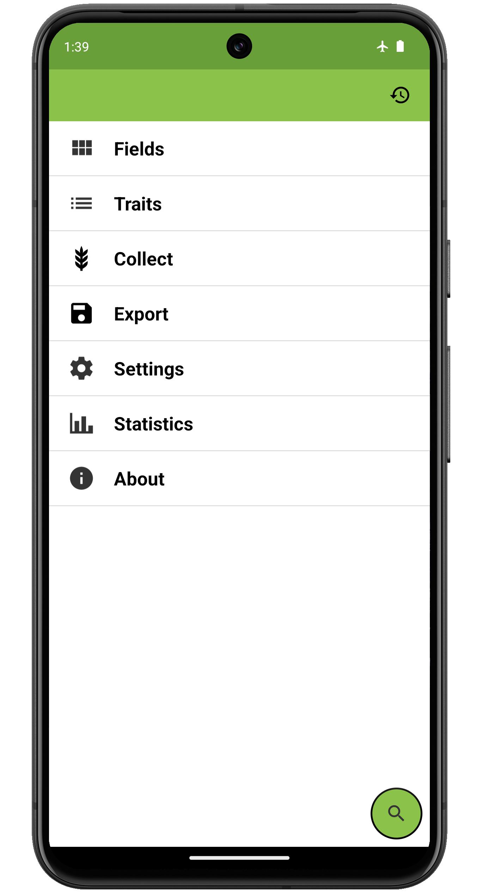

Field Book
==========

Introduction
------------

Field Book is an open-source Android app that can be used to collect
data on field research plots. When used in place of paper field books,
it eliminates the need for data transcription and reduces the risk of
errors. It runs on a wide range of inexpensive hardware, allowing
consumer-grade technology to be used in environments where cost and
inflexibility have been limiting factors. The source code for Field Book
is available on [GitHub](https://github.com/PhenoApps/Field-Book).

Getting Started
---------------

Field Book can be downloaded from the [Google Play
Store](https://play.google.com/store/apps/details?id=com.tracker.fieldbook)
or can be installed manually from the latest [GitHub
Release](https://github.com/PhenoApps/Field-Book/releases). After
installing the app, all permissions should be accepted and sample data
consisting of three fields and traits can be optionally loaded. The
images in the documentation utilize the sample data.

Structure
---------

<figure align="center" class="image">
   
  <figcaption><i>Primary Field Book screen</i></figcaption> 
</figure>

Field Book contains a home screen with links to the major sections of
the app. To use Field Book:

1.  Import your  [Fields](fields.md)
   
2.  Create  [Traits](traits.md)
   
3.  Optionally modify any  [Settings](settings.md)
   
4.  Navigate to [Collect](collect.md)
   
5.   [Export](export.md) data to a CSV (comma
    separated value) file

The  Changelog can be accessed from the top toolbar to see new features and
additions to the app.
