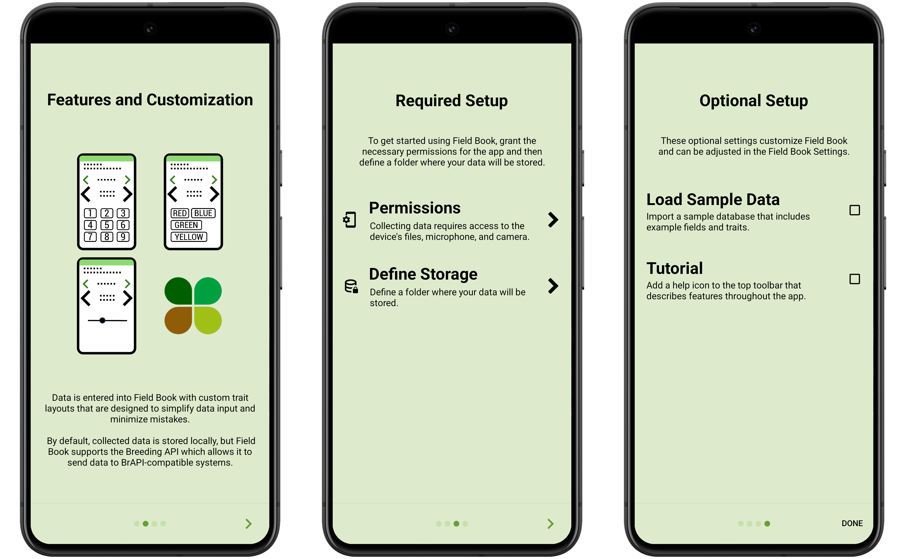

<link rel="stylesheet" type="text/css" href="_styles/styles.css">

# Field Book

## Introduction

Field Book is an open-source Android app used to collect data on field research plots.
When used in place of paper, it eliminates the need for data transcription and reduces the risk of errors.
It runs on a wide range of inexpensive hardware, allowing consumer-grade technology to be used in environments where cost and inflexibility have been limiting factors.
The source code for Field Book is available on [GitHub](https://github.com/PhenoApps/Field-Book).

<figure class="image">
   
  <figcaption class="screenshot-caption"><i>Field Book collect screen</i></figcaption> 
</figure>

## Getting Started

Field Book can be downloaded from the [Google Play Store](https://play.google.com/store/apps/details?id=com.tracker.fieldbook) or can be installed manually from the latest [GitHub Release](https://github.com/PhenoApps/Field-Book/releases).

Field Book will display a brief introduction when you open it for the first time.
During this intro, you must accept the required permissions and choose or create a storage directory for app files.
You can also optionally enable a tutorial or load a set of sample fields and sample traits.
The screenshots in documentation are from this sample data.

<figure class="image">
   
  <figcaption class="screenshot-caption"><i>Field Book intro slides</i></figcaption> 
</figure>

<figure class="image">
   
  <figcaption class="screenshot-caption"><i>Field Book home screen</i></figcaption> 
</figure>

When the intro finishes, Field Book will allow you to access to functional portions of the app.
You can navigate between these to:

 - Import  [Fields](fields.md)
 - Create or manage  [Traits](traits.md)
 -  [Collect](collect.md) data
 -  [Export](export.md) data
 - Customize  [Settings](settings.md)
 - View data  [Statistics](statistics.md)
 - Learn more  [About](about.md) Field Book or check for updates

The  Changelog can be accessed from the top toolbar to see new features and additions to the app.

## License

All text, images, and presentations available as part of the documentation for Field Book can be reused under a CC BY-SA license.
