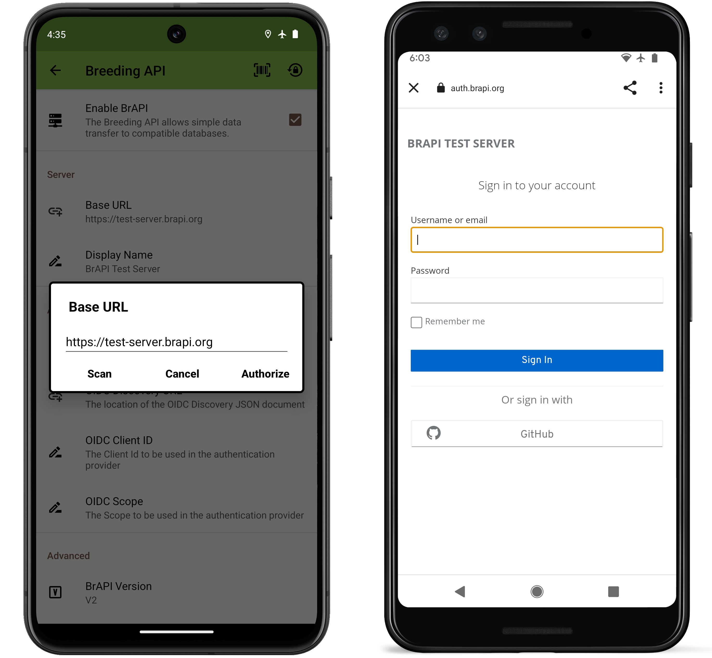
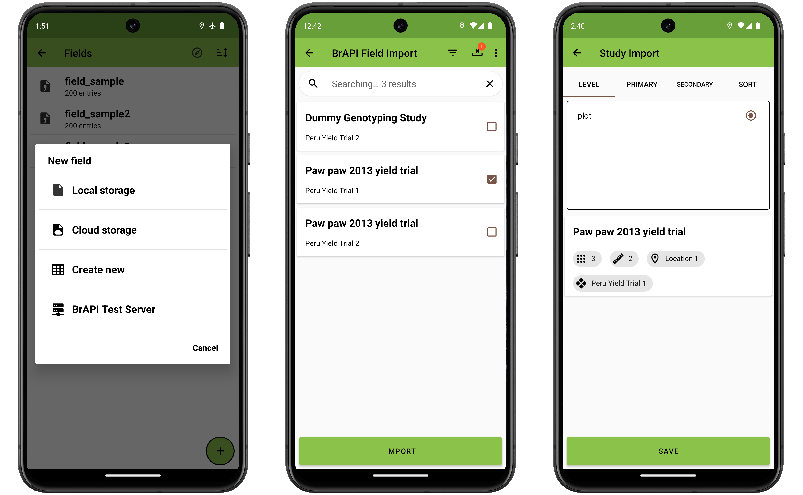
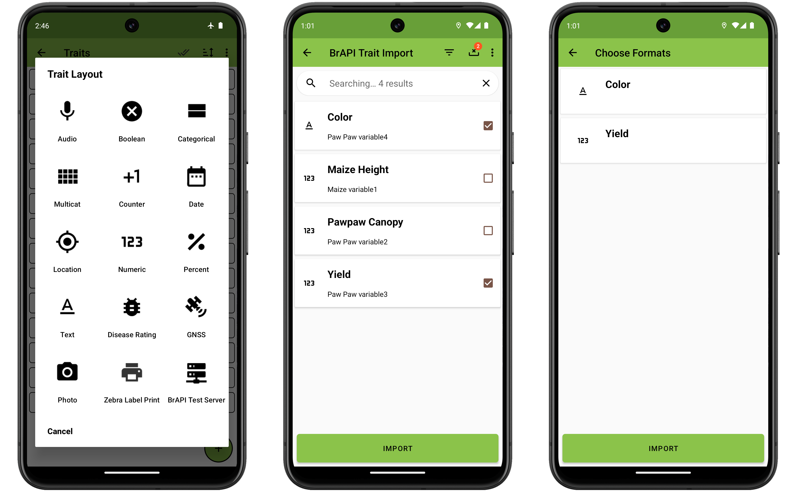
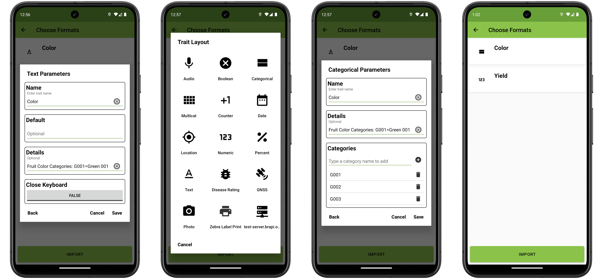
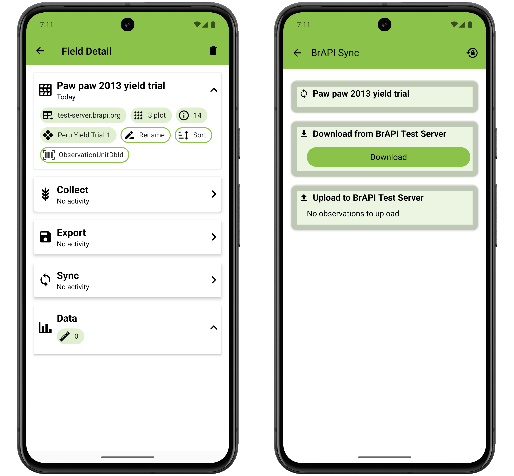
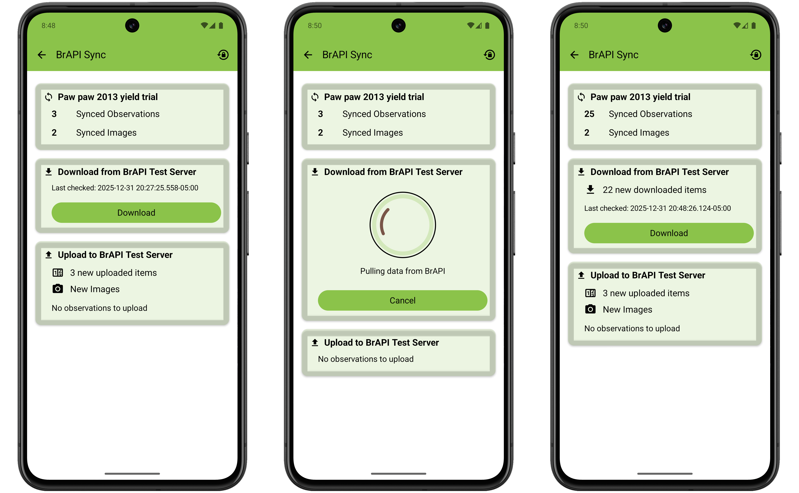
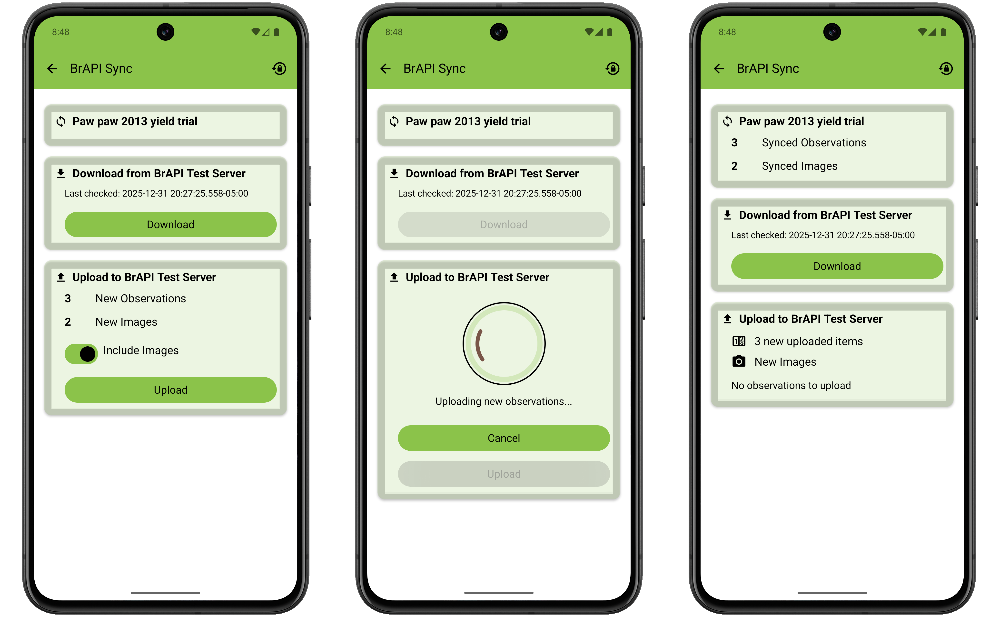

<link rel="stylesheet" type="text/css" href="_styles/styles.css">

# Breeding API (BrAPI)

## Overview

BrAPI is an application programming interface for plant breeding.
It allows Field Book to directly communicate with compatible databases to import fields and traits, and export collected data.
This eliminates the need to manually transfer files and enables Field Book to offer more sophisticated features including field, trait, and data syncing.

## Setup

BrAPI can be set up in the  [Brapi settings](./settings/settings-brapi.md).
To use BrAPI, set the base URL to the URL of a valid BrAPI server and authorize it.
Once authorized, Field Book will be able to communicate with the server to import fields and traits and export data.

<figure class="image">
   
  <figcaption class="screenshot-caption"><i>Example BrAPI URL authorization</i></figcaption> 
</figure>

## Import fields

To import a field using BrAPI, press the  button in the bottom righthand corner of the Fields screen.
The authorized server will be listed in the New Field dialog.

Field Book will load and display a list of fields (known as `studies` in BrAPI) from the BrAPI server.
The fields list will take some time to retrieve when first accessed or when the cache is refreshed.

<figure class="image">
   
  <figcaption class="screenshot-caption"><i>The BrAPI field import process</i></figcaption> 
</figure>

Select one or more fields from the list to import using the checkbox on the right of each listed field.
You can search for specific fields using the search bar at the top of the screen.
Fields can be filtered by `program`, `season`, `trial`, or `crop` by pressing  in the top toolbar.

The number of selected fields is displayed on the  icon in the toolbar.
Press this icon to clear your selections.
If your field was recently created in your database, you may need to reset the cache from the menu in the top toolbar.
Press the import button on the bottom of the screen to download the fields to Field Book.

The final screen shows additional details for each selected field, including the number of entries, number of associated traits, location, and season.
The tabs at the top can be used to change the observation level and sort order for the selected fields.

Press the Save button at the bottom of the screen to import the fields into Field Book.
The fields and any linked traits will be saved for use in Field Book.

!> Any field can be exported locally, but only fields that have been imported via BrAPI are able to export data via BrAPI.
And only if that data is also collected using BrAPI-imported traits.

## Import traits

Depending on the BrAPI server, fields may have linked traits that are imported with the field.
Additional traits can be imported via BrAPI in the Traits screen.
Ensure BrAPI is enabled and configured in the  [Brapi settings](settings-brapi.md)

When creating a new trait, your BrAPI server name will be included as a format choice.

<figure class="image">
   
  <figcaption class="screenshot-caption"><i>The BrAPI trait import process</i></figcaption> 
</figure>

Field Book will load and list the available traits (known as `observationVariables` in BrAPI) from your BrAPI server.
The traits list will take some time to retrieve when first accessed or when the cache is refreshed.

Select one or more traits from the list using the checkbox on the right of the each listed trait.
You can search for specific traits using the search bar at the top of the screen.
Traits can also be filtered by `trial`, `study`, or `crop` by pressing  in the top toolbar.

The number of selected traits is displayed on the the  icon in the toolbar.
Press this icon to clear your selections.
If your trait was recently created in your database, you may need to reset the cache from the menu in the top toolbar.

When you are finished with your selections, press the import button on the bottom of the screen to download the traits to Field Book.
The final step provides an opportunity to modify trait details like format.
Select a trait to open the trait parameters and press back to access the different trait format options.
Select the desired format, edit any additional parameters as desired, and press save.

<figure class="image">
   
  <figcaption class="screenshot-caption"><i>Changing a trait format from text to categorical</i></figcaption> 
</figure>

Once you are satisified with the traits, press the Import button at the bottom of the screen to save them for use in Field Book.

## Sync

Fields imported using BrAPI include a  **Sync** option in the field detail page to transfer data between Field Book and BrAPI-compatible databases.
The top card shows a summary of transfers to the BrAPI database including uploaded observations and images.

<figure class="image">
  
  <figcaption class="screenshot-caption"><i>BrAPI Sync with no observations</i></figcaption>
</figure>

### Importing and merging observations

<figure class="image">
  
  <figcaption class="screenshot-caption"><i>Downloading observations from the server</i></figcaption>
</figure>

Remote observations can be imported into Field Book in the second card.
If observations have been collected on different devices, this is a good way to synchronize data across users.

If there are conflicts between local and remote observations, there are several different merge options:

- Server: replace local observations with the remote values
- Local: keep local observation values
- Recent: keep the most recent observation value
- Manual: decide for each conflict

<figure class="image">
  
  <figcaption class="screenshot-caption"><i>Resolving conflicts during download</i></figcaption>
</figure> 

### Uploading observations

<figure class="image">
  
  <figcaption class="screenshot-caption"><i>Uploading Field Book (local) observations to the server</i></figcaption>
</figure>

A summary of new observations is displayed in the last card.
These observations can be uploaded to the connected BrAPI database.
Images can be optionally skipped during upload to decrease upload time.