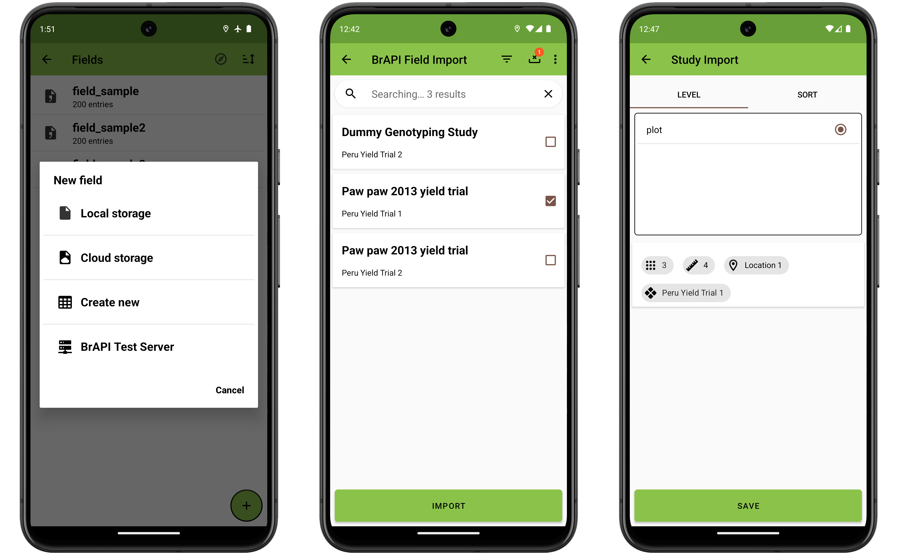

BrAPI (Breeding API)
====================

Overview
--------

BrAPI is an application programming interface for plant breeding. It
allows Field Book to directly communicate with compatible databases to
import fields and traits, and export collected data. This eliminates the
need to manually transfer files and enables Field Book to offer more
sophisticated features including field and trait metadata and data
syncing.

Setup
-----

BrAPI can be set up in the
 [Brapi settings](settings-brapi.md). To use BrAPI, set the
base URL to the URL of a valid BrAPI server and authorize it. Once
authorized, Field Book will be able to communicate with the server to
import fields and traits and export data.

<figure align="center" class="image">
   
  <figcaption><i>Example BrAPI URL authorization</i></figcaption> 
</figure>

Import fields
-------------

To import a field using BrAPI, press the floating  button in the bottom righthand corner of the Fields activity. Then select BrAPI as the import source (The BrAPI import option will use the server display name set in BrAPI settings).

Field Book will then display a list of possible fields (known as `studies` in the BrAPI standard) from the BrAPI server. The load time will depend on the status of the BrAPI cache. The fields list will take some time to retrieve when first accessed (or when the cache is refreshed), but will load much faster on subsequent imports.

<figure align="center" class="image">
   
  <figcaption><i>The BrAPI field import process</i></figcaption> 
</figure>

Select one or more fields from the list to import by checking the checkbox on the right of the field item. Available fields can be filtered by typing a search string into the search bar. They can also be filtered by program, season, trial or crop by pressing the  icon in the top toolbar.

The count of selected fields is tracked and displayed over top of the  icon in the toolbar. Press this icon to clear your selections. If you do not find the field you are looking for but know that it is available on the server then use the  icon in the toolbar to reset the cache.

Once you are satisfied with your selections press the import button on the bottom of the screen.

The final step shows additional details for each selected field, including the observation unit count, trait count, location, and season. The tabs at the top can be used to set/change the observation level, ids, and sort order for the selected fields.

Press the Save button at the bottom of the screen once satisified with the selections. The fields (and any traits linked to them) will be saved for use in Field Book.

!> Any field can be exported locally, but only fields that have been imported via BrAPI are able to export data via BrAPI. And only if that data is also collected using BrAPI-imported traits.

Import traits
-------------

Depending on the BrAPI server, fields may have linked traits that are
imported with the field. Additional traits can be imported via BrAPI in the Traits activity. First make sure BrAPI is enabled and configured in the  [Brapi settings](settings-brapi.md)

Then the BrAPI Display Name of the server you connected to will show up as the last format choice in the list when you press the press the floating  button in the bottom right of the Traits screen.

<figure align="center" class="image">
   
  <figcaption><i>The BrAPI trait import process</i></figcaption> 
</figure>

When you select this option Field Book will then display a list of possible traits (known as `observationVariables` in the BrAPI standard) from the BrAPI server. This import process is much like the BrAPI field import process. The load time will depend on the status of the cache. The traits list will take some time to retrieve when first accessed (or when the cache is refreshed), but will load much faster on subsequent imports.

Select one or more traits from the list to import by checking the checkbox on the right of the trait item. Available traits can be filtered by typing a search string into the search bar. They can also be filtered by trial, study or crop by pressing the  icon in the top toolbar.

The count of selected traits is tracked and displayed over top of the  icon in the toolbar. Press this icon to clear your selections. If you do not find the trait you are looking for but know that it is available on the server then use the  icon in the toolbar to reset the cache.

When you are finished with your selections press the import button on the bottom of the screen.

The final step provides an opportunity to modify trait details like the trait layout if the default layout is not desired. Press a trait item to open the trait parameters. Press back to access the different trait layout options. Select the desired layout, edit any additional parameters as desired, then press save

<figure align="center" class="image">
   
  <figcaption><i>Changing a trait's layout from text to categorical</i></figcaption> 
</figure>

Once you are satisified with the traits, press the Import button at the bottom of the screen to save them for use in Field Book.

Sync
----

The  BrAPI sync option is found on the field detail page of BrAPI fields. Sync connects to the server specified in  [Brapi settings](settings-brapi.md), updating the field with new data that has been added from other sources since the last sync or import. This option will not work for fields imported from a file.

<figure align="center" class="image">
   
  <figcaption><i>Downloading 25 observations from the BrAPI server using BrAPI sync</i></figcaption> 
</figure>

Export data
-----------

Once data has been collected it can be exported via BrAPI by pressing
**Export** and selecting BrAPI from the Export Data options.

Before the export is finalized, Field Book will display a summary of
BrAPI Export statistics. These include a breakdown of the number of new
vs synced(imported) vs edited observations, as well as skipped
observations. The same statistics are displayed for images.

<figure align="center" class="image">
   
  <figcaption><i>The BrAPI data export process</i></figcaption> 
</figure>

Pressing the **Export** button uploads the observations to the external BrAPI
database.
