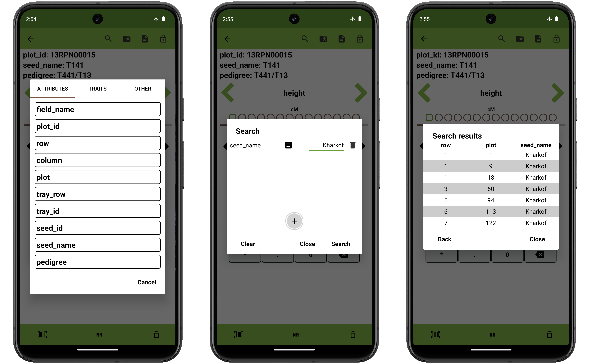
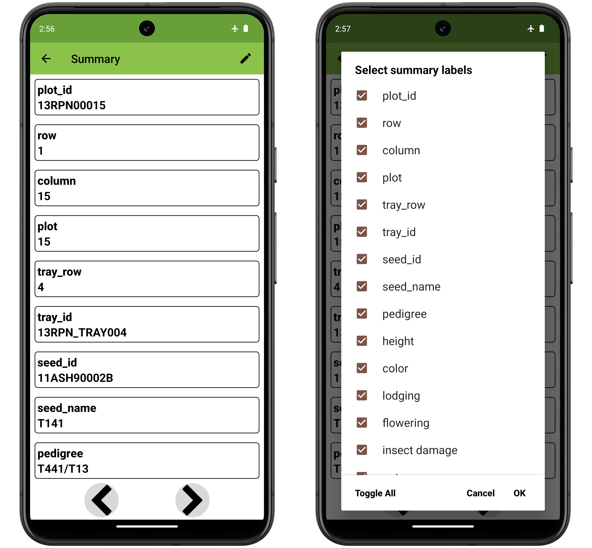
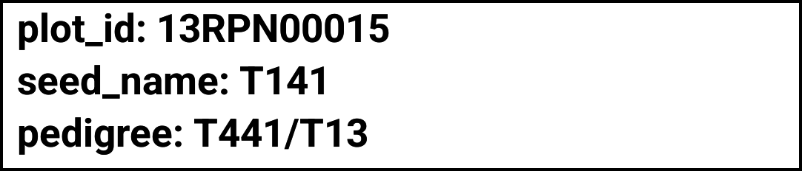
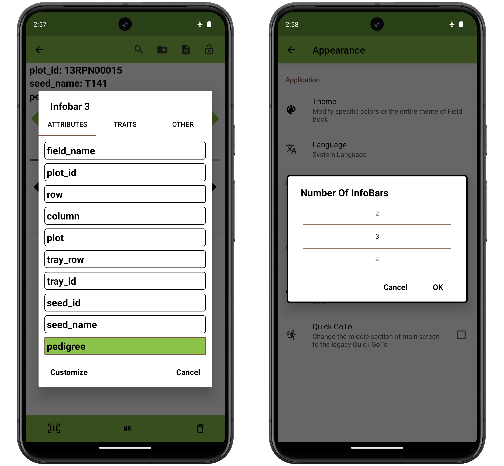
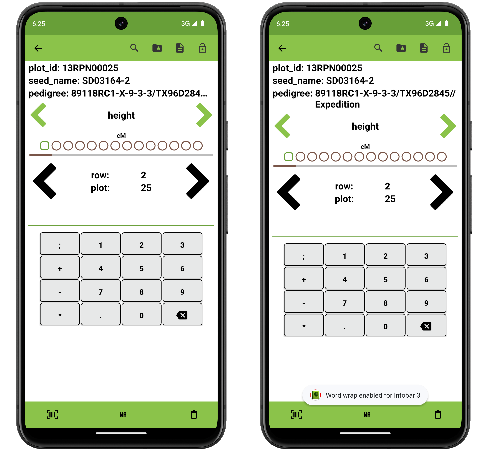
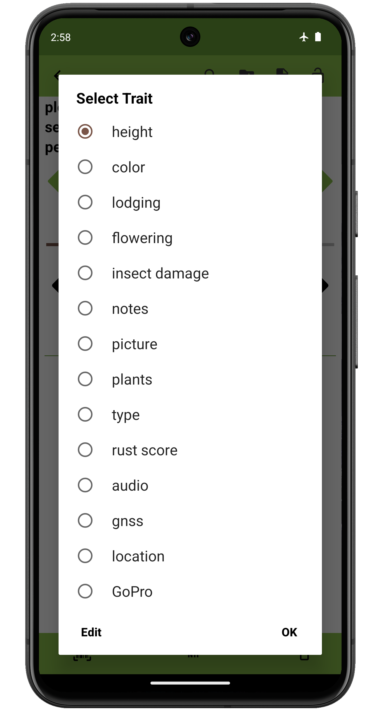
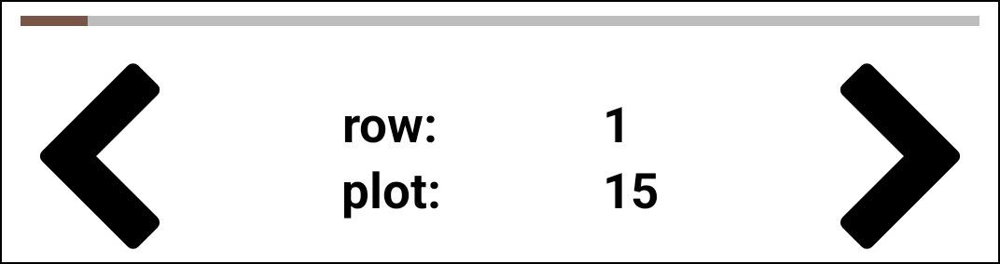
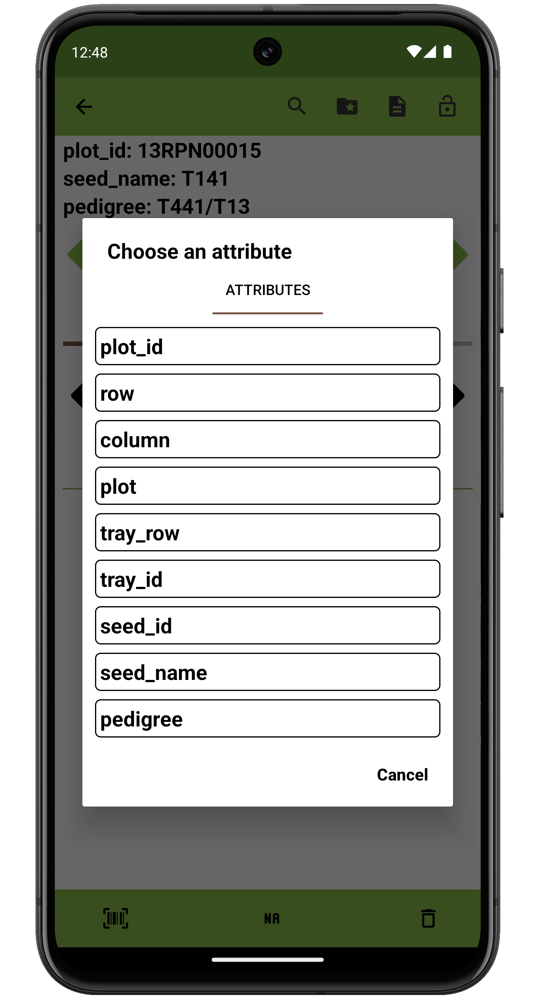
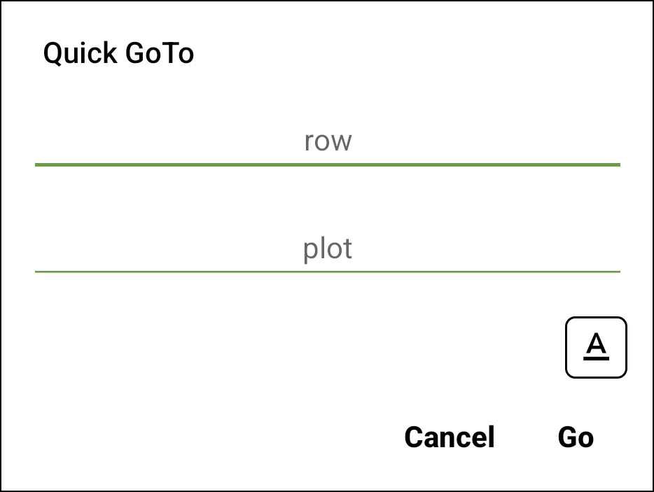

<link rel="stylesheet" type="text/css" href="_styles/styles.css">

# Collect

Field Book increases data collection speed by optimizing and simplifying data input.
Only a single entry and trait are visible for data input which reduces the risk of error and allows custom trait-specific layouts.

## Overview

The small green arrows are used to navigate between **traits**.
The line of dots below the arrows represents the individual traits that are currently active.
The active trait is square and traits with data are filled.

The large black arrows are used to navigate between **entries**.
The progress bar above the arrows indicates current positional progress through the list of entries.

Data is entered in the bottom area of the screen using a trait-specific layout.
Newly entered or edited values are displayed in italics text.
Previously collected values are displayed as red and bold text.

<figure class="image">
   
  <figcaption class="screenshot-caption"><i>Collect screen</i></figcaption> 
</figure>

## Collect Screen Details

#### Top toolbar

By default there are four icons in the top toolbar that provide additional functionality during data collection.

<figure class="image">
   
  <figcaption class="screenshot-caption"><i>The Collect screen top toolbar</i></figcaption> 
</figure>

-  **Search** opens a dialog to search for a specific entry.

<figure class="image" class="screenshot">
   
  <figcaption class="screenshot-caption"><i>The collect screen search tool</i></figcaption> 
</figure>

The search dialog can be populated by pressing the  icon and selecting from the list of attributes, traits, or other columns.
Once a column is added, you can enter a search string on the text entry line.
The  icon allows you to select the search operator including `is equals to`, `is not equal to`, `contains`, `is more than`, and `is less than`.
The  icon will remove the selected column from the search.
Multiple columns can be added when searching.
The search will return a table of matching entries that match the search criteria.
Pressing any line in the results table will navigate to the corresponding entry.

-  **Resources** opens the `resources` folder and can be used to load reference images.
Long press the icon to jump directly to the most recently loaded file, rather than the file picker.

-  **Summary** opens a dialog that displays all information for the current entry.

<figure class="image">
   
  <figcaption class="screenshot-caption"><i>The Summary screen</i></figcaption> 
</figure>

Arrows at the bottom of the Summary screen navigate forward or backward to other entries.
By default, the Summary screen shows all of the imported data from the field file and the trait values that have been collected.
The edit icon in the top toolbar allows you to customize which data fields and traits are displayed.
Selecting a trait from the summary screen navigates to that trait.

-  **Lock** adds restrictions on data input to prevent accidental changes. Pressing the icon multiple times will cycle through three states:
  -  **Unlocked** is the default, unfrozen state that allows trait values to be entered, edited, or deleted.
  -  **Locked** freezes the collect input so no values can be entered, modified, or deleted.
  -  **Limited** freezes existing data but allows entry of new values.

More features can be added to the toolbar in the  [Features Settings](settings-features.md).
Default tools can be removed from the toolbar in the  [Appearance Settings](settings-appearance.md).

#### InfoBars

<figure class="image">
   
  <figcaption class="screenshot-caption"><i>The Collect screen InfoBars</i></figcaption> 
</figure>

InfoBars display information about the current entry.
Pressing InfoBar prefixes allows you to select which data is displayed.

<figure class="image">
   
  <figcaption class="screenshot-caption"><i>Customizing InfoBars</i></figcaption> 
</figure>

An InfoBar can show an attribute imported with the field or a trait value.
The number of InfoBar can be changed by pressing "Customize" in the the dialog which navigates to the "Number of InfoBars" preference in the  [Appearance Settings](settings-appearance.md).
Word wrapping for InfoBar text can be toggled by longpressing the displayed value.
InfoBar prefixes can be replaced with symbols by toggling the "Hide InfoBar Prefix" setting in the  [Appearance Settings](settings-appearance.md).

<figure class="image">
   
  <figcaption class="screenshot-caption"><i>Enabling word wrap for long pedigree strings</i></figcaption> 
</figure>

#### Trait navigation

<figure class="image">
   
  <figcaption class="screenshot-caption"><i>The Collect screen trait navigation section</i></figcaption> 
</figure>

The small, green arrows are used to move between the visible traits.
Dots at the bottom of the section show progress through the traits for the current entry.
Pressing the current trait name will display a dialog of all visible traits.
Selecting a different trait will navigate the app to that trait.
Pressing "Edit" will navigate to the [Traits](traits.md) screen where you can modify which traits are currently active or create new traits.

<figure class="image">
   
  <figcaption class="screenshot-caption"><i>Pressing the active trait to see the trait dialog</i></figcaption> 
</figure>

#### Entry navigation

<figure class="image">
   
  <figcaption class="screenshot-caption"><i>The Collect screen entry navigation section</i></figcaption> 
</figure>

The large, black arrows navigate between different entries.
The bar at the top of the section shows progress through all entries in the field.
Pressing and holding the an arrow will continuously scroll through the entries.
The longer the arrows are pressed, the faster the scrolling speed.

Primary and secondary IDs are displayed between the entry arrows.
Different attributes can be displayed in this area by pressing the labels.

<figure class="image">
   
  <figcaption class="screenshot-caption"><i>Modifying which attribute is used as primary id</i></figcaption> 
</figure>

The values in this area can be pressed to open the Quick GoTo dialog.
Enter a new value to jump to the first matching entry.

<figure class="image">
   
  <figcaption class="screenshot-caption"><i>The Quick GoTo dialog</i></figcaption> 
</figure>

#### Data input

The bottom half of the screen is used to input data.
The elements and layout of this area change based on the trait that is currently active.
Information for each specific trait format can be found in the Trait Formats pages.

Newly input or edited values are colored black and displayed with italic font.
Saved values are colored red and displayed in normal font.

<figure class="image">
   
  <figcaption class="screenshot-caption"><i>Collect screen</i></figcaption> 
</figure>

#### Bottom toolbar

The bottom toolbar contains three buttons for data input:

-  enters data by scanning a barcode.
-  enters NA for when a phenotype is not available.
-  deletes the observation.