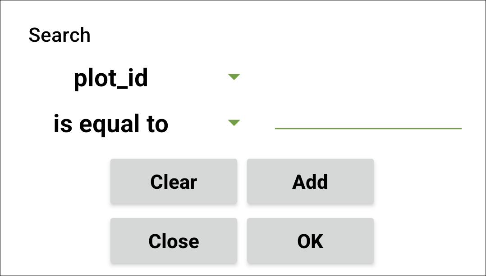
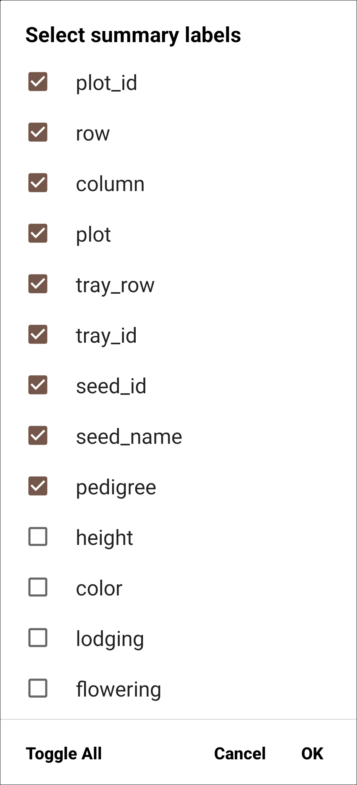
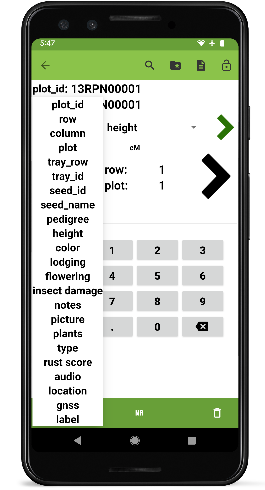

Collect
=======

Overview
--------

Field Book aims to increase the rate at which data can be collected by
tailoring the input screen to fit the exact task. Only a single entry
and trait are visible at a time during collection. This reduces the risk
of error and allows trait-specific layouts to be used for data input.

The small green arrows are used to navigate between traits. The large
black arrows are used to navigate between entries. Data is entered in
the bottom area of the screen using a layout determined by the current
trait. Data is saved to an internal database as it is collected.

<figure align="center" class="image">
   
  <figcaption><i>Data collection screen</i></figcaption> 
</figure>

Collect Screen Details
----------------------

#### Top toolbar

By default there are four buttons at the top of the screen (in addtion
to the back navigation arrow).

-    **Search** opens a dialog to search for a specific entry.

    <figure align="center" class="image">
       
      <figcaption><i>The collect screen search tool</i></figcaption> 
    </figure>

The search dialog provides a flexible interface for finding a specific
entry within the current field. Select which imported data field to
search by, what strategy to use to find a match, and enter a search
string. Press Add to construct a complex search with an additional field
and search string, or press OK to execute the search.

-  **Resources** opens the `resources` directory and can be used to load reference images.
-  **Summary** opens a dialog that displays all info for the current entry.

<figure align="center" class="image">
   
  <figcaption><i>The collect screen summary tool</i></figcaption> 
</figure>

Summary shows detailed information for the current entry. Arrows at the
bottom navigate forwards or backwards to other entries. By default the
summary shows all of the imported data fields from the field file, but
none of the collected trait values. Pressing the edit icon in the top
toolbar opens a dialog to customize which data fields and traits are
shown. Selecting a trait from the summary screen navigates to that
trait.

<figure align="center" class="image">
   
  <figcaption><i>Customizing the summary display</i></figcaption> 
</figure>

 **Lock** adds restrictions on data input to prevent accidental changes. Pressing the icon multiple times will cycle through three states:
-    **Unlocked** is the default, unfrozen state that allows trait values to be entered, edited, or deleted.
-    **Locked** freezes the collect input so no values can be entered, modified, or deleted.
-    **Limited** freezes existing data but allows entry of new values.

More tools can be added to the toolbar in the
 [General Settings](settings-general.md). Default tools can be removed from the toolbar in  [Appearance Settings](settings-appearance.md).

#### InfoBars

<figure align="center" class="image">
   
  <figcaption><i>The collect screen InfoBar section</i></figcaption> 
</figure>

InfoBars display information about the current plot. InfoBar prefixes
can be pressed to adjust which data field is displayed.

<figure align="center" class="image">
   
  <figcaption><i>Selecting which data field is shown in the InfoBars</i></figcaption> 
</figure>

#### Trait navigation

<figure align="center" class="image">
   
  <figcaption><i>The collect screen trait navigation section</i></figcaption> 
</figure>

The small, green arrows are used to move between the different traits
that are currently active. Pressing the current trait will show a
dropdown of all currently active traits.

<figure align="center" class="image">
   
  <figcaption><i>Pressing the active trait to see the trait
dropdown</i></figcaption> 
</figure>

#### Entry navigation

<figure align="center" class="image">
   
  <figcaption><i>The collect screen entry navigation section</i></figcaption> 
</figure>

The large, black arrows navigate between different entries. Pressing and
holding these arrows will continuously scroll. The longer the arrows are
pressed, the faster the scrolling becomes.

#### Data input

The bottom half of the screen is used to input data. The elements and
layout of this area change based on the trait that is currently active.
Information for each specific trait format can be found in the Trait
Formats pages.

#### Bottom toolbar

The bottom toolbar contains three buttons for data input:

-    enters data by scanning a barcode.
-    enters NA for when a phenotype is not available.
-    deletes the entered data.
