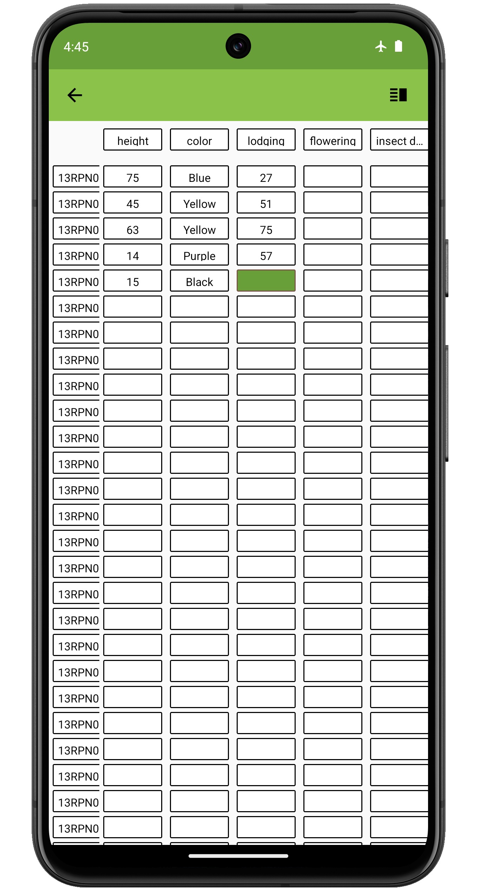

<link rel="stylesheet" type="text/css" href="_styles/styles.css">

# Datagrid

## Overview

DataGrid is accessed by pressing the  icon in the Collect top toolbar.
DataGrid displays a matrix of entries and traits in the active field.
This view allows rapid identification of missing values.
Swipe left and right to view additional columns of trait data and swipe up and down to view additional rows of entry data.
Pressing an individual cell navigates directly to the corresponding entry and trait.

<figure class="image">
   
  <figcaption class="screenshot-caption"><i>Datagrid showing a grid of entries, traits, and collected values</i></figcaption> 
</figure>

## Settings

The column used as the row header can be changed by pressing the  icon in the toolbar and selecting a different attribute.

<figure class="image">
   
  <figcaption class="screenshot-caption"><i>Changing the row header from plot_id to plot</i></figcaption> 
</figure>