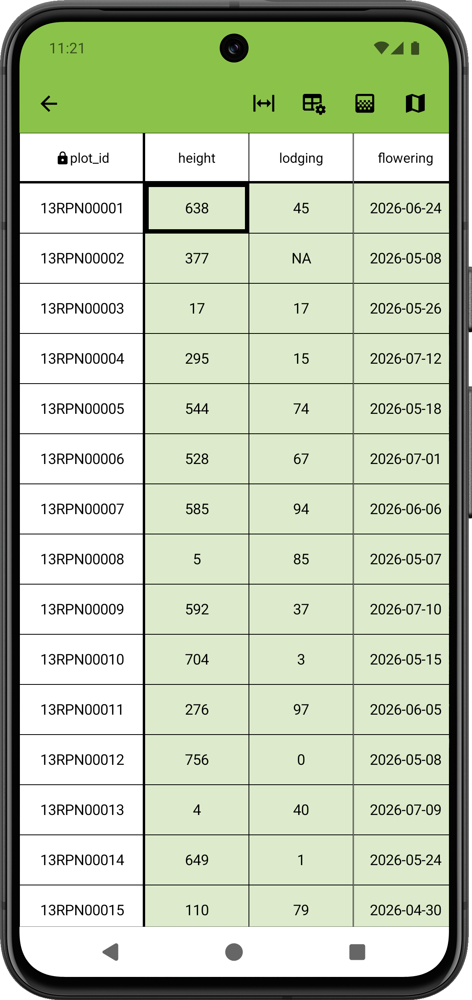
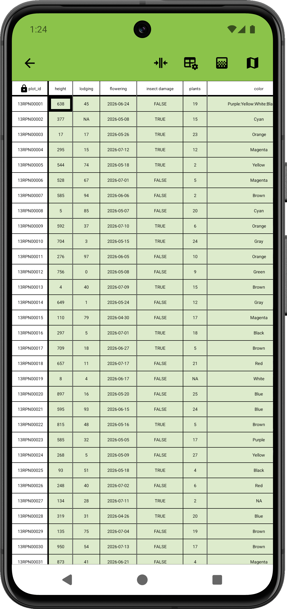
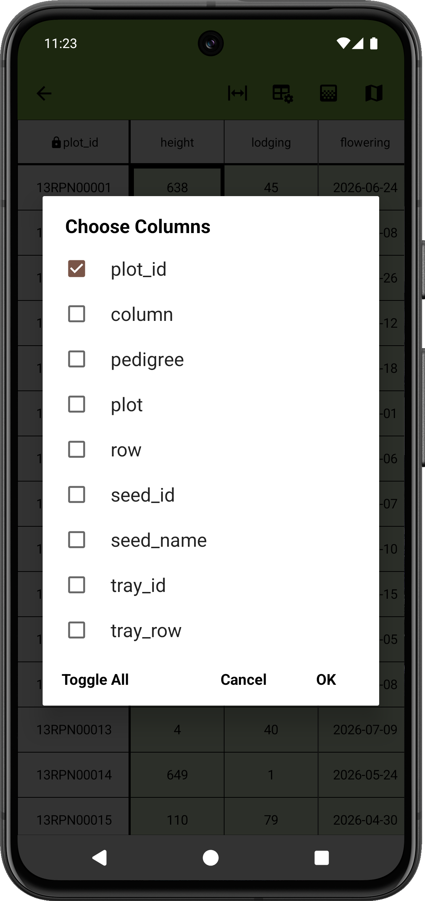
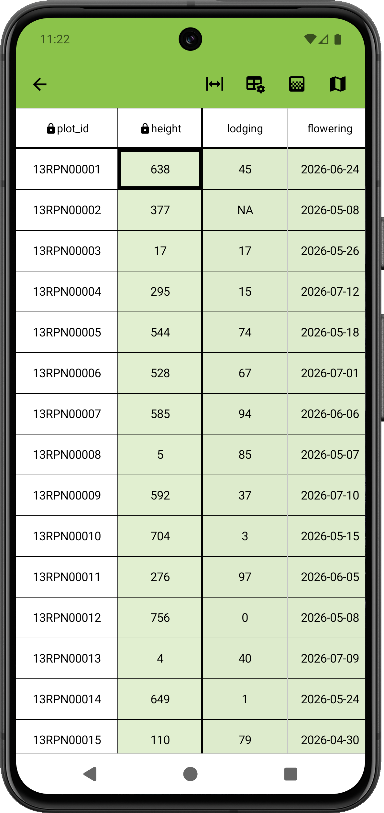
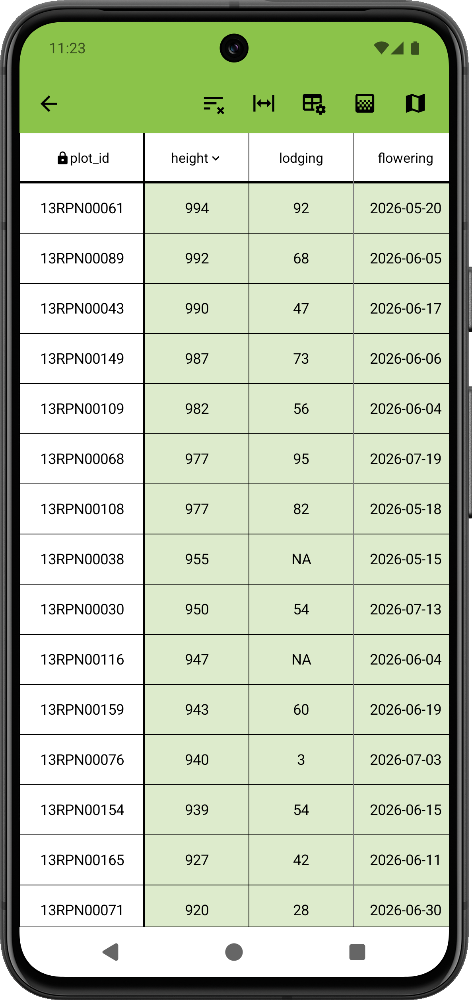
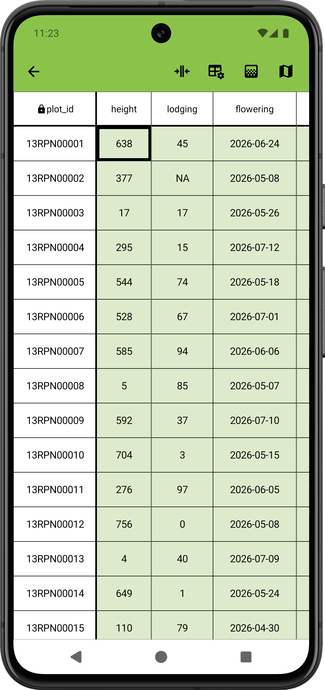
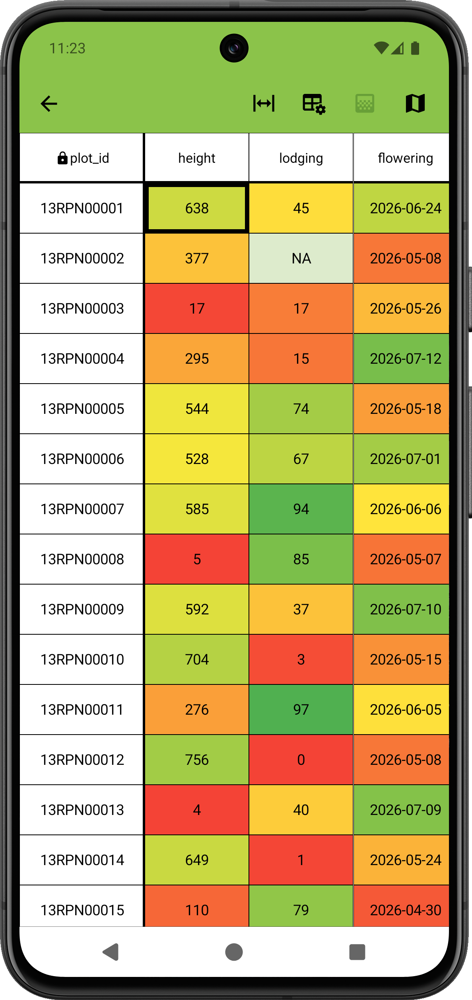
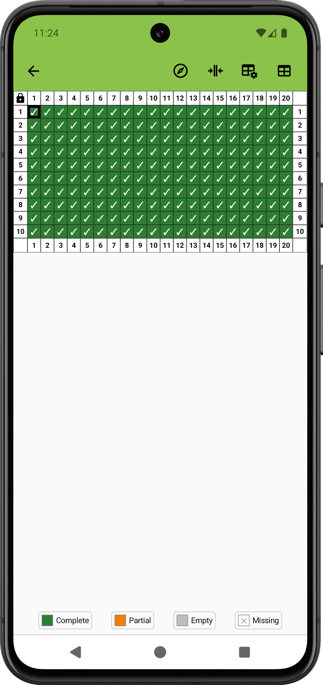
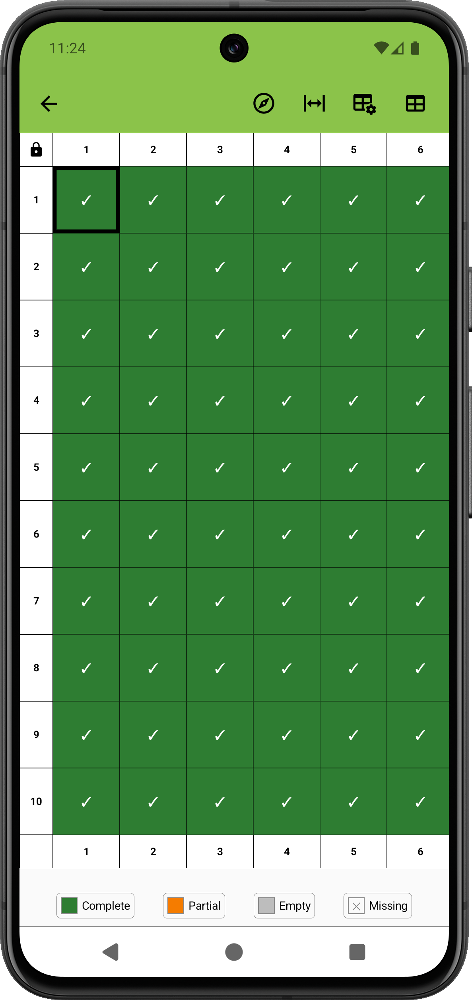
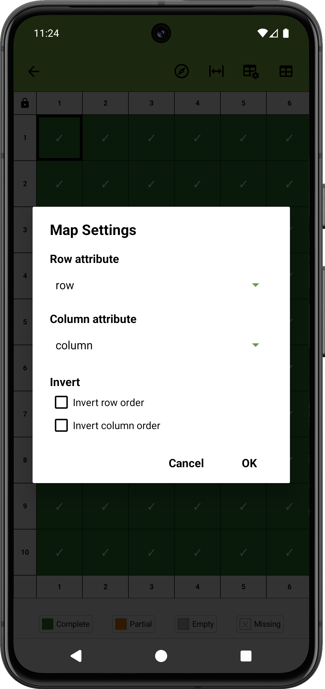

<link rel="stylesheet" type="text/css" href="_styles/styles.css">

# Datagrid

## Overview

DataGrid is accessed by pressing the  icon in the Collect top toolbar.
DataGrid displays a matrix of entries and traits in the active field.
Swipe left and right to view additional columns of trait data and swipe up and down to view additional rows of entry data.
Pinch with two fingers in the grid to zoom in or out.
Pressing an individual cell navigates directly to the corresponding entry and trait.
If the trait has repeated measurements and more than one value has already been recorded, a dialog opens first so you can choose which value to navigate to.

<figure class="image" style="text-align: center">
    

       
       
    

  <figcaption class="screenshot-caption"><i>Datagrid at the default zoom level, and zoomed out</i></figcaption> 
</figure>

## Column Management

### Choosing Extra Info Columns

The unique entry identifier is shown as the first columnby default.
Additional entry attribute columns can be shown alongside it by opening the Choose Columns dialog  via the top toolbar.
Check or uncheck attributes to add or remove them as columns, or use the "Toggle All" button to select or clear them all at once.

<figure class="image">
   
  <figcaption class="screenshot-caption"><i>Choosing which entry attributes appear as extra columns</i></figcaption> 
</figure>

### Locking and Unlocking Columns

Locked columns stay visible when scrolling horizontally.
Long-press a column header to lock or unlock it; locked columns move to the front of the table and show a  icon.

<figure class="image">
   
  <figcaption class="screenshot-caption"><i>Locking columns in the datagrid</i></figcaption> 
</figure>

### Sorting Columns

Press a column header to sort the datagrid by that column in ascending order; press it again to reverse the sort to descending.
The active sort column shows a chevron indicating its direction.
Once a sort is applied, a "Reset Sort" icon  on the toolbar will clear the sort and restore the default order.

<figure class="image">
   
  <figcaption class="screenshot-caption"><i>Sorting the datagrid by a selected column</i></figcaption> 
</figure>

### Wrapping Column Content

By default, all columns have identical, fixed width and truncate long text.
Press the  icon to expand columns to fit their content, or the  icon to collapse them back to a fixed width.

<figure class="image">
   
  <figcaption class="screenshot-caption"><i>Toggling column content wrapping in the datagrid</i></figcaption> 
</figure>

## Data Visualization

### Cell Shading

Numeric and date trait data can be shaded to visualize values and identify trends with the  icon in the toolbar.

<figure class="image">
   
  <figcaption class="screenshot-caption"><i>Datagrid with cell shading enabled to show value distribution</i></figcaption> 
</figure>

## Map View

As an alternative spatial view, entries can be viewed on a map.
The  icon switches to map view and the  icon switches back to grid view.
Long-pressing the corner cell will lock or unlock the header row and column, and pinching with two fingers will zoom.

<figure class="image" style="text-align: center">
    

       
       
    

  <figcaption class="screenshot-caption"><i>Datagrid with map view overlay showing entry locations</i></figcaption> 
</figure>

A legend at the bottom of the map shows that data completeness for each plot: Complete, Partial, Empty, or Missing (no layout position found).
Pressing the legend entries will filter the grid to only show matching plots.

The  icon opens Map Settings, where you can choose the entry attributes used for the row and column position or invert the row or column order to move the starting location of the field.

<figure class="image">
   
  <figcaption class="screenshot-caption"><i>Map Settings for choosing row/column attributes or inverting the layout</i></figcaption> 
</figure>

A "Locate Active Plot" icon  on the toolbar scrolls to the active entry.