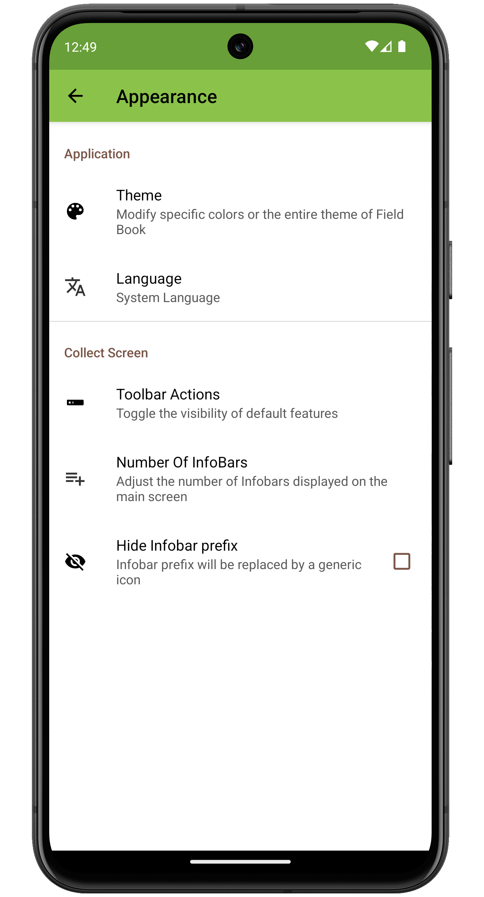

Appearance Settings
===================

<figure align="center" class="image">
   
  <figcaption><i>Appearance settings screen
layout</i></figcaption> 
</figure>

Application
-----------

####  Theme

Allows users to modify specific colors or the entire theme of Field
Book.

<figure align="center" class="image">
   
  <figcaption><i>Theme options within appearance
settings</i></figcaption> 
</figure>

####  Language

Allows the user to change the Field Book language to one of 14 different
options.

<figure align="center" class="image">
   
  <figcaption><i>Language options</i></figcaption> 
</figure>

####  Tutorial

Adds a

icon to the toolbar that enables the tutorial. The tutorial provides
contextual information throughout the app.

Collect Screen
--------------

####  Customize toolbar icons

Allows the user to change which default toolbar buttons are displayed on
the Collect screen.

<figure align="center" class="image">
   
  <figcaption><i>Turn default toolbar options
on/off</i></figcaption> 
</figure>

####  Number of Infobars

Allows the user to change the number of Infobars that are displayed on
the Collect screen.

<figure align="center" class="image">
   
  <figcaption><i>Choice of number of
Infobars</i></figcaption> 
</figure>

####  Quick GoTo

Changes the read-only primary/secondary order on the Collect screen to
edit texts that can search and move to specific entries.

<figure align="center" class="image">
   
  <figcaption><i>Editable primary/secondary order</i></figcaption> 
</figure>
