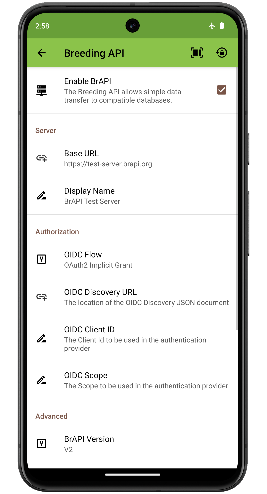
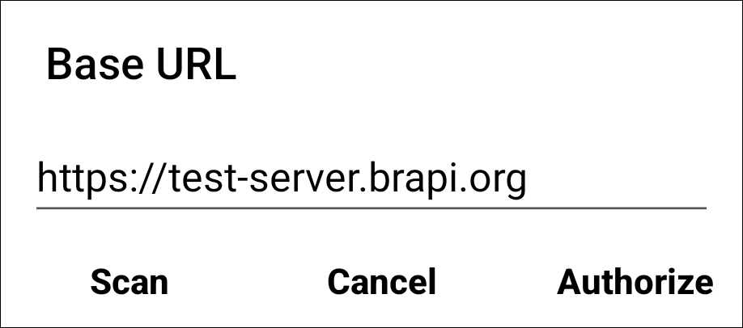
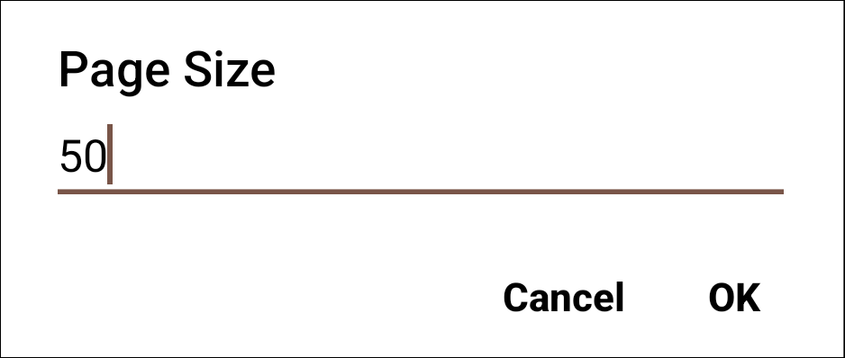
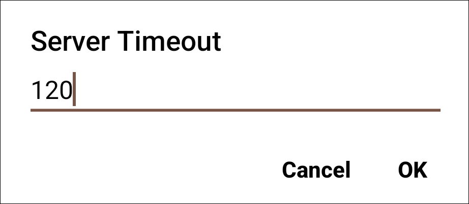
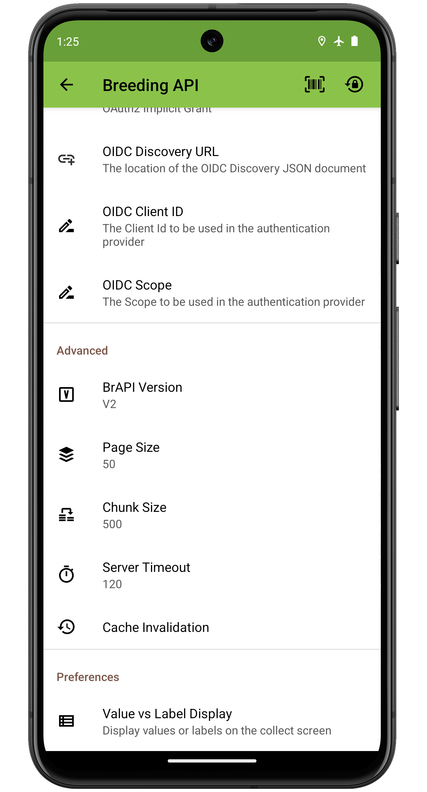
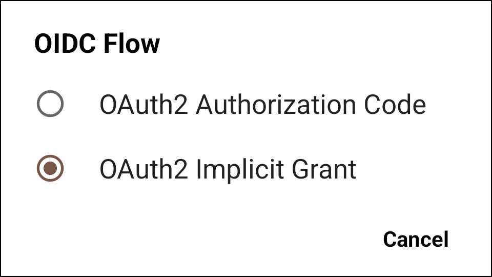
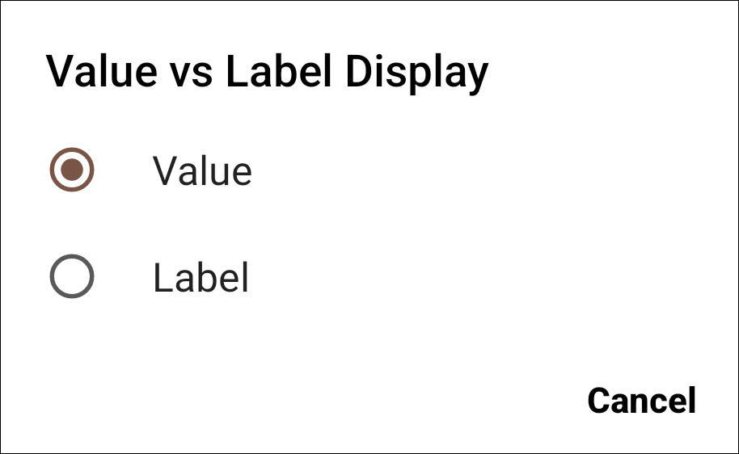
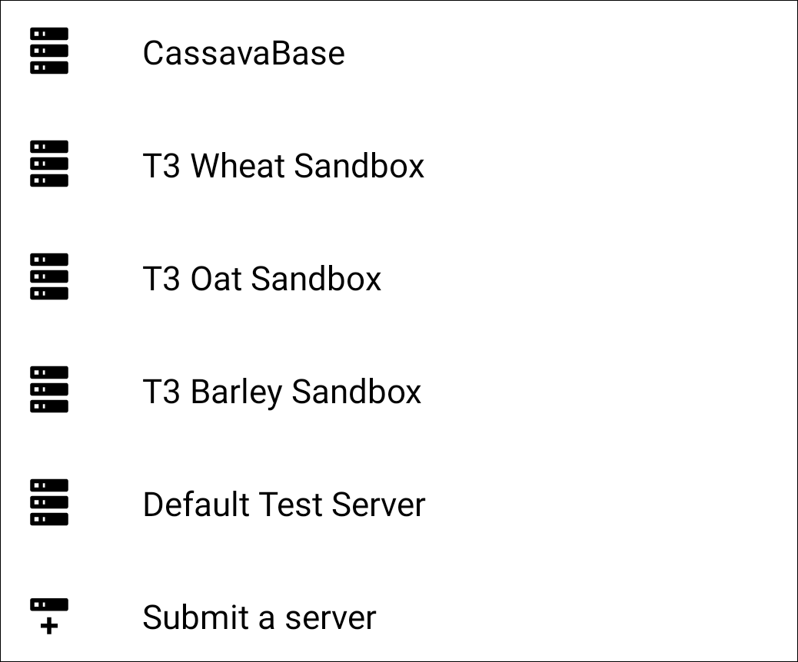

BrAPI Settings
==============

Configuration
-------------

<figure align="center" class="image">
   
  <figcaption><i>BrAPI Configuration
Settings</i></figcaption> 
</figure>

####  BrAPI Base URL

Set the server URL when importing via BrAPI.

<figure align="center" class="image">
   
  <figcaption><i>BrAPI Base URL setting</i></figcaption> 
</figure>

####  Authorize BrAPI

Open the authorization page to login to the BrAPI server and allow Field
Book to communicate with it.

####  BrAPI Version

Set the version of the BrAPI specification that will be used to
communicate with the server. Defaults to V2.

<figure align="center" class="image">
   
  <figcaption><i>BrAPI version setting</i></figcaption> 
</figure>

####  Page Size

Set the page size for BrAPI server responses. Defaults to 1000.

<figure align="center" class="image">
   
  <figcaption><i>BrAPI page size setting</i></figcaption> 
</figure>

####  Chunk Size

Set the chunk size. Defaults to 500.

<figure align="center" class="image">
   
  <figcaption><i>BrAPI chunk size setting</i></figcaption> 
</figure>

####  Server Timeout

Set the time limit in seconds to wait for a repsonse from the server
before timing out. Defaults to 2 minutes.

<figure align="center" class="image">
   
  <figcaption><i>BrAPI server timeout setting</i></figcaption> 
</figure>

Advanced Auth Settings
----------------------

<figure align="center" class="image">
   
  <figcaption><i>BrAPI Advanced Auth Settings</i></figcaption> 
</figure>

####  OIDC Flow

BrAPI server authentication version. Defaults to OAuth2 Implicit Grant.

<figure align="center" class="image">
   
  <figcaption><i>BrAPI OIDC flow setting</i></figcaption> 
</figure>

####  OIDC Discovery URL

The location of the OIDC discovery JSON document.

<figure align="center" class="image">
   
  <figcaption><i>BrAPI OIDC url setting</i></figcaption> 
</figure>

BrAPI Variables
---------------

####  Value vs Label Display

Sets desired field for display when using a categorical trait the comes
from a BrAPI Variable.

<figure align="center" class="image">
   
  <figcaption><i>BrAPI Value vs Label setting</i></figcaption> 
</figure>

Community Servers
-----------------

####  Scan a server barcode

Add a BrAPI server by scanning a URL barcode.

#### Advanced

Access servers from the BrAPI community.

<figure align="center" class="image">
   
  <figcaption><i>BrAPI database
whitelist</i></figcaption> 
</figure>
