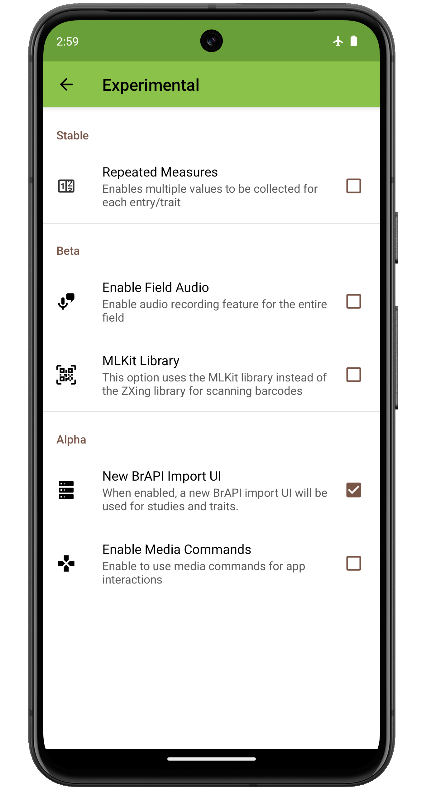

Experimental Settings
=====================

<figure align="center" class="image">
   
  <figcaption><i>Experimental settings screen layout</i></figcaption> 
</figure>

####  Repeated Measures

Turns on repeated measures. When turned on, a green plus symbol appears
next to the trait value entry box on the collect screen.

<figure align="center" class="image">
   
  <figcaption><i>Collect screen value entry with repeated measurements enabled</i></figcaption> 
</figure>

When pressed it creates a new entry field for collecting an additional
observation on the same plot for the same trait.

!> To export data that includes repeated measures make sure to chose the
**Database** format or to use **BrAPI**. These formats allow repeated
measures to be differentiated by timestamp. If exporting in **Table**
format then only the latest measurement will be included.
