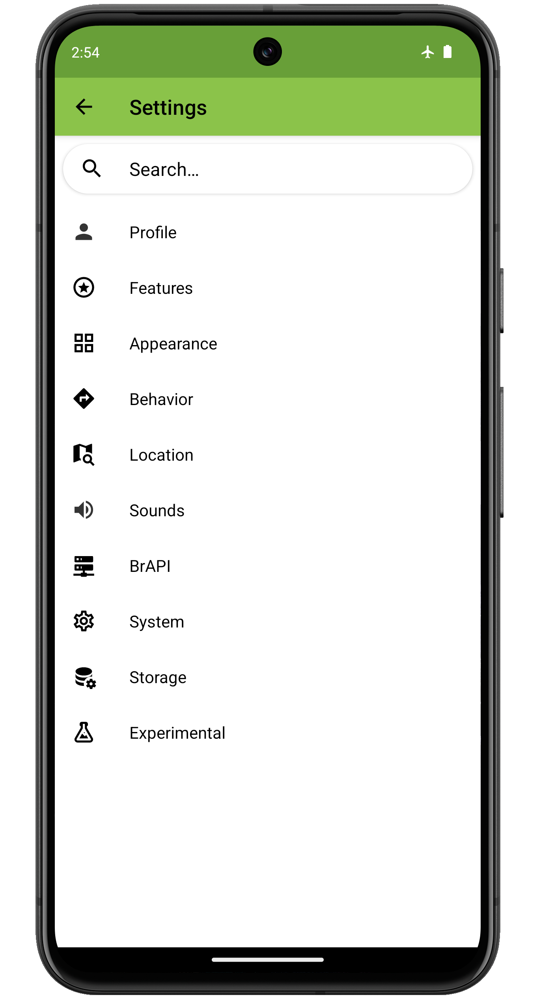
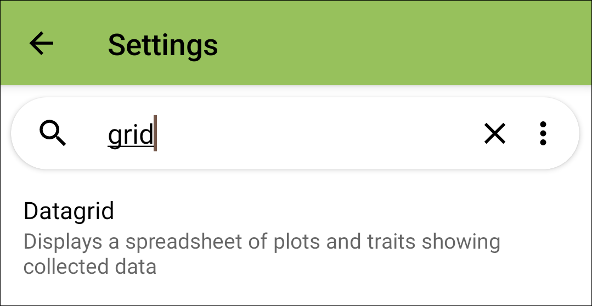
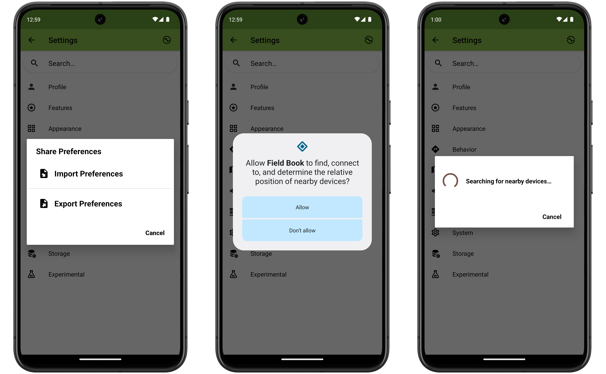
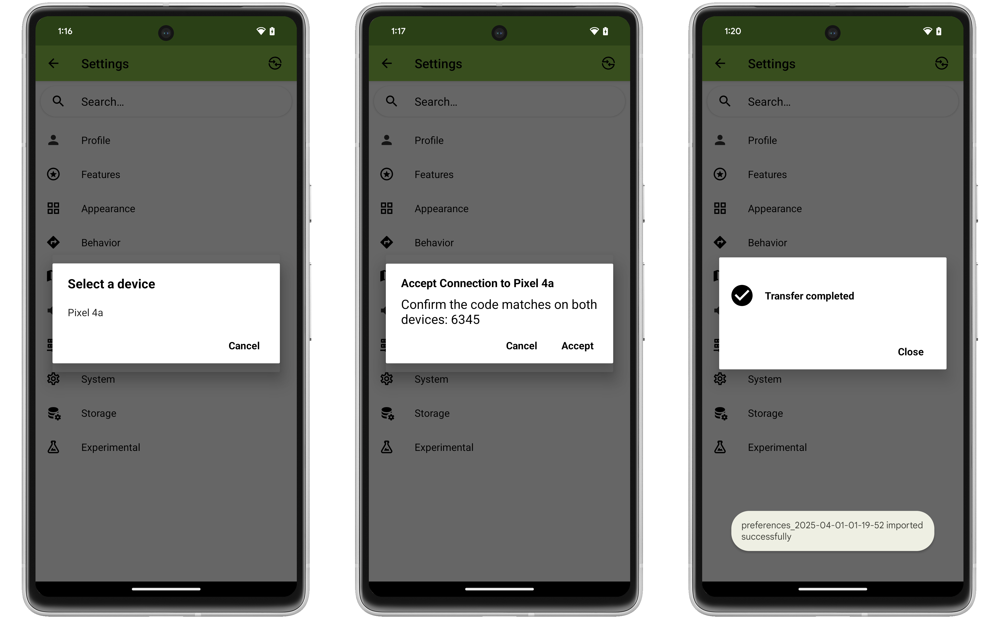

<link rel="stylesheet" type="text/css" href="_styles/styles.css">

# Settings

<figure class="image">
   
  <figcaption class="screenshot-caption"><i>Settings screen layout</i></figcaption> 
</figure>

Field Book settings are grouped into ten subcategories:

-  [Profile Settings](settings/settings-profile.md) set the identity of the person collecting data.
-  [Appearance Settings](settings/settings-appearance.md) change language, theme, icons, or layouts.
-  [Features Settings](settings/settings-features.md) add or remove toolbar features.
-  [Behavior Settings](settings/settings-behavior.md) modify default collect actions.
-  [Location Settings](settings/settings-location.md) modify location details and manage geonavigation.
-  [Sound Settings](settings/settings-sounds.md) toggle sound notifications for collection activities.
-  [Brapi Settings](settings/settings-brapi.md) connect to an external data source using the Breeding API (BrAPI).
-  [System Settings](settings/settings-system.md) change import, export, and file sharing defaults.
-  [Storage Settings](settings/settings-storage.md) modify storage location and internal database settings.
-  [Experimental Settings](settings/settings-experimental.md) manage new features that are currently being tested and are not enabled by default.

The  **Search Bar** at the top of the screen can be used to quickly find and navigate to a specific setting.

<figure class="image">
   
  <figcaption class="screenshot-caption"><i>Searching for a specific setting</i></figcaption> 
</figure>

The  **Nearby Share** icon in the top right of the toolbar can be used to quickly copy all settings from one device to another.

First, press the  icon and choose whether the device will be importing or exporting settings.
If this is the first time using the feature you will also have to give permission to use nearby share.
After these choices the app will indicate it is looking for a nearby device.

<figure class="image">
   
  <figcaption class="screenshot-caption"><i>Initial steps to share settings with nearby share</i></figcaption> 
</figure>

Follow the same steps on the other device you are importing from/exporting to.
The importing device will then display a list of devices it sees nearby that are trying to share data.
Select the desired device, confirm the pairing codes match, and accept the connection on both devices.
Once accepted the transfer will occur and indicate it is finished with a "Transfer completed" message. 

<figure class="image">
   
  <figcaption class="screenshot-caption"><i>Final steps to share settings with nearby share</i></figcaption> 
</figure>

