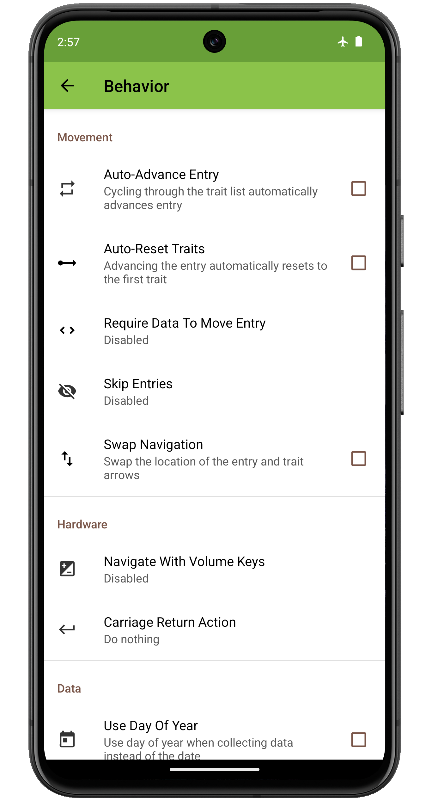
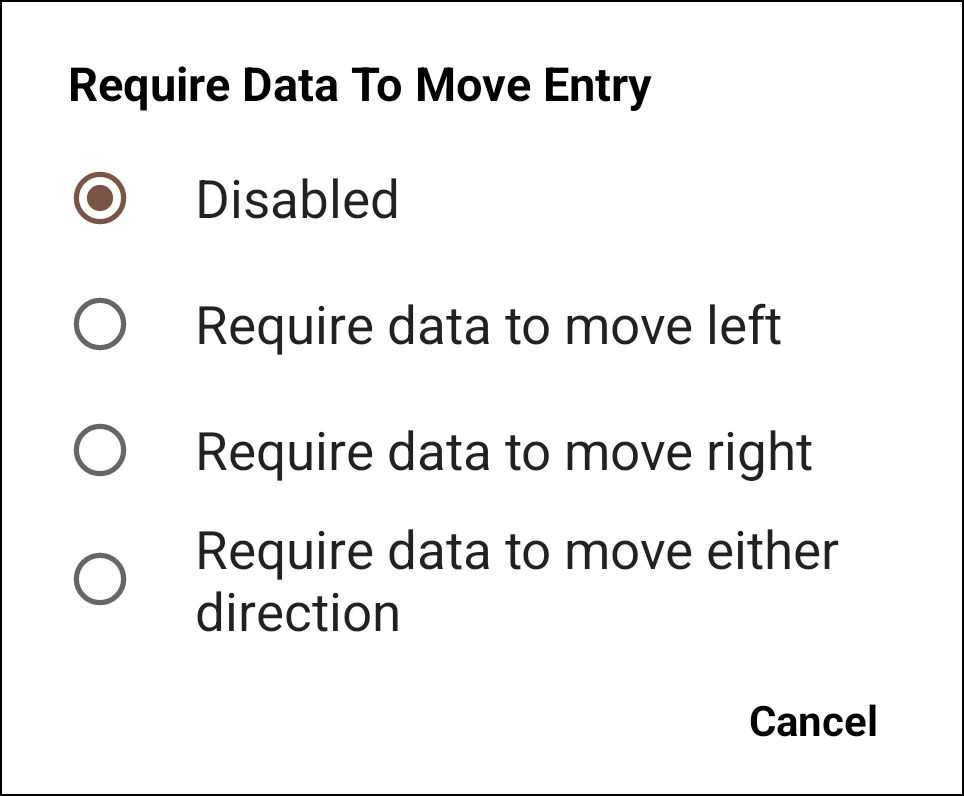
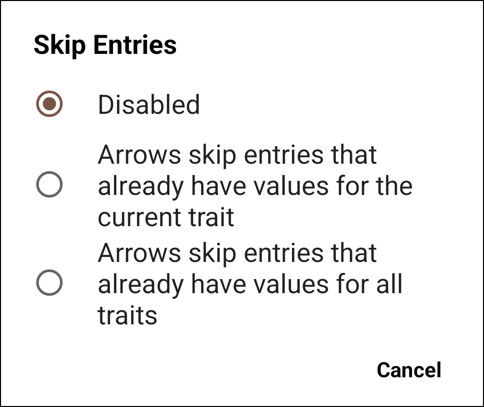

<link rel="stylesheet" type="text/css" href="../_styles/styles.css">

# Behavior Settings

<figure class="image">
   
  <figcaption class="screenshot-caption"><i>Behavior settings screen</i></figcaption> 
</figure>

## Movement

####  Auto-Advance Entry

When enabled, once all active traits have been cycled, the app automatically advances to the next entry.

####  Auto-Reset Traits

When enabled, advancing to the next entry automatically resets to the first trait.

####  Require Data To Move Entry

Disables the left, right, or both entry arrows unless data has been collected to ensure an entry isn't skipped during data collection.

<figure class="image">
   
  <figcaption class="screenshot-caption"><i>Choice of direction disabled</i></figcaption> 
</figure>

####  Skip Entries

When advancing entries, skips either entries that already have data for the active trait, or entries that already have data for all traits.

<figure class="image">
   
  <figcaption class="screenshot-caption"><i>Choice of skip behavior</i></figcaption> 
</figure>

####  Swap Navigation

Switches the location of the trait advancement section (small green arrows) and the entry advancement section (large black arrows).

## Hardware

####  Navigate With Volume Keys

Allows volume keys to be used to move to next/previous entry.
This also disables the volume buttons being able to change the device volume when Collect is open.

####  Carriage Return Action

Allows the user to choose the behavior of the carriage return signal that can be included when scanning barcodes: next plot, next trait, or do nothing.

<figure class="image">
   
  <figcaption class="screenshot-caption"><i>Choice of return key signal behavior</i></figcaption> 
</figure>