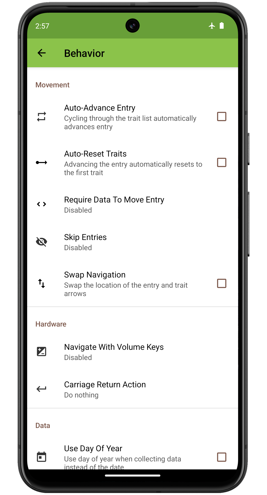
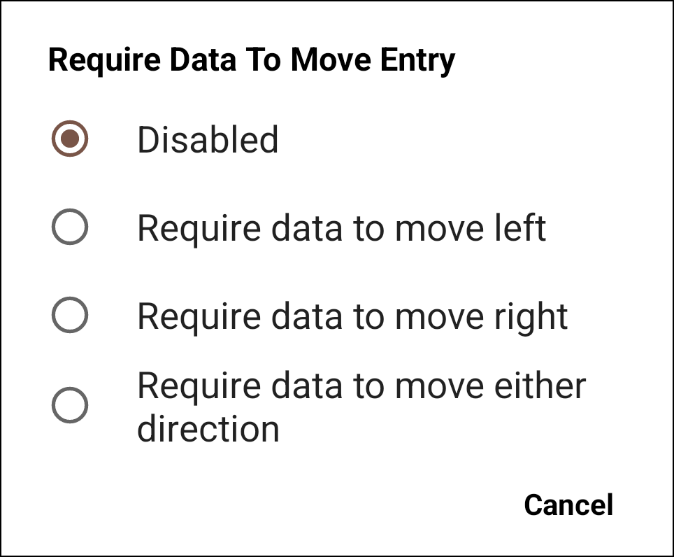
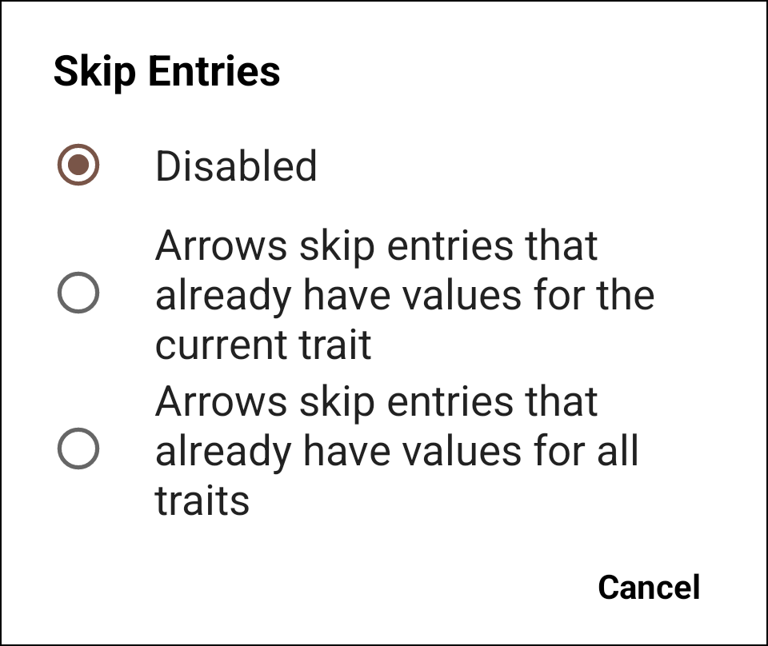
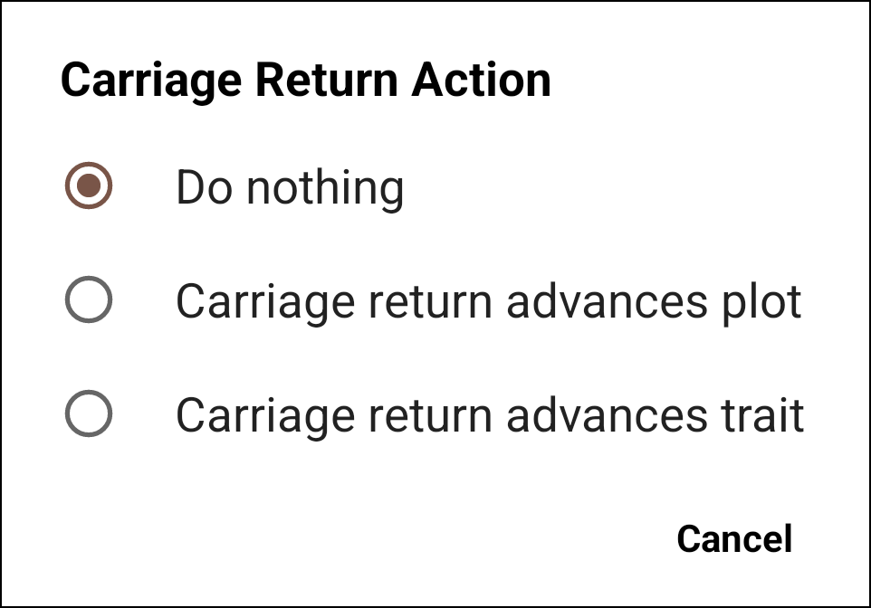

<link rel="stylesheet" type="text/css" href="../_styles/styles.css">

# Behavior Settings

<figure class="image">
   
  <figcaption class="screenshot-caption"><i>Behavior settings screen</i></figcaption> 
</figure>

## Movement

####  Auto-Advance Entry

When enabled, once all active traits have been cycled, the app automatically advances to the next entry.

####  Auto-Reset Traits

When enabled, advancing to the next entry automatically resets to the first trait.

####  Require Data To Move Entry

Disables the left, right, or both entry arrows unless data has been collected to ensure an entry isn't skipped during data collection.

<figure class="image">
   
  <figcaption class="screenshot-caption"><i>Choice of direction disabled</i></figcaption> 
</figure>

####  Skip Entries

When advancing entries, skips either entries that already have data for the active trait, or entries that already have data for all traits.

<figure class="image">
   
  <figcaption class="screenshot-caption"><i>Choice of skip behavior</i></figcaption> 
</figure>

####  Swap Navigation

Switches the location of the trait advancement section (small green arrows) and the entry advancement section (large black arrows).

## Barcodes

#### Toolbar Barcode Scanning

Sets how a barcode scanned from the bottom toolbar is interpreted.
Barcodes can be used to move to an entry, record the value as a phenotype, record the value as a phenotype if it is not an entry ID, or ask each time.

#### Always Use Detected Barcode

When enabled, a barcode detected while attaching media is processed automatically.
When disabled, the detection box must be tapped to use the barcode.

#### Suggest Similar IDs

When enabled, a scanned or entered ID with no exact match shows a list of close matches to choose from.
This helps when a barcode is misread or only partly scanned.
Matches ignore case and spaces, and allow a missing, extra, swapped, or wrong character, or a truncated ID.
Entries in the current field are suggested first, followed by other fields.
When scanning from the Fields screen, field names and aliases are also suggested.
Field Book never moves to a suggested entry until one is chosen.
Suggestions are not shown when an unmatched barcode is recorded as a phenotype value.

## Hardware

####  Navigate With Volume Keys

Allows volume keys to be used to move to next/previous entry.
This also disables the volume buttons being able to change the device volume when Collect is open.

####  Carriage Return Action

Allows the user to choose the behavior of the carriage return signal that can be included when scanning barcodes: next plot, next trait, or do nothing.

<figure class="image">
   
  <figcaption class="screenshot-caption"><i>Choice of return key signal behavior</i></figcaption> 
</figure>