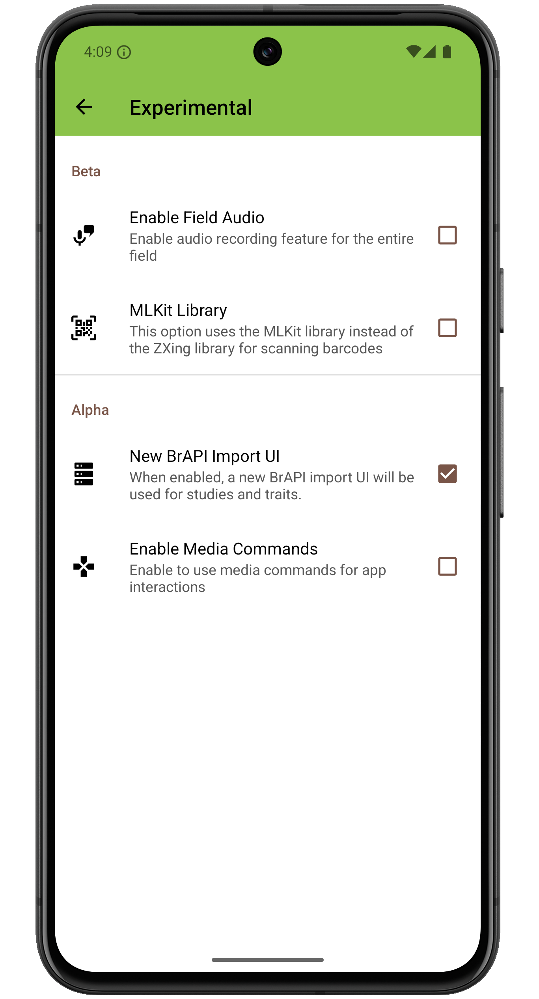

<link rel="stylesheet" type="text/css" href="_styles/styles.css">

# Experimental Settings

<figure class="image">
   
  <figcaption class="screenshot-caption"><i>Experimental settings screen layout</i></figcaption> 
</figure>

## Beta

####  Enable Field Audio

Adds an icon to collect toolbar for recording audio at the field level.

####  MLKit Library

Changes the software library used for barcode scans from `ZXing` to `MLKit`.

## Alpha

####  New BrAPI Import UI

Replace old BrAPI field and trait import UIs with new streamlined version that includes search and additional step for identifer/format selection.

####  Enable Media Commands

Allows media remotes to control app through media commands.