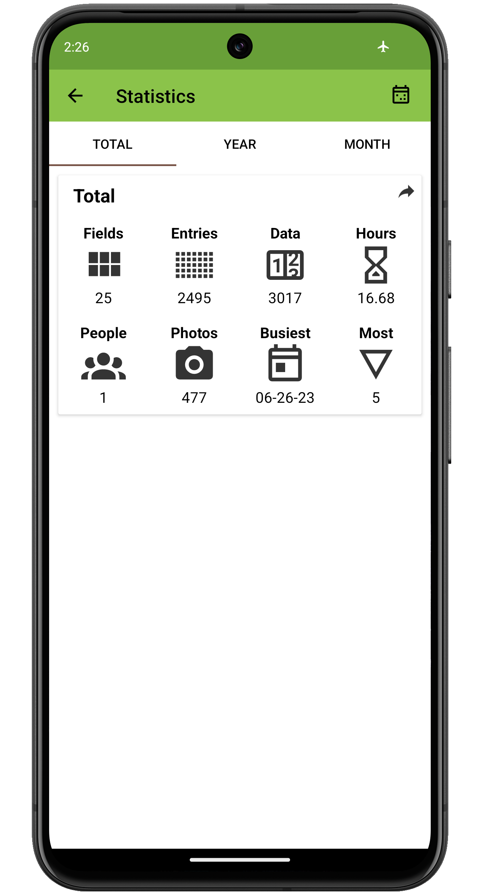
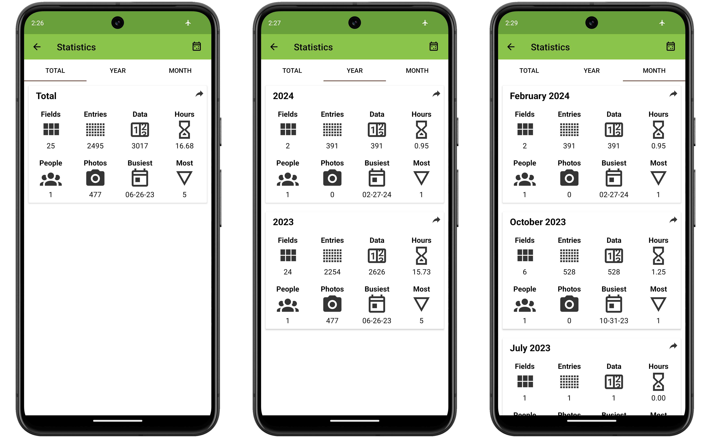
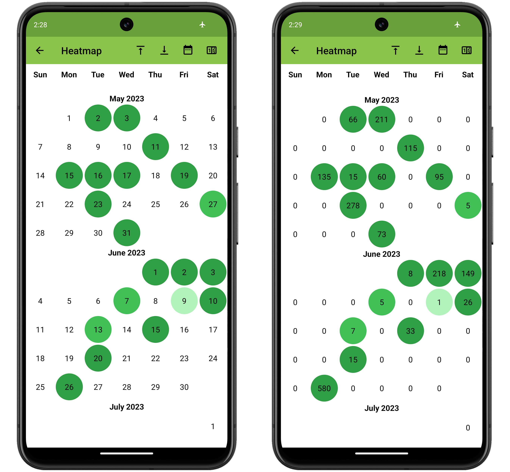

<link rel="stylesheet" type="text/css" href="_styles/styles.css">

# Statistics

## Overview

The Statistics screen provides helpful information about Field Book usage.

<figure class="image">
   
  <figcaption class="screenshot-caption"><i>The Statistics screen</i></figcaption> 
</figure>

## Statistics cards

Each card shows statistics about the:
- Number of fields with data collected
- Number of entries with data collected
- Number of observations
- Hours spent collecting data
- Number of people who collected data
- Number of photos taken
- Date with the largest number of observations (busiest day)
- Entry with the most observations (most observed).

<figure class="image">
   
  <figcaption class="screenshot-caption"><i>The total, year, and month tabs</i></figcaption> 
</figure>

Press the Year or Month tab to split the single card into multiple statistics cards covering different time intervals.
Press the arrow icon in the upper righthand corner of a card to export an image of the card.

## Heatmap

The heatmap view can be accessed through the icon on the toolbar.
The heatmap view shows your collection activity overlayed on a calendar.
Each circle on a date represents collection activity on that date, with the color intensity corresponding to the number of observations.

Use the up and down arrows in the toolbar to scroll through the calendar.
Use the calendar icon to set a custom range of dates.
Use the number icon to switch the calendar from showing dates to showing the number of observations that were collected for each day.

<figure class="image">
   
  <figcaption class="screenshot-caption"><i>The heatmap view, left with dates, right with obs numbers</i></figcaption> 
</figure>