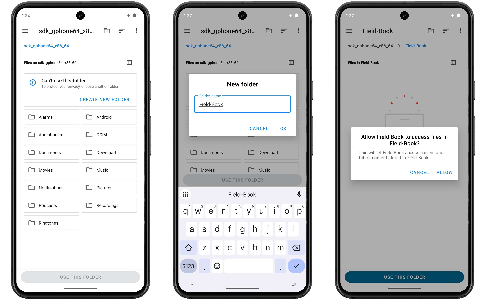

<link rel="stylesheet" type="text/css" href="_styles/styles.css">

# Storage

# Setup

Defining a **Storage location** where files will be saved is a required step when setting up Field Book.
You can select an existing folder or create a new one.
The selected **Storage location** can be changed in the  [Storage Settings](settings-storage.md).

<figure class="image">
   
  <figcaption class="screenshot-caption"><i>Creating a new folder for storage</i></figcaption> 
</figure>

# Subfolders

Field Book will create the following subfolders within the selected **Storage location** folder:

- `field_import`: contains files to be imported into Field Book
- `field_export`: contains exported data files
- `plot_data`: contains data associated with plots (e.g., audio, photos)
- `resources`: allows the user to access photos/documents while collecting data (e.g., rating scales, field maps)
- `database`: contains automatic and manual database export files
- `trait`: contains trait files and the disease rating customizable scale
- `archive`: stores backups when exported fields are overwritten
- `geonav`: stores log files created from the GeoNav feature

# File transfer

To add your own files, you can manually transfer files from a computer by connecting your Android device via a USB cable and changing its USB mode to allow file transfer.
Each device manufacturer has slight variations for this process, but it is generally accessible from the notifications drawer.

<figure class="image">
   
  <figcaption class="screenshot-caption"><i>Example settings for USB file transfer</i></figcaption> 
</figure>

# Internal database

Field Book uses an internal SQLite database to store imported and collected.
The database schema is modelled after the Breeding API (BrAPI) standard, and is documented in the [Field Book Wiki](https://github.com/PhenoApps/Field-Book/wiki)

The database is automatically backed up to the `database` folder at regular intervals and can be manually exported and imported in  [Storage Settings](settings-storage.md).
This feature can also be used to transfer data between devices or for troubleshooting.
