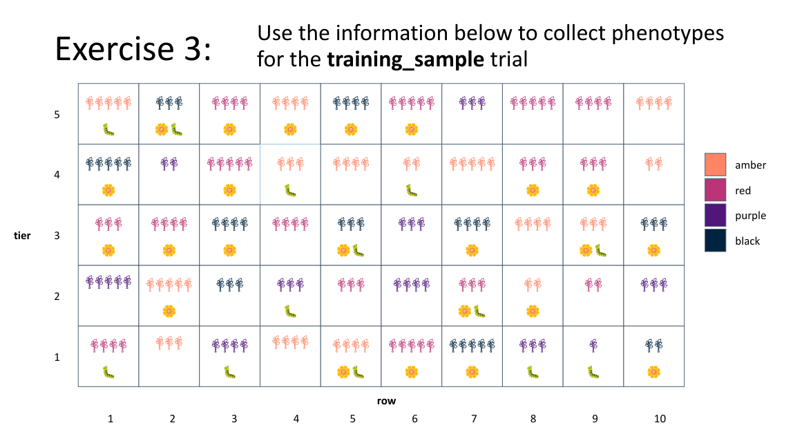

<link rel="stylesheet" type="text/css" href="_styles/styles.css">

# Training Resources

In addition to this documentation, we have created training materials that can be used to introduce Field Book to breeders and technicians or to bring existing users up-to-speed with new features. This [training presentation](https://docs.google.com/presentation/d/1Milb9mO_LNtLmgo4AQYH7nQ-9E428gGv/edit?usp=sharing&ouid=109819954855460677835&rtpof=true&sd=true) introduces Field Book's core features and key settings with accompanying excercises.

The exercises in the the training slides are based on the `training_sample.csv` field file which is copied into the `field_import` folder on install and is imported as part of the training.

<figure class="image">
   
  <figcaption class="screenshot-caption"><i>The training sample field in exercise 3</i></figcaption> 
</figure>
