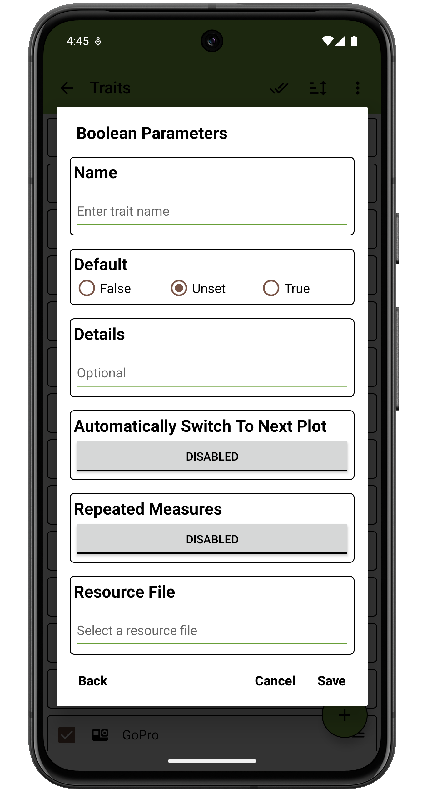
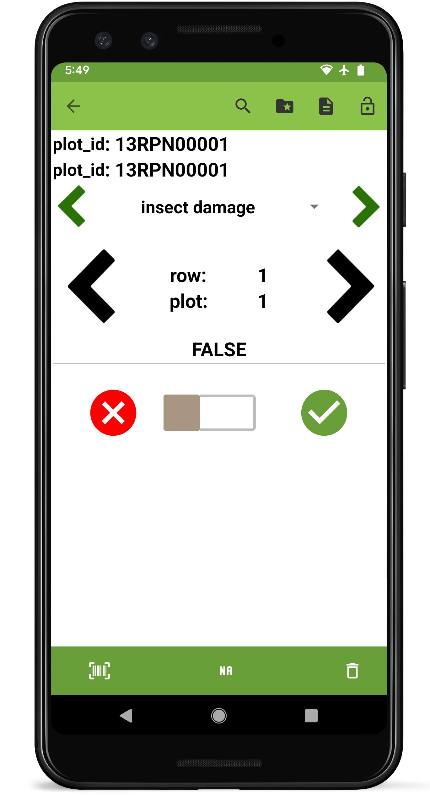

 Boolean Trait
===============================================================================

Overview
--------

The Boolean trait format is used to record TRUE/FALSE values. It is
created with a trait name, default value, and optional details. On the
collect page you can toggle between TRUE and FALSE as needed. Details
text is displayed under the trait name on the collect page.

Creation
--------

<figure align="center" class="image">
   
  <figcaption><i>Boolean trait creation dialog</i></figcaption> 
</figure>

Collect layout
--------------

<figure align="center" class="image">
   
  <figcaption><i>Boolean trait collection interface</i></figcaption> 
</figure>