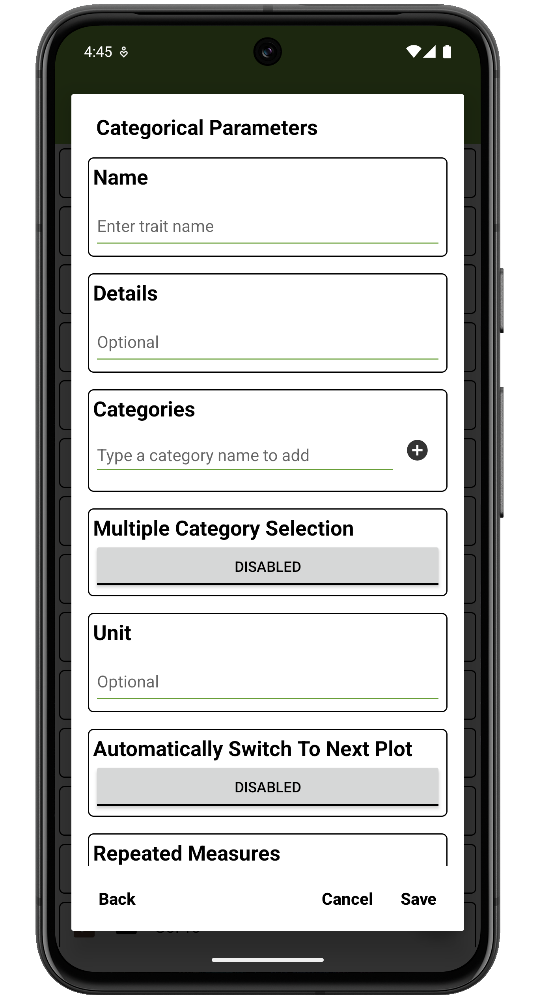
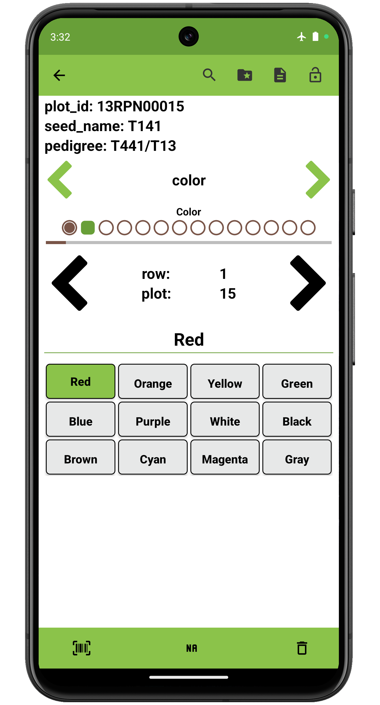

 Categorical Trait
======================================================================================

Overview
--------

The categorical trait format is used when trait values fall into a set
of discrete categories. Categories are invidiually added in the
`Categories` section of the create screen. Details text is displayed
under the trait name on the collect page.

Defined categories are displayed as buttons on the collect screen; a
single category can be selected per entry.

Creation
--------

<figure align="center" class="image">
   
  <figcaption><i>Categorical trait creation dialog</i></figcaption> 
</figure>

Collect layout
--------------

<figure align="center" class="image">
   
  <figcaption><i>Categorical trait collection interface</i></figcaption> 
</figure>