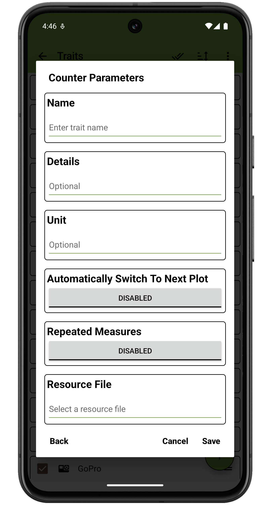
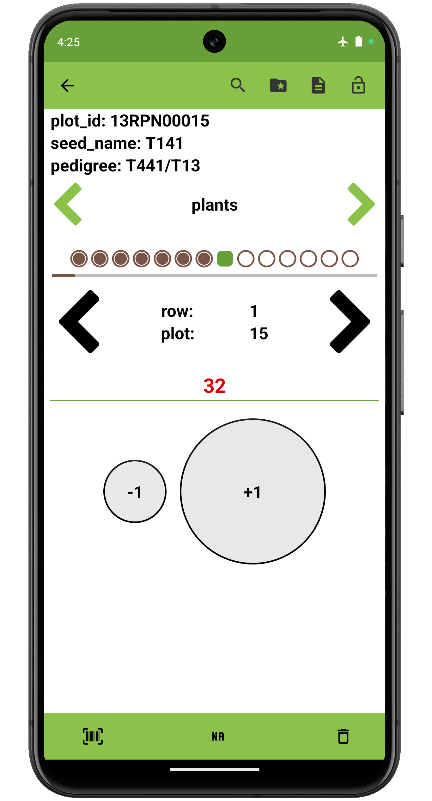

 Counter Trait
=====================================================================================

Overview
--------

The counter trait format is used to count numeric integer data, starting
from zero. It is created with a trait name and optional details.

On the collect screen, the counter starts at zero and can be incremented
or decremented via the **+1** and **-1** buttons.

Creation
--------

<figure align="center" class="image">
   
  <figcaption><i>Counter trait creation dialog</i></figcaption> 
</figure>

Collect layout
--------------

<figure align="center" class="image">
   
  <figcaption><i>Counter trait collection interface</i></figcaption> 
</figure>