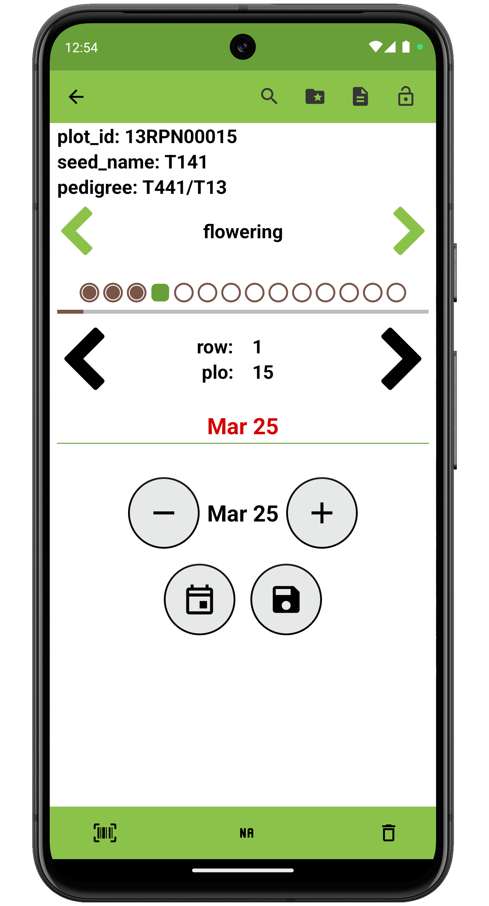

 Date Trait
===========================================================================

Overview
--------

The date trait format is used to record dates. Details text is displayed
under the trait name on the collect page.

On the collect screen, the current date is displayed by default and can
be incremented forwards or backwards in single day intervals. A calendar
date picker allows selection of a specific date.

Creation
--------

<figure align="center" class="image">
   
  <figcaption><i>Date trait creation dialog</i></figcaption> 
</figure>

Collect layout
--------------

<figure align="center" class="image">
   
  <figcaption><i>Date trait collection interface</i></figcaption> 
</figure>

Press the bottom calendar icon to open the date picker

<figure align="center" class="image">
   
  <figcaption><i>The calendar date picker</i></figcaption> 
</figure>
