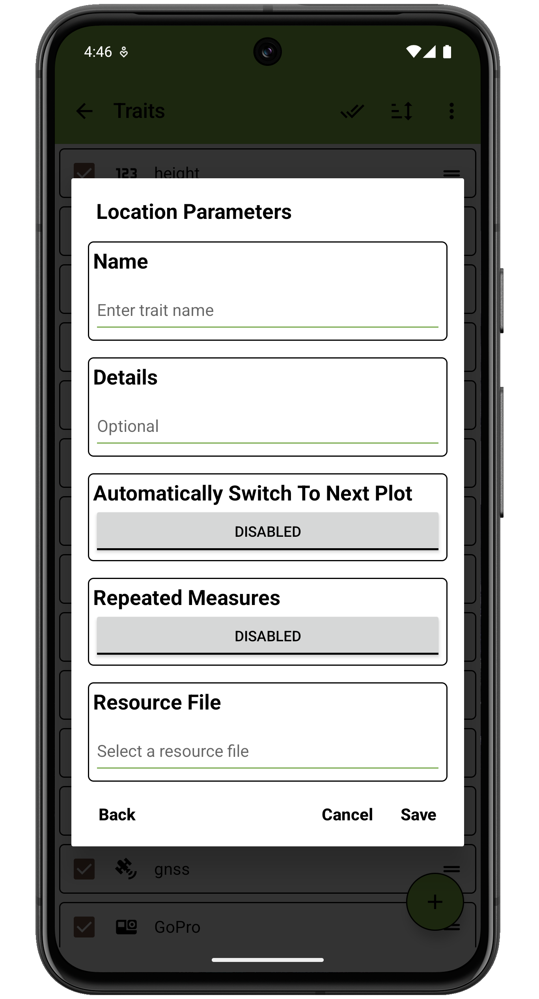
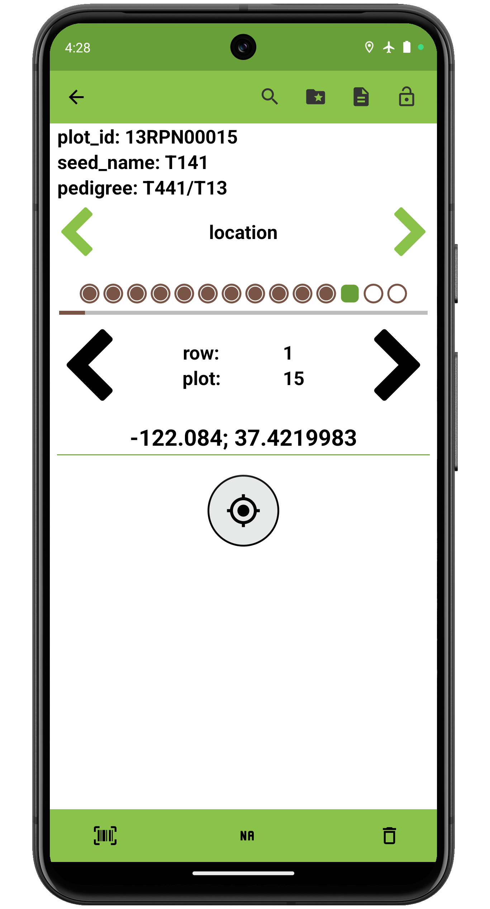

 Location Trait
===================================================================================

Overview
--------

The location trait is used to record the GPS coordinates of the device.
It is created with a trait name and optional details.

On the collect page, pressing the

button will record the current latitude and longitude. If the device is
connected to an external location source, the coordinates from this
source will be used instead of the device's internal GPS.

Creation
--------

<figure align="center" class="image">
   
  <figcaption><i>Location trait creation dialog</i></figcaption> 
</figure>

Collect layout
--------------

<figure align="center" class="image">
   
  <figcaption><i>Location trait collection interface</i></figcaption> 
</figure>
