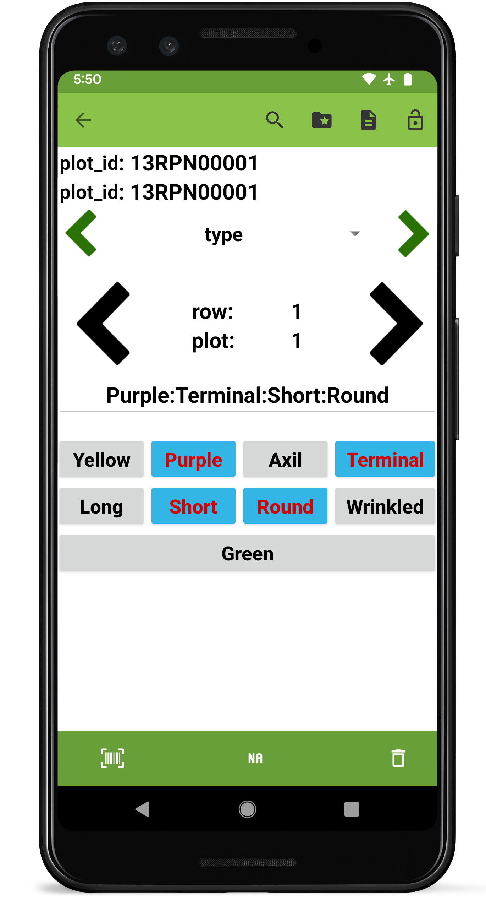

 Multicat Trait
===============================================================================

Overview
--------

The categorical trait format is used when trait values fall into a set
of discrete categories. Categories are invidiually added in the
`Categories` section of the create scren. Categories within a multicat
trait must be unique. Details text is displayed under the trait name on
the collect screen.

Defined categories will be displayed as buttons on the collect screen.
Multiple categories can be selected per entry.

Creation
--------

<figure align="center" class="image">
   
  <figcaption><i>Multicat trait creation dialog</i></figcaption> 
</figure>

Collect layout
--------------

<figure align="center" class="image">
   
  <figcaption><i>Multicat trait collection interface</i></figcaption> 
</figure>
