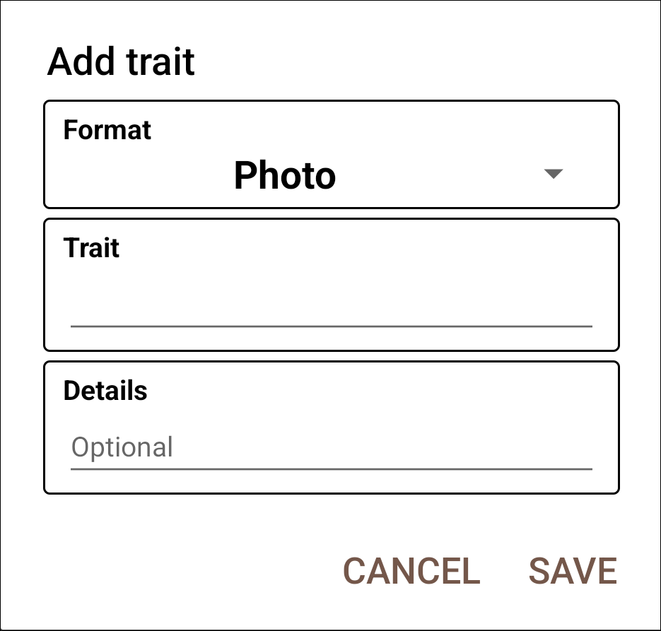
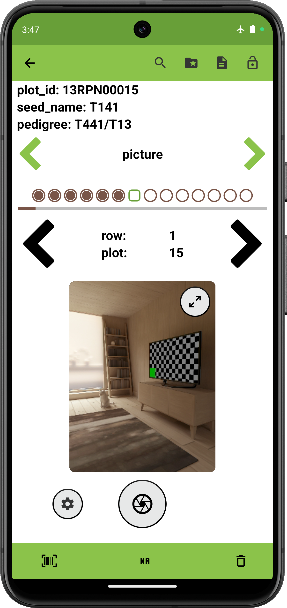

 Photo Trait
=====================================================================

Overview
--------

The photo trait format is used to capture images. It is created with a
trait name and optional details.

On the collect page, the camera icon opens the device camera to capture
images. Multiple photos can be captured for each entry. 

Captured photos are stored in `.jpg` format, and named by using underscores to join the entry's unique_id, the trait name, the photo number, and a timestamp. The resulting files are stored in a picture folder within a field-specific subfolder of `plot_data`. An example photo filepath would be `plot_data/FIELD_NAME/picture/PHOTO_FILE_NAME.jpg`.

Creation
--------

<figure align="center" class="image">
   
  <figcaption><i>Photo trait creation dialog</i></figcaption> 
</figure>

Collect layout
--------------

<figure align="center" class="image">
   
  <figcaption><i>Photo trait collection interface</i></figcaption> 
</figure>
