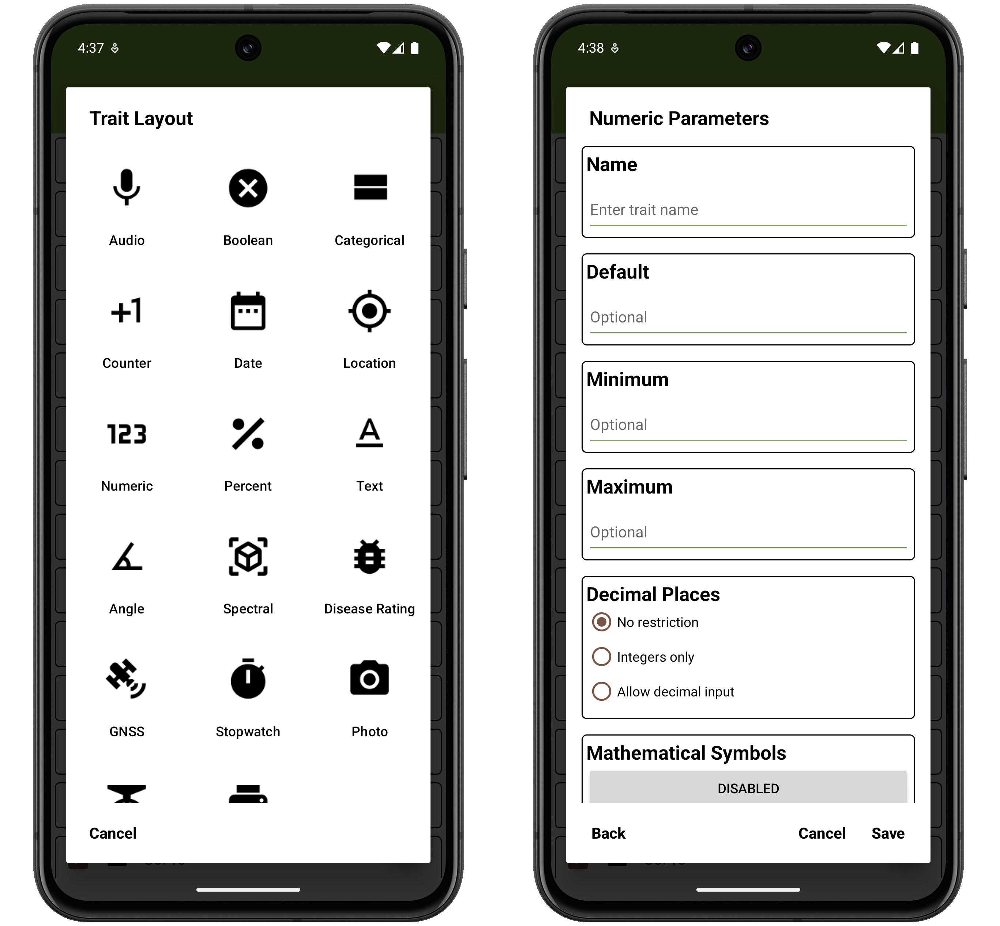
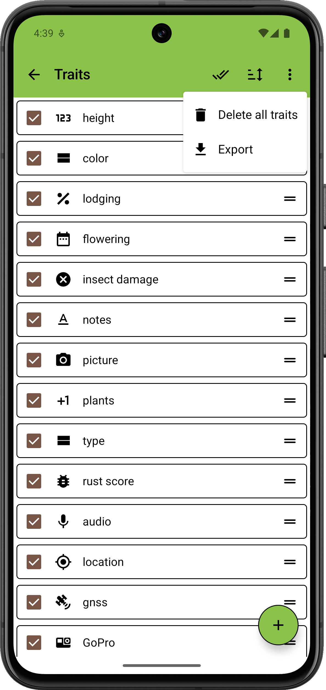
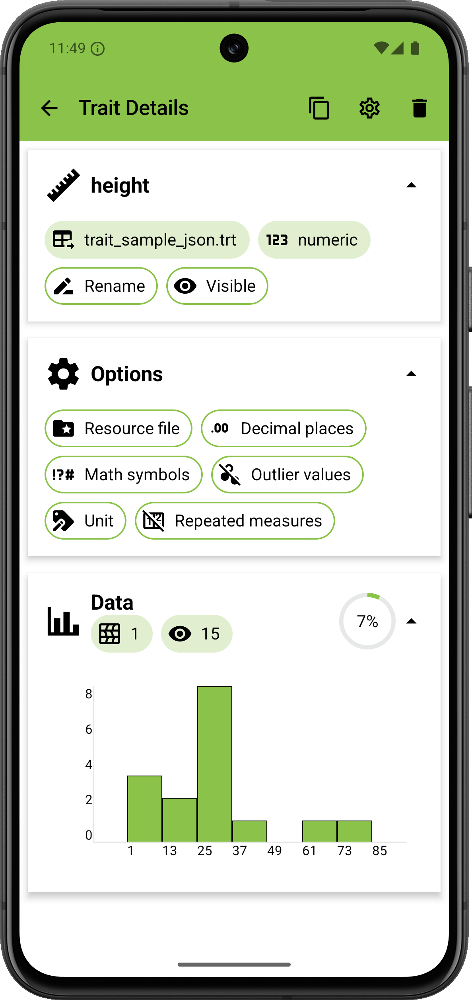
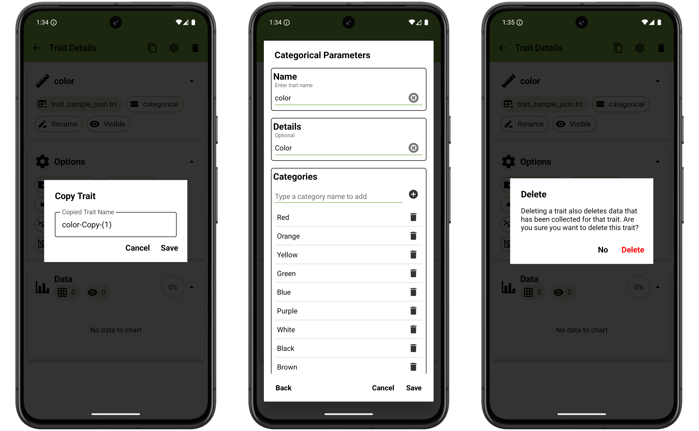
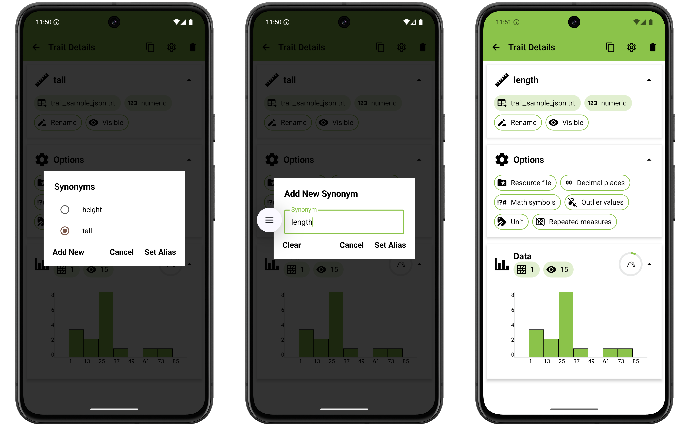

<link rel="stylesheet" type="text/css" href="_styles/styles.css">

# Traits

## Overview

Data is collected in Field Book by defining different traits.
Each trait layout is optimized to collect a specific data type.
Traits can be created and managed in the Traits screen.
Trait names and aliases must be unique.

<figure class="image">
   
  <figcaption class="screenshot-caption"><i>The Traits screen layout with sample data loaded</i></figcaption> 
</figure>

## Creating a Trait

Traits are created by pressing the  icon in the bottom right corner of the Traits screen.
Select a format, then fill in the trait parameters in the format-specific dialog.
Each trait has a `format`, a `name`, optional `details`, `resource-file`, and format-dependent fields such as `min`, `max`, and `default`.

<figure class="image">
   
  <figcaption class="screenshot-caption"><i>Creation of a <a href="#traits/trait-numeric">Numeric</a> trait</i></figcaption> 
</figure>

## Managing Traits

Existing traits can be managed using the following features:

#### Single trait changes

- **Reorder** an individual trait by long-pressing and dragging the  icon.
- **Copy**, **Edit**, or **Delete** an individual trait in the [trait details](#trait-details).
- Set an individual trait to be **Visible** or **Hidden** in the  [Collect](collect.md) screen by toggling the checkbox on each trait line.

#### All trait changes

Actions that apply to all traits can be initiated from the top toolbar.

- Make all traits **Visible** or **Invisible** by pressing the  icon.
- Reorder all traits by pressing the  icon in the toolbar and selecting one of the sort criteria (options include trait `Name`, `Format`, `Import Order`, and `Visibility`).
- Select **Delete all traits** from the menu to remove every trait in the list.
- Select **Export** from the menu to export the current traits to a file.

<figure class="image">
   
  <figcaption class="screenshot-caption"><i>All traits mangement menu</i></figcaption> 
</figure>

Trait imports and exports can be loaded from [local storage](fields.md#local-storage) or [cloud sources](fields.md#cloud-storage). 
Trait lists are exported as `.trt` files in the `trait` folder.
It is not recommended to manually edit these files.

You will be prompted to check whether you want to export and/or delete all the existing traits when importing traits from a file.

For information about importing traits using BrAPI, see the [BrAPI](brapi.md) section of the documentation.

## Trait Details

Pressing a trait item in the traits list opens a Trait Detail screen.

<figure class="image">
   
  <figcaption class="screenshot-caption"><i>Trait Detail Page</i></figcaption> 
</figure>

The toolbar in each trait details page has the following options:

-  Creates a copy of the current trait with the exact same attributes.
Opens up a dialog which takes input for the new trait name.
-  Opens a dialog with existing attributes that can be edited.
-  Will delete the trait after user confirmation.

<figure class="image">
   
  <figcaption class="screenshot-caption"><i>Trait detail toolbar button results</i></figcaption> 
</figure>

The top card includes metadata about the trait (import source, format, visibility).  
Renaming trait will change the name displayed (alias) for the field throughout the app.
The format chip can be used to change the trait format if no data has been collected.
Trait visibility can be toggled by clicking on the visibility chip.

<figure class="image">
   
  <figcaption class="screenshot-caption"><i>Setting a new trait alias</i></figcaption> 
</figure>

The Options card includes format-specific settings.
Trait parameters that can be toggled (eg. `Mathematical Symbols` and `Allow Invalid Value` parameters in <a href="#traits/trait-numeric">Numeric trait</a>) can be toggled by pressing the chip, with the icon displaying the current setting.
Other trait parameters will display a dialog for additional input or interaction.

The Data card summarizes data that has been collected for the trait.
-  denotes the number of fields where an observation was recorded.
-  denotes the total number of observations.
- The progress indicator denotes the percent of entries with values across the fields.

The chart displays a histogram or graph of the observations.

## Repeated Measures

Repeated measures can be enabled for traits during trait creation or in the [trait detail](#trait-details) screen.
When enabled, a plus symbol appears next to the trait value entry box on the Collect screen.

<figure class="image">
   
  <figcaption class="screenshot-caption"><i>Collect screen value entry with repeated measurements enabled</i></figcaption> 
</figure>

When pressed it creates a new box to collect additional phenotypes on the same entry for the same trait.

!> To export data that includes repeated measures make sure to choose the **Database** format or to use **BrAPI**.
These formats allow repeated measures to be differentiated by timestamp.
If exporting in **Table** format, only the most recent measurement will be included.