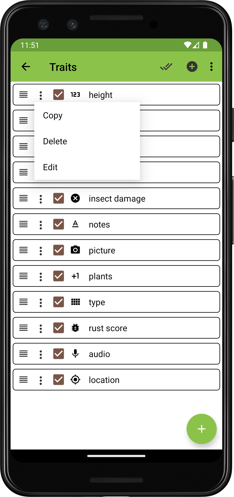

<link rel="stylesheet" type="text/css" href="_styles/styles.css">

# Traits

## Overview

Data is collected in Field Book by defining different traits.
Each trait layout is optimized to collect a specific data type.
Traits can be created and managed in the Traits screen.

<figure class="image">
   
  <figcaption class="screenshot-caption"><i>The Traits screen layout with sample data loaded</i></figcaption> 
</figure>

## Creating a Trait

Traits are created by pressing the  icon in the bottom right corner of the Traits screen.
Select a format, then fill in the trait parameters in the format-specific dialog.
Each trait has a `format`, a trait `name`, optional `details`, and format-dependent fields such as `min`, `max`, and `default`.
Trait names must be unique.

<figure class="image">
   
  <figcaption class="screenshot-caption"><i>Creation of a <a href="#traits/trait-numeric">Numeric</a> trait</i></figcaption> 
</figure>

## Managing Traits

Existing traits can be manipulated using the following features:

#### Single trait changes

- **Reorder** an individual trait by pressing and dragging the  icon.
- **Copy**, **Edit**, or **Delete** an individual trait by pressing the  icon on its trait line and selecting the desired operation.
- Set an individual trait to be **Active** or **Inactive** in the  [Collect](collect.md) screen by checking/unchecking the checkbox on each trait line.

<figure class="image">
   
  <figcaption class="screenshot-caption"><i>Single trait management menu</i></figcaption> 
</figure>

#### All trait changes

Actions that apply to all traits can be initiated from the top toolbar.

- Make all traits **Visible** or **Invisible** by pressing the  icon.
- Reorder all traits by pressing the  icon in the toolbar and selecting one of the sort criteria (options include trait `Name`, `Format`, `Import Order`, and `Visibility`).
- Select **Delete all traits** from the menu to remove every trait in the list.
- Select **Import/Export** from the menu to load new traits into Field Book or to export the current traits to a file.

<figure class="image">
   
  <figcaption class="screenshot-caption"><i>All traits mangement menu</i></figcaption> 
</figure>

Trait imports and exports are similar to field imports and can be lodaed from [local storage](fields.md#local-storage) or [cloud sources](fields.md#cloud-storage). 
Trait lists are exported as `.trt` files in the `trait` folder.
It is not recommended to manually edit these files.

For information about importing traits using BrAPI, see the [BrAPI](brapi.md) section of the documentation.