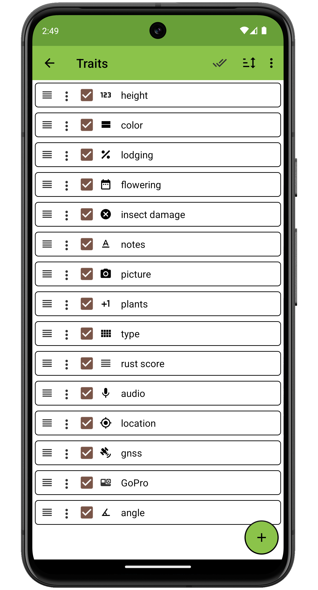

Traits
======

Overview
--------

Data is collected in Field Book by defining different traits. Each trait
layout is optimized for a specific type of data collection. The traits
screen allows new traits to be defined and existing traits to be
managed.

<figure align="center" class="image">
   
  <figcaption><i>The Traits screen layout with sample data
loaded</i></figcaption> 
</figure>

Creating a Trait
----------------

Traits can be created by pressing the large  icon at the
bottom right of the screen. Select a format, then fill in the required fields in the format-specific dialog. Trait names must be unique. Each trait has a `format`, a trait `name`, optional `details`, and
format-dependent fields such as `min`, `max`, and `default`.

<figure align="center" class="image">
   
  <figcaption><i>Trait creation for a <a href="#/trait-numeric">Numeric</a> trait, and other format options</i></figcaption> 
</figure>

Managing Traits
---------------

Once created, traits can be manipulated using the following features:

#### Single trait changes

- **Reorder** an individual trait by pressing and dragging the  icon on the far left of its trait line.

- **Copy**, **Edit**, or **Delete** an individual trait by pressing the  icon on its trait line, then selecting the desired operation from a list.

- Set an individual trait to be **Visible** or **Invisible** on the [Collect](collect.md) screen by checking/unchecking the checkbox on each trait line.

<figure align="center" class="image">
   
  <figcaption><i>Single trait management menu</i></figcaption> 
</figure>

#### All trait changes

- Make all traits **Visible** or **Invisible** by pressing the  icon in the toolbar.

- Reorder all traits by pressing the  icon in the toolbar, and then selecting one of the sort criterion (options include trait `Name`, `Format`, `Import Order`, and `Visibility`)

- Open the trait **Menu** using the  icon on right side of the toolbar to access additional operations affecting all traits.
  
- Select **Delete all traits**, then confirm, to remove every trait in the list.
  
- Select **Import/Export** to load new traits into Field Book and/or to save the current traits to a file.

<figure align="center" class="image">
   
  <figcaption><i>All traits mangement menu</i></figcaption> 
</figure>

Trait imports and exports are similar to field imports/exports in that
they rely on files stored in a dedicated folder (Local Storage), or on using the device file manager to select a trait file anywhere on the device, including from cloud utilities like Google Drive (Cloud Storage).

BrAPI imports are accessed separately, in the create trait workflow. First make sure BrAPI is enabled and configured in the  [Brapi settings](settings-brapi.md)

Then the BrAPI Display Name of the server you connected to will show up as the last format choice in the list when you press the create trait icon in the bottom right of the screen. Check out the  [BrAPI](brapi.md) section of the documentation for details of the trait import process, as well as field import, sync, and data export.

?> When using local storage, trait lists are stored as `.trt` files in the
`trait` folder. Technically `.trt` files are just `.csv` files with the extension renamed; exported `.trt` files can be opened as `.csv` if desired. However it is not recommended to manually edit and reimport these files, trait edits are best done within the application.
