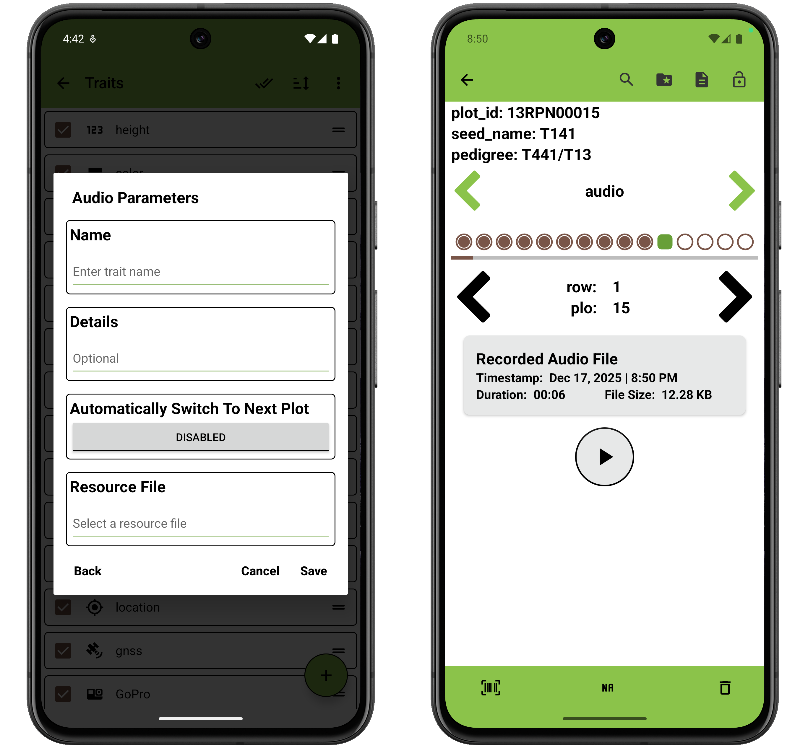

<link rel="stylesheet" type="text/css" href="_styles/styles.css">

#  Audio Trait

The audio trait format is used to record audio.
It is created with a `name` and optional `details`.
Details text is displayed under the trait name on the Collect screen.

On the Collect screen, press the  button to begin recording audio.
Press the  button to stop recording.
Press the  button to play back the audio that has been recorded.

Recorded audio files are stored in `.mp3` format, and named with the entry's `unique id` and a
timestamp.
The resulting files are stored in an audio folder within a field-specific subfolder of `plot_data`.
An example audio filepath would be `plot_data/FIELD_NAME/audio/AUDIO_FILE_NAME.mp3`.

<figure class="image">
   
  <figcaption class="screenshot-caption"><i>Audio trait creation dialog and collect format</i></figcaption> 
</figure>