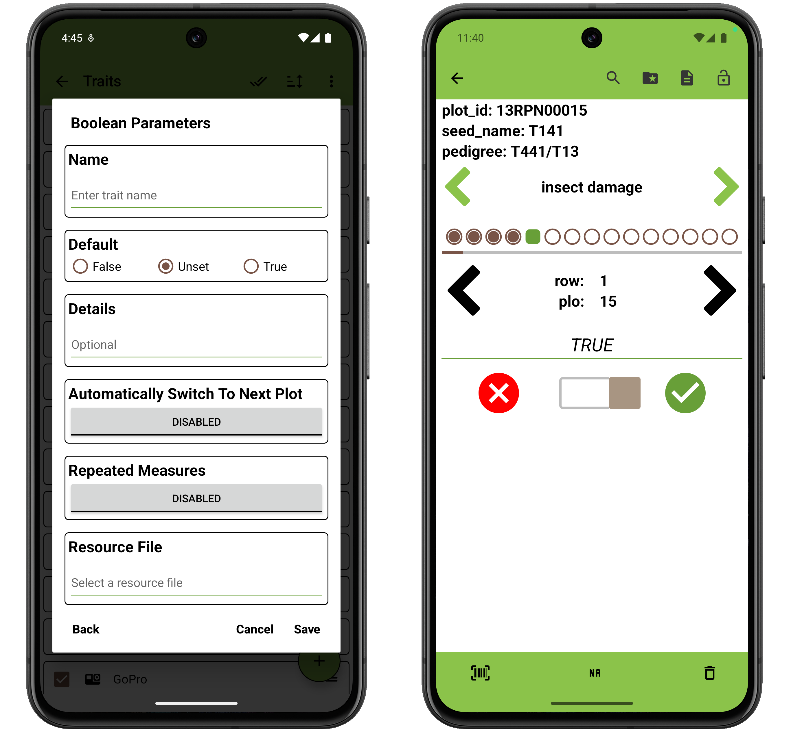

<link rel="stylesheet" type="text/css" href="../_styles/styles.css">

#  Boolean Trait

The Boolean trait format is used to record `TRUE`/`FALSE` values.
On the Collect screen you can toggle between `TRUE` and `FALSE`.

### Parameters
- `Name` assign a value for trait name, alias, and assigns synonyms list to hold the value.
- `Default` value can be set to False, True, or even Unset to avoid storing a boolean value by default.
- `Details` text is displayed under the trait name on the Collect screen.
- `Automatically Switch to Next Plot` when enabled will immediately move to next entry when the user records an observation for an entry in the Collect screen.
- `Repeated Measures` turns on repeated measure for the trait when enabled.
- `Resource File` opens the resources folder and can be used to set a image for the trait that can be reference later in the Collect screen.

On the collect screen, deleting an observation for a entry will set the seekbar to unset state and vice versa.

<figure class="image">
   
  <figcaption class="screenshot-caption"><i>Boolean trait creation dialog and collect format</i></figcaption> 
</figure>