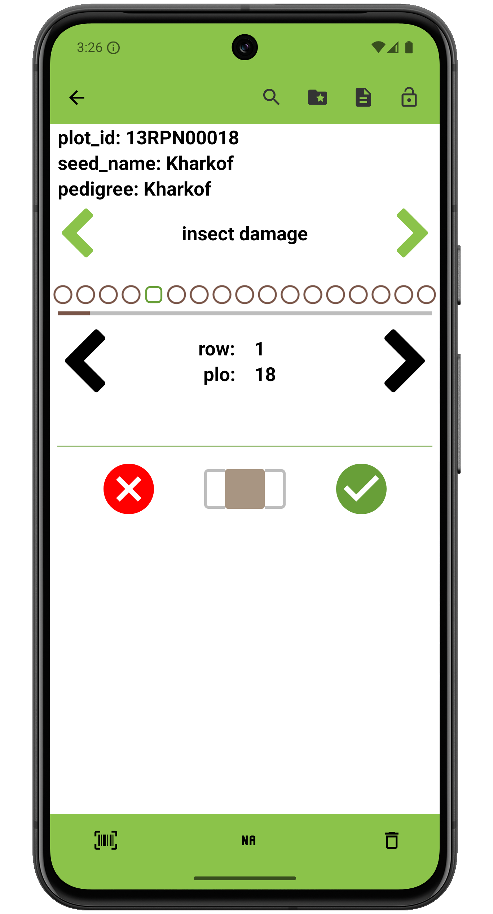

<link rel="stylesheet" type="text/css" href="../_styles/styles.css">

#  Boolean Trait

The Boolean trait format is used to record `TRUE`/`FALSE` values.
On the Collect screen you can toggle between `TRUE`, `UNSET`, and `FALSE`.

### Parameters
- `Name` assign a value for trait name.
- `Default` value can be set to False, True, or Unset.
- `Details` text is displayed under the trait name on the Collect screen.
- `Automatically Switch to Next Plot` toggles immediately moving to next entry when the user records an observation for an entry in the Collect screen.
- `Repeated Measures` toggles repeated measure for the trait.
- `Resource File` sets an image for the trait that will be opened by default when accessing resources from Collect.

On the collect screen, deleting an observation will move the view to its unset state.

<figure class="image">
   
  <figcaption class="screenshot-caption"><i>Boolean trait creation dialog and collect format</i></figcaption> 

</figure><figure class="image">
   
  <figcaption class="screenshot-caption"><i>Intitial entry state when boolean default is unset</i></figcaption> 
</figure>