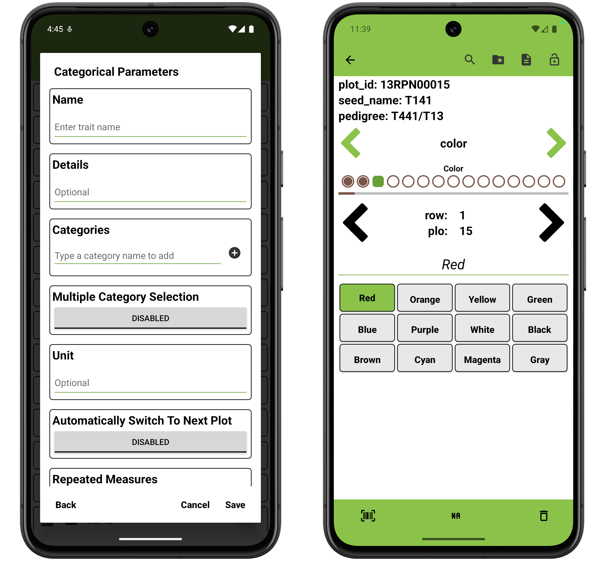
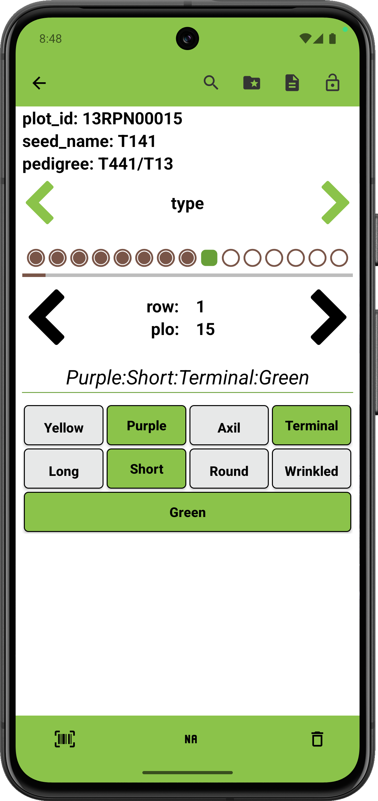

<link rel="stylesheet" type="text/css" href="../_styles/styles.css">

#  Categorical Trait

The categorical trait format is used when trait values fall into a set of discrete categories.

### Parameters
- `Name` assign a value for trait name, alias, and assigns synonyms list to hold the value.
- `Details` text is displayed under the trait name on the Collect screen.
- `Categories` represents the individual unqiue categories.
- `Multiple Category Selection` can be set to allow single or multiple category selection for each entry. 
- `Unit` text can be set to denote the unit for the observation.
- `Automatically Switch to Next Plot` when enabled will immediately move to next entry when the user records an observation for an entry in the Collect screen.
- `Repeated Measures` turns on repeated measure for the trait when enabled.
- `Resource File` opens the resources folder and can be used to set a image for the trait that can be reference later in the Collect screen.

Defined categories are displayed as buttons on the Collect screen.

<figure class="image">
   
  <figcaption class="screenshot-caption"><i>Categorical trait creation dialog and collect format</i></figcaption> 
</figure>

<figure class="image">
   
  <figcaption class="screenshot-caption"><i>Categorical trait with multicat enabled</i></figcaption> 
</figure>