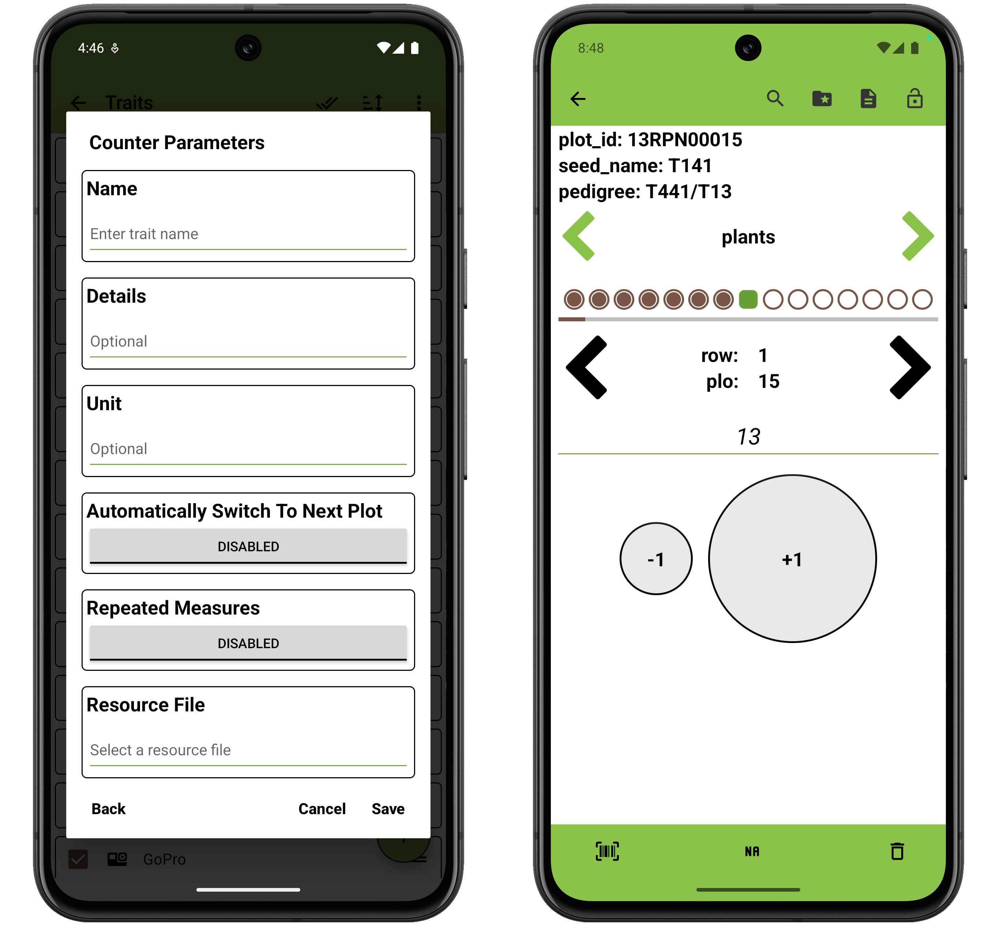

<link rel="stylesheet" type="text/css" href="../_styles/styles.css">

#  Counter Trait

The counter trait format is used to count numeric integer data, starting from zero.

### Parameters
- `Name` assign a value for trait name.
- `Details` text is displayed under the trait name on the Collect screen.
- `Unit` text can be set to denote the unit for the observation.
- `Automatically Switch to Next Plot` toggles immediately moving to next entry when the user records an observation for an entry in the Collect screen.
- `Repeated Measures` toggles repeated measure for the trait.
- `Resource File` sets an image for the trait that will be opened by default when accessing resources from Collect.

On the Collect screen, the counter starts at zero and can be incremented or decremented via the **+1** and **-1** buttons.

<figure class="image">
   
  <figcaption class="screenshot-caption"><i>Counter trait creation dialog and collect format</i></figcaption> 
</figure>