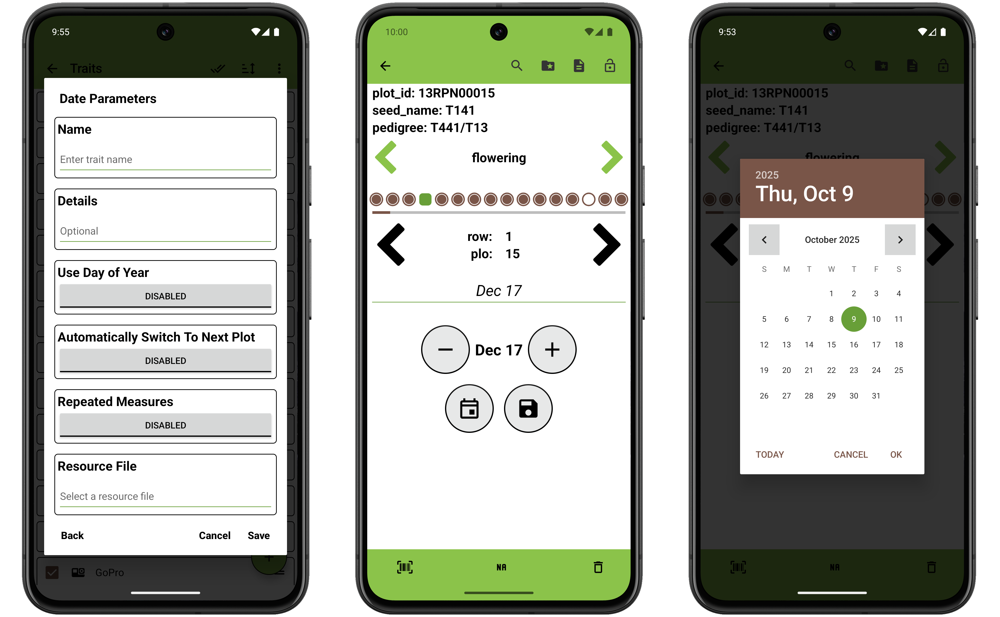

<link rel="stylesheet" type="text/css" href="_styles/styles.css">

#  Date Trait

The date trait format is used to record dates.
Details text is displayed under the trait name on the Collect screen.

On the Collect screen, the current date is displayed by default and can be incremented forwards ( **+** ) or backwards ( **-** ) in single day intervals.
The calendar button will open a date picker to select a specific date.

<figure class="image">
   
  <figcaption class="screenshot-caption"><i>Date trait creation dialog, collect format, and date picker</i></figcaption> 
</figure>
