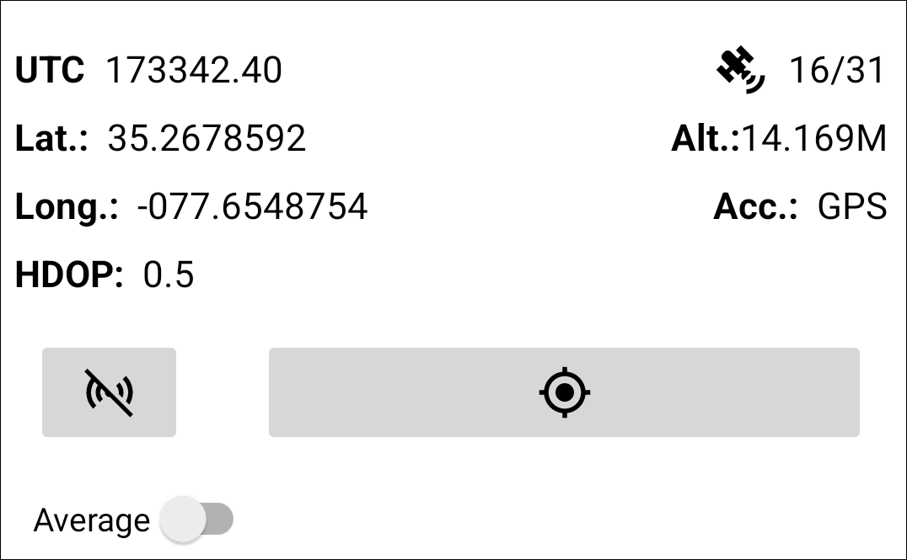
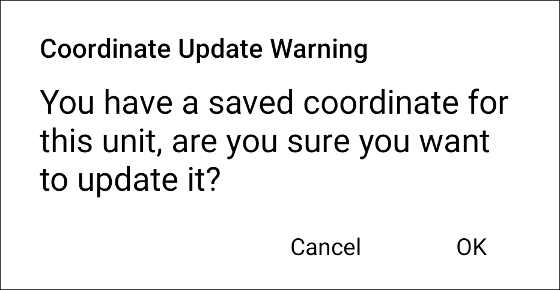

<link rel="stylesheet" type="text/css" href="../_styles/styles.css">

#  GNSS Trait

## Overview

The GNSS trait format is used to acquire high-precision geocoordinates from an external, Bluetooth-connected device.
While other traits only capture phenotypic data, the GNSS trait is intended to be used to also capture entry metadata that can be used in conjunction with the [Geonav](geonav.md) feature to automatically navigate through the field.

<figure class="image">
   
  <figcaption class="screenshot-caption"><i>GNSS trait creation dialog and collect format</i></figcaption> 
</figure>

## Details

When first navigating to a GNSS trait, the Collect screen will display a  button that will list devices that can be used in conjunction with this trait.

<figure class="image">
   
  <figcaption class="screenshot-caption"><i>GNSS device select dialog</i></figcaption> 
</figure>

Once a device is selected, the screen will display values from the GNSS receiver output including latitude and longitude coordinates, current Coordinated Universal Time (UTC), the Horizontal Dilution of Precision (HDOP, a measure of the suitability of satellite positioning in the sky, ideally 1 or below), the number of available satellites, the altitude, and accuracy.

<figure class="image">
   
  <figcaption class="screenshot-caption"><i>GNSS receiver output</i></figcaption> 
</figure>

Pressing  will record an instantaneous GNSS reading.
Toggling the average option will record an average of incoming location data for 5s, 10s, or manually (whereby all manually collected location points are averaged to create a representative value).

<figure class="image">
   
  <figcaption class="screenshot-caption"><i>GNSS average options</i></figcaption> 
</figure>

Attempting to overwrite saved coordinates will display a warning dialog to confirm that existing coordinates will be lost.

<figure class="image">
   
  <figcaption class="screenshot-caption"><i>GNSS update warning</i></figcaption> 
</figure>

If errors occur while collecting GNSS data (e.g., socket cannot be established), users may have to manually disconnect/reconnect to the external device.