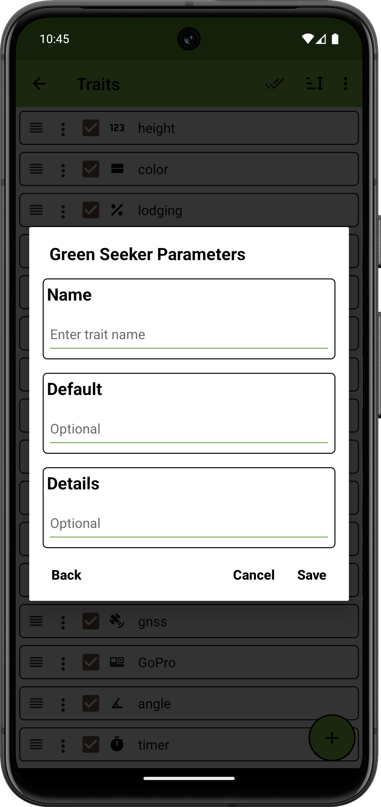
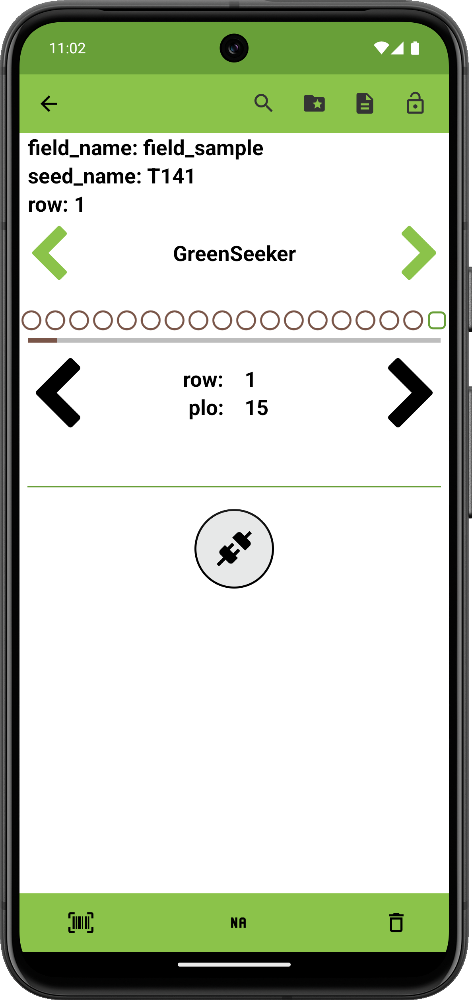
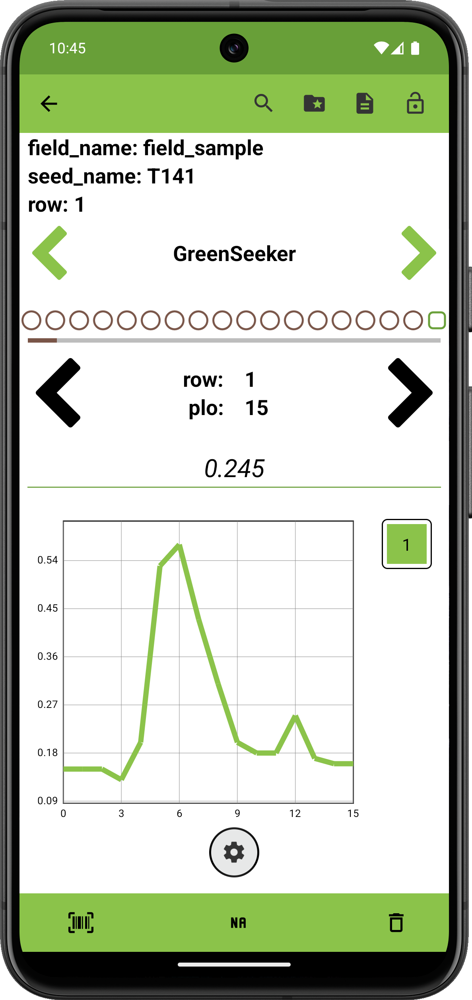

<link rel="stylesheet" type="text/css" href="../_styles/styles.css">

#  GreenSeeker Trait

## Overview

This trait format supports [GreenSeeker](https://ww2.agriculture.trimble.com/product/greenseeker-handheld-crop-sensor/) devices that allow users to capture NDVI (Normalized Difference Vegetation Index) values to measure plant health.
The GreenSeeker emits light in the red and near-infrared regions of the spectrum and measures the amount of light reflected back to the sensor.

Please refer to the [datasheet](https://ww2.agriculture.trimble.com/wp-content/uploads/2022/03/022503-1487B-en-US_GreenSeeker_Handheld_Crop_Sensor_DS_USL_0222_LR.pdf) provided by Trimble for more information on the GreenSeeker device and NDVI.

## Creation

#### Parameters
- `Name` assign a value for trait name.
- `Default` automatically assigns a specific value for the observation when visiting an entry having no observation recorded previously.
- `Details` text is displayed under the trait name on the Collect screen.
- `Automatically Switch to Next Plot` toggles immediately moving to next entry when the user records an observation for an entry in the Collect screen.
- `Repeated Measures` toggles repeated measure for the trait.
- `Resource File` sets an image for the trait that will be opened by default when accessing resources from Collect.

<figure class="image" style="text-align: center">
    

      
      
    

</figure>

## Connect

Press the connect button to scan and connect to a compatible device.

<figure class="image" style="text-align: center">
    

      
    

</figure>

## Collect

Once a device is connected, a settings button and graph view are displayed.
Scans are visually displayed on the graph.
Selecting an individual scan will highlight the corresponding line on the graph.
Each point in the graph represents a single 0-0.99 NDVI reading.
The average of the scan is shown above the graph.
Long-pressing the scan number allows users to save a text comment about the specific scan.
The settings button opens a dialog that shows device information and allows the hardware to be disconnected.

<figure class="image">
      
</figure>

## Export

| plot_id    | value | trait       |
|------------|-------|-------------|
| 13RPN00001 | 0.012 | GreenSeeker |
| 13RPN00001 | 0.3   | GreenSeeker |
| 13RPN00002 | 0.5   | GreenSeeker |

Exported files will display collected averages as the trait value.
A separate file also contains every NDVI value that was captured as part of each scan.
Bundling media during export will automatically include the `GreenSeeker_spectral_file.csv` that contains the NDVI values.

| sample_name | device_id           | device_name | comments | created_at           | average | 0.0  | 1.0  | 2.0  | 3.0  | 4.0  | 5.0  |
|-------------|---------------------|-------------|----------|----------------------|---------|------|------|------|------|------|------|
| 13RPN00008  | 18:04:ED:39:7C:A2   | GreenSeeker |          | 07-31-25 14:38:12    | 0.088   | 0.1  | 0.1  | 0.07 | 0.1  | 0.09 | 0.07 |
| 13RPN00008  | 18:04:ED:39:7C:A2   | GreenSeeker |          | 07-31-25 14:38:14    | 0.109   | 0.13 | 0.09 |      |      |      |      |
| 13RPN00008  | 18:04:ED:39:7C:A2   | GreenSeeker |          | 07-31-25 14:38:17    | 0.081   | 0.08 | 0.12 | 0.06 | 0.07 | 0.08 |      |
| 13RPN00008  | 18:04:ED:39:7C:A2   | GreenSeeker |          | 07-31-25 14:38:21    | 0.103   | 0.12 | 0.09 | 0.1  |      |      |      |
| 13RPN00008  | 18:04:ED:39:7C:A2   | GreenSeeker |          | 07-31-25 14:38:25    | 0.098   | 0.1  | 0.11 | 0.09 | 0.09 | 0.1  |      |
| 13RPN00009  | 18:04:ED:39:7C:A2   | GreenSeeker |          | 07-31-25 14:38:44    | 0.088   | 0.09 | 0.08 | 0.08 | 0.09 | 0.1  |      |
| 13RPN00009  | 18:04:ED:39:7C:A2   | GreenSeeker |          | 07-31-25 14:38:49    | 0.100   | 0.1  |      |      |      |      |      |
| 13RPN00009  | 18:04:ED:39:7C:A2   | GreenSeeker |          | 07-31-25 14:38:51    | 0.090   | 0.09 |      |      |      |      |      |
| 13RPN00009  | 18:04:ED:39:7C:A2   | GreenSeeker |          | 07-31-25 14:38:52    | 0.079   | 0.08 |      |      |      |      |      |
| 13RPN00009  | 18:04:ED:39:7C:A2   | GreenSeeker |          | 07-31-25 14:38:54    | 0.090   | 0.09 |      |      |      |      |      |
