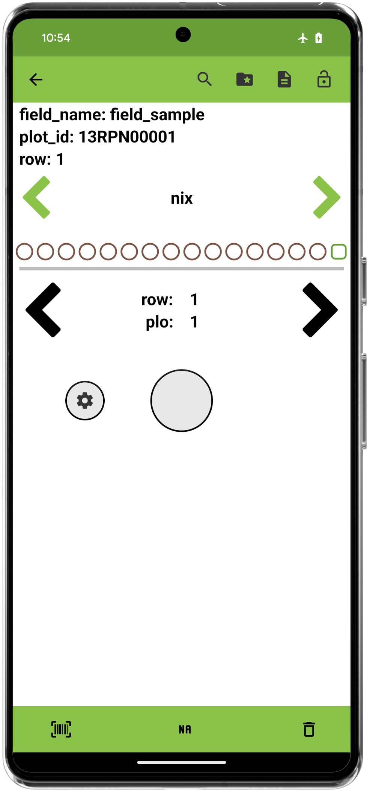
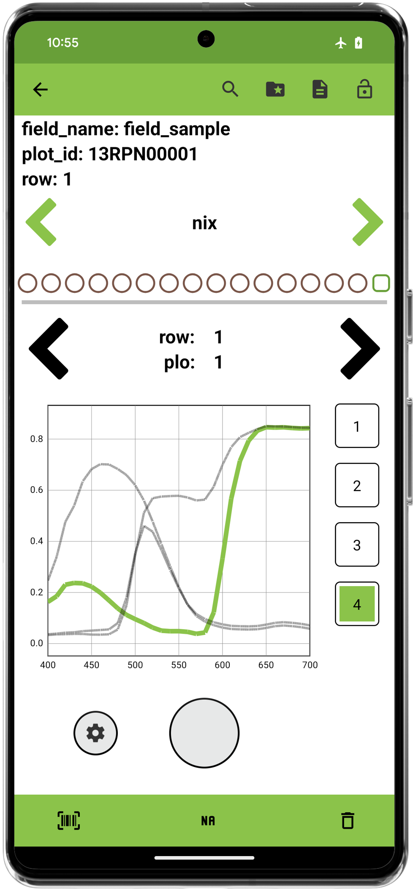

<link rel="stylesheet" type="text/css" href="../_styles/styles.css">

#  GreenSeeker Trait

## Overview

This trait format currently supports [GreenSeeker](https://ww2.agriculture.trimble.com/product/greenseeker-handheld-crop-sensor/) devices.

The GreenSeeker device allows the user to hold a trigger to capture NDVI (Normalized Difference Vegetation Index) readings.
NDVI is a measure of plant health based on how the plant reflects light at certain frequencies (some visible and some invisible to the human eye).
The GreenSeeker emits light in the red and near-infrared regions of the spectrum and measures the amount of light reflected back to the sensor.

Please refer to the data sheet provided by Trimble for more information on the GreenSeeker device and NDVI, including usage details:
[DataSheet](https://ww2.agriculture.trimble.com/wp-content/uploads/2022/03/022503-1487B-en-US_GreenSeeker_Handheld_Crop_Sensor_DS_USL_0222_LR.pdf)

## Creation

<figure class="image" style="text-align: center">
    

      
      
      
    

</figure>

## Connect

Press the connect button to scan for compatible devices.
The desired device can be selected from the dialog that is displayed.

<figure class="image" style="text-align: center">
    

      
      
    

</figure>

## Collect

Once a device is connected, a settings button and capture button are displayed.

<figure class="image">
    
</figure>

Scans are visually displayed on a graph.
Selecting an individual scan will highlight the corresponding line on the graph.
Each point in the graph represents a single 0-0.99 NDVI reading. The average of the scan is shown above the graph.
Long-press the scan number to save a text comment.

<figure class="image">
      
</figure>

The settings button opens a dialog that shows device settings and allows the hardware to be disconnected.

<figure class="image">
      
</figure>

## Export

| plot_id    | value | trait       |
|------------|-------|-------------|
| 13RPN00001 | 0.012 | GreenSeeker |
| 13RPN00001 | 0.3   | GreenSeeker |
| 13RPN00002 | 0.5   | GreenSeeker |

Output table and database files will have averages shown as trait values, a file also contains all NDVI values for each scan.
This file can be automatically included in the exported file by exporting with media bundled which will create a folder structure similar to below.
In this example, the `GreenSeeker_spectral_file.csv` contains the NDVI values for the scans that were collected in `field_sample`.

<figure class="image">
    
</figure>

| sample_name | device_id           | device_name | comments | created_at           | average | 0.0  | 1.0  | 2.0  | 3.0  | 4.0  | 5.0  |
|-------------|---------------------|-------------|----------|----------------------|---------|------|------|------|------|------|------|
| 13RPN00008  | 18:04:ED:39:7C:A2   | GreenSeeker |          | 07-31-25 14:38:12    | 0.088   | 0.1  | 0.1  | 0.07 | 0.1  | 0.09 | 0.07 |
| 13RPN00008  | 18:04:ED:39:7C:A2   | GreenSeeker |          | 07-31-25 14:38:14    | 0.109   | 0.13 | 0.09 |      |      |      |      |
| 13RPN00008  | 18:04:ED:39:7C:A2   | GreenSeeker |          | 07-31-25 14:38:17    | 0.081   | 0.08 | 0.12 | 0.06 | 0.07 | 0.08 |      |
| 13RPN00008  | 18:04:ED:39:7C:A2   | GreenSeeker |          | 07-31-25 14:38:21    | 0.103   | 0.12 | 0.09 | 0.1  |      |      |      |
| 13RPN00008  | 18:04:ED:39:7C:A2   | GreenSeeker |          | 07-31-25 14:38:25    | 0.098   | 0.1  | 0.11 | 0.09 | 0.09 | 0.1  |      |
| 13RPN00009  | 18:04:ED:39:7C:A2   | GreenSeeker |          | 07-31-25 14:38:44    | 0.088   | 0.09 | 0.08 | 0.08 | 0.09 | 0.1  |      |
| 13RPN00009  | 18:04:ED:39:7C:A2   | GreenSeeker |          | 07-31-25 14:38:49    | 0.100   | 0.1  |      |      |      |      |      |
| 13RPN00009  | 18:04:ED:39:7C:A2   | GreenSeeker |          | 07-31-25 14:38:51    | 0.090   | 0.09 |      |      |      |      |      |
| 13RPN00009  | 18:04:ED:39:7C:A2   | GreenSeeker |          | 07-31-25 14:38:52    | 0.079   | 0.08 |      |      |      |      |      |
| 13RPN00009  | 18:04:ED:39:7C:A2   | GreenSeeker |          | 07-31-25 14:38:54    | 0.090   | 0.09 |      |      |      |      |      |
