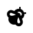
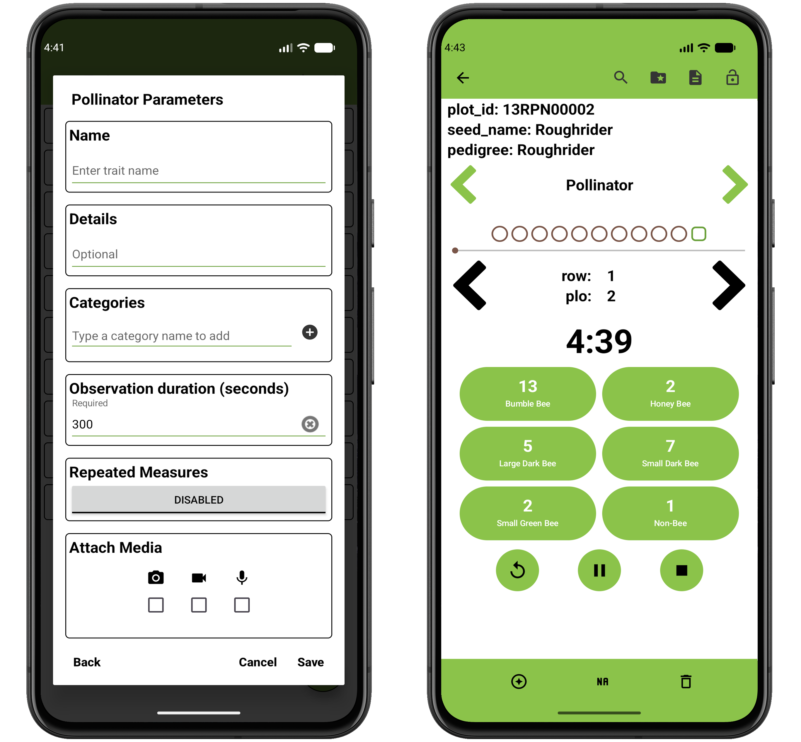

<link rel="stylesheet" type="text/css" href="../_styles/styles.css">

#  Pollinator Trait

The pollinator trait format is used to count pollinator visits across categories during a timed observation period.

### Parameters
- `Name` assign a value for trait name.
- `Details` text is displayed under the trait name on the Collect screen.
- `Categories` define the pollinator types counted during the observation.
At least one category is required.
- `Observation Duration (seconds)` sets the length of the timed observation period.
- `Repeated Measures` toggles repeated measure for the trait.

On the Collect screen, press the  start button to start the countdown.
Press the  pause button to pause the countdown.
Press a category button each time a pollinator of that type is observed to increment its count.
Press the  stop button to end the observation and save the counts.
The observation is also saved automatically when the timer reaches zero.
Use the delete button in the toolbar to remove a saved observation and start the entry over.

Per-category counts and the elapsed time are saved together for each entry.

<figure class="image">
   
  <figcaption class="screenshot-caption"><i>Pollinator trait creation dialog and collect format</i></figcaption> 
</figure>
