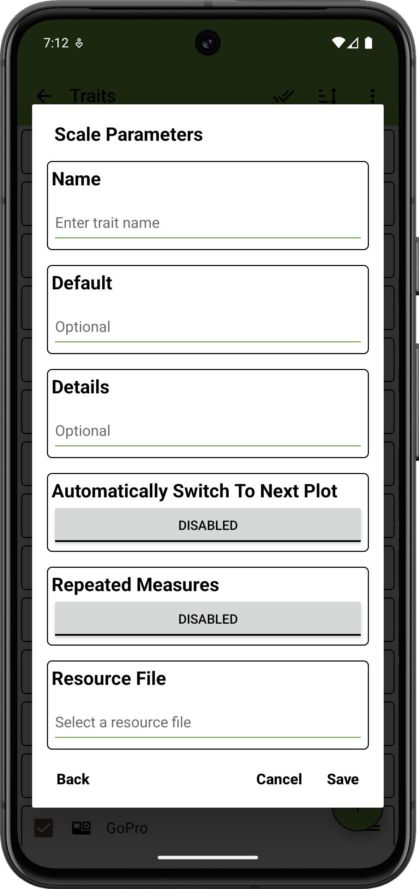
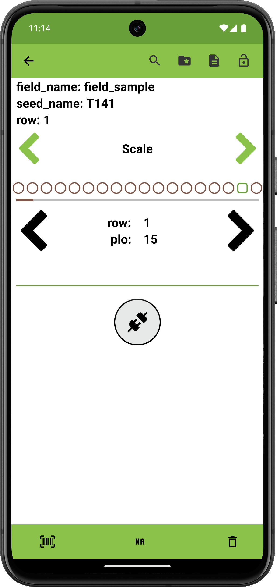
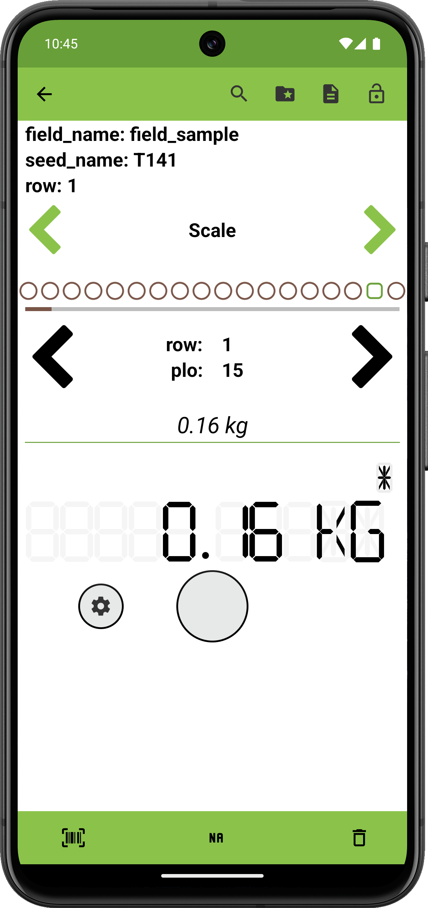

<link rel="stylesheet" type="text/css" href="../_styles/styles.css">

#  Scale Trait

## Overview

The scale trait allows the user to connect to Bluetooth scales and collect weight data.

## Creation

#### Parameters
- `Name` assign a value for trait name.
- `Default` automatically assigns a value when visiting an entry that has no observations.
- `Details` text is displayed under the trait name on the Collect screen.
- `Automatically Switch to Next Plot` toggles immediately moving to next entry when the user records an observation for an entry in the Collect screen.
- `Repeated Measures` toggles repeated measure for the trait.
- `Resource File` sets an image for the trait that will be opened by default when accessing resources from Collect.

<figure class="image" style="text-align: center">
    

      
    

</figure>

## Collect

Press the connect button to scan for compatible devices.
The desired device can be selected from the dialog that is displayed.

Once a device is connected, data is read from the scale and displayed in the UI.
Supported devices may send data that includes the unit of measure.
Weight stability is displayed as an asterisk above the weight value.

<figure class="image" style="text-align: center">
    

      
      
    

</figure>

## Compatible devices

### Crane Scale OCS-L

Low-cost Crane hanging scales with Bluetooth are compatible with this trait with no modifications necessary.

### A&D Check Weighing Bench Scales with Bluetooth

Deivces such as the SJ-6000WP-BT can be used with this trait but the settings must be adjusted to output data in `Stream` mode.

### Other devices

Other devices may be compatible with this trait but have not been tested.
If you have a specific scale model you'd like to see supported, please contact the developers with more information.