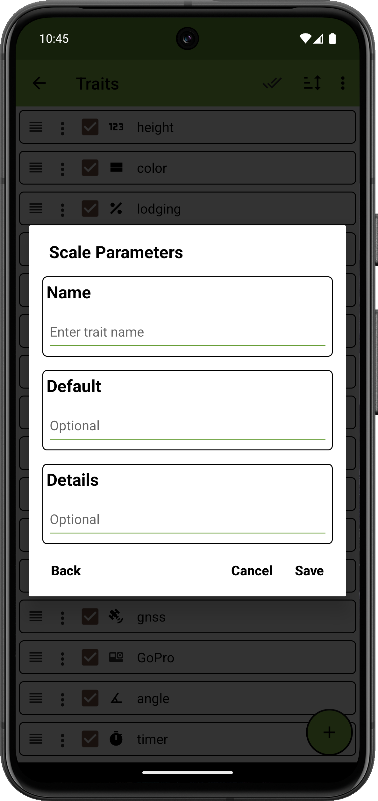

<link rel="stylesheet" type="text/css" href="../_styles/styles.css">

#  Scale Trait

## Overview

The scale trait allows the user to connect to Bluetooth scales and collect weight data.

## Creation

<figure class="image" style="text-align: center">
    

      
    

</figure>

## Collect

Press the connect button to scan for compatible devices.
The desired device can be selected from the dialog that is displayed.

Once a device is connected, data is read from the scale and displayed in the UI.
Supported devices send data configured on the device, sometimes including unit of measure, such as pounds or kilograms.
Some scales also indicate weight stability which is displayed as an asterisk above the weight in the UI.

<figure class="image" style="text-align: center">
    

      
      
    

</figure>

## Compatible devices

### Crane Scale OCS-L

Low-cost Crane hanging scales with Bluetooth are compatible with this trait with no modifications necessary.

### A&D Check Weighing Bench Scales with Bluetooth

Deivces such as the SJ-6000WP-BT can be used with this trait but the settings must be adjusted to output data in `Stream` mode.

### Other devices

Other devices may be compatible with this trait but have not been tested. If you have a specific scale model you'd like to see supported, please contact the developers with more information.