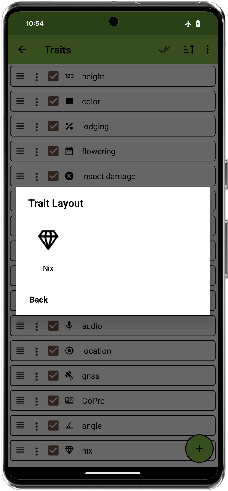
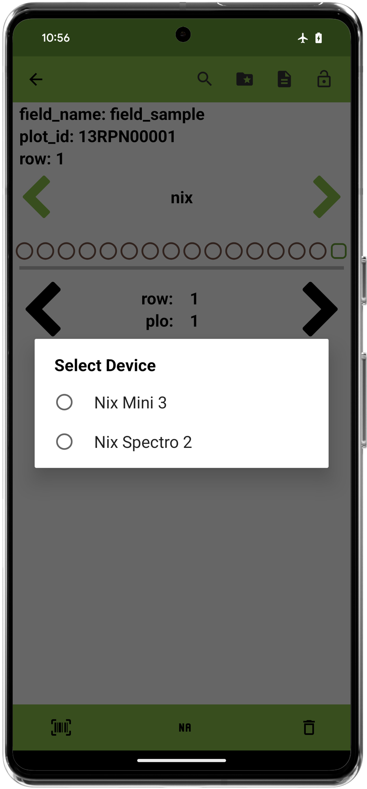

<link rel="stylesheet" type="text/css" href="../_styles/styles.css">

#  Scale Trait

## Overview

The scale trait allows the user to connect to Bluetooth scales and collect weight data.
This trait format currently supports:
* Crane Scale OCS-L
* A&D BT (SJ-6000WP-BT)

other scales may work, but haven't been tested.

## Creation

<figure class="image" style="text-align: center">
    

      
      
      
    

</figure>

## Connect

Press the connect button to scan for compatible devices.
The desired device can be selected from the dialog that is displayed.

<figure class="image" style="text-align: center">
    

      
      
    

</figure>

## Collect

Once a device is connected, data is read from the scale and displayed in the UI. Supported devices send data configured on the device,
sometimes including unit of measure, such as pounds or kilograms. Some devices also show if the scale is stable or not, which is displayed
as an asterisk above the weight in the UI.

<figure class="image">
    
</figure>

