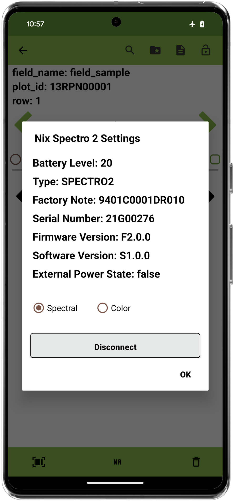

<link rel="stylesheet" type="text/css" href="../_styles/styles.css">

#  Spectral Trait

## Overview

Users can collect data using spectrometer hardware using the Spectral trait format. Currently, the only supported spectral format is "Nix". 

https://www.nixsensor.com/

Currently, spectral collection has two modalities:
1. **Color**: this captures a hexadecimal representation of the color reflected by the hardware. 
2. **Spectral**: this is a high-dimensional phenotype that writes the wavelength and reflectance to a file.

**Note** Modalities can be swapped on the fly during collection.

## Creation

When creating a spectral trait, the user first chooses the "Spectral icon", then the sub-trait type.

Currently the only spectral format available is "Nix".

<figure class="image" style="text-align: center">
    

      
      
    

</figure>

## Connect

When first loading the collect activity, the user must select the connect button to choose a device.

Please wait a moment while the device listens for possible connections, at times hardware may automatically reconnect.

<figure class="image" style="text-align: center">
    

      
      
    

</figure>

## Collect

When a device is connected, the user is presented with a settings button and a capture button.
<figure class="image">
    

      
    

</figure>

When capturing the data, a loading icon is shown. For color data the user will see a preview of the color captured along with its hexadecimal value.
<figure class="image" style="text-align: center">
    

      
      
    

</figure>

For spectral data, the values will be graphed.

<figure class="image">
    

      
    

</figure>

Users can click on the right-hand item selector to highlight the respective data.

<figure class="image" style="text-align: center">
    

      
      
    

</figure>

The settings button opens a dialog that lets the user disconnect from the hardware, and also view various device settings.

<figure class="image">
    

      
    

</figure>

**Caveat**: Each observation unit (plot entry) may only collect data from one device type at a time. 
So a user may not collect data with a Nix Mini 3 after capturing data with a Nix Spectro 2.
<figure class="image">
    

      
    

</figure>

## Export

Exporting spectral high dimensional data is similar to exporting images in Field Book. To get the actual high dimensional data for the spectral modality,
the user must export with media bundled. This will create a folder structure shown below. In this example the field_sample has a SPECTRO2_spectral_file.csv that has the actual
high dimensional data.

<figure class="image">
    

      
    

</figure>

Color data is exported normally as a hexadecimal value in the typical CSV files. High dimensional spectral data will just reference the file name.

| plot_id     | trait                      | trait            |
|-------------|----------------------------|------------------|
| 13RPN00001  | #432D28                    | Nix Spectrometer |
| 13RPN00001  | #432D28                    | Nix Spectrometer                 |
| 13RPN00002  | SPECTRO2_spectral_file.csv | Nix Spectrometer                 |
| 13RPN00002  | SPECTRO2_spectral_file.csv | Nix Spectrometer                 |
| 13RPN00002  | SPECTRO2_spectral_file.csv | Nix Spectrometer                 |

### Spectral Data Example (shortened)

Spectral data is exported with the spectral wavelengths as headers and their reflectance values in the rows (per observation).

| 400.0 | 410.0 | 420.0 | 430.0 | 440.0 | 450.0 | 460.0 | 470.0 | 480.0 | 490.0 | 500.0 | 510.0 | 520.0 | 530.0 | 540.0 | 550.0 | 560.0 | 570.0 | 580.0 | 590.0 | 600.0 | 610.0 | 620.0 | 630.0 | 640.0 | 650.0 | 660.0 | 670.0 | 680.0 | 690.0 | 700.0 |
|--------|--------|--------|--------|--------|--------|--------|--------|--------|--------|--------|--------|--------|--------|--------|--------|--------|--------|--------|--------|--------|--------|--------|--------|--------|--------|--------|--------|--------|--------|--------|
| 0.005386159 | 0.0034736749 | 0.004429763 | 0.0055570602 | 0.0045986734 | 0.003765883 | 0.0048455857 | 0.0053884797 | 0.00539336 | 0.0057685804 | 0.0058536846 | 0.005779812 | 0.005931692 | 0.0057815257 | 0.0057423916 | 0.0058006085 | 0.005743943 | 0.005875524 | 0.0060191303 | 0.0063243136 | 0.0065872837 | 0.0068126377 | 0.0069246385 | 0.0069922004 | 0.007039003 | 0.0073516257 | 0.007614309 | 0.008558854 | 0.009281475 | 0.008675506 | 0.008990008 |

