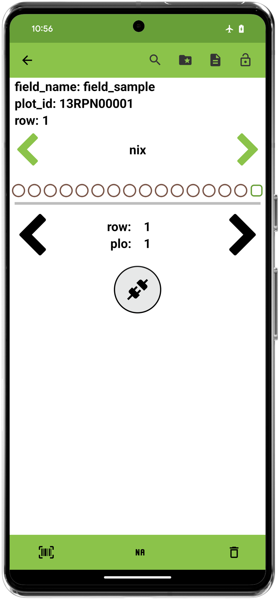

<link rel="stylesheet" type="text/css" href="../_styles/styles.css">

#  Spectral Trait

## Overview

The spectral trait format is used to capture data from external spectrometers and color sensors.
This trait format currently supports [Nix](https://www.nixsensor.com/) color sensors and spectrometers.

Spectral data can be collected in two ways depending on the sensor:
1. **Color**: captures a hexadecimal representation of the color being scanned 
2. **Spectral**: collects reflectance data from many wavelengths

## Creation

#### Parameters
- `Name` assign a value for trait name, alias, and assigns synonyms list to hold the value.
- `Details` text is displayed under the trait name on the Collect screen.
- `Automatically Switch to Next Plot` when enabled will immediately move to next entry when the user records an observation for an entry in the Collect screen.
- `Repeated Measures` turns on repeated measure for the trait when enabled.
- `Resource File` opens the resources folder and can be used to set a image for the trait that can be reference later in the Collect screen.

<figure class="image" style="text-align: center">
  
  <figcaption class="screenshot-caption"><i>Spectral trait creation dialog</i></figcaption> 
</figure>

## Connect

Press the connect button to scan for compatible devices.
The desired device can be selected from the dialog that is displayed.

<figure class="image" style="text-align: center">
    

      
      
    

</figure>

## Collect

Once a device is connected, a settings button and capture button are displayed.

<figure class="image">
    
</figure>

Color data is shown as a preview of the color along with its hexadecimal value.
When capturing the data, a loading icon is displayed.

<figure class="image" style="text-align: center">
    

      
      
    

</figure>

Spectral scans are visually displayed on a graph.
Selecting an individual scan will highlight the corresponding line on the graph.
Long-press the scan number to save a text comment.

<figure class="image">
      
</figure>

The settings button opens a dialog that shows device settings and allows the hardware to be disconnected.
This dialog also allows data visualization to be toggled between the spectral and color choices.
Only one sensor model may be used for each trait:entry combination.

<figure class="image">
      
</figure>

## Export

| plot_id    | value                      | trait |
|------------|----------------------------|-------|
| 13RPN00001 | #432D28                    | nix   |
| 13RPN00001 | #432D28                    | nix   |
| 13RPN00002 | SPECTRO2_spectral_file.csv | nix   |
| 13RPN00002 | SPECTRO2_spectral_file.csv | nix   |
| 13RPN00002 | SPECTRO2_spectral_file.csv | nix   |

While color scans are stored as hexadecimal values, spectral scans are stored in a secondary file with the spectral wavelengths as headers and reflectance values in the rows.
This file can be automatically included in the exported file by exporting with media bundled which will create a folder structure similar to below.
In this example, the `SPECTRO2_spectral_file.csv` contains the reflectance values for the scans that were collected in `field_sample`.

<figure class="image">
    
</figure>

| 400.0 | 410.0 | 420.0 | 430.0 | 440.0 | 450.0 | 460.0 | 470.0 | 480.0 | 490.0 | 500.0 | 510.0 | 520.0 | 530.0 | 540.0 | 550.0 | 560.0 | 570.0 | 580.0 | 590.0 | 600.0 | 610.0 | 620.0 | 630.0 | 640.0 | 650.0 | 660.0 | 670.0 | 680.0 | 690.0 | 700.0 |
|--------|--------|--------|--------|--------|--------|--------|--------|--------|--------|--------|--------|--------|--------|--------|--------|--------|--------|--------|--------|--------|--------|--------|--------|--------|--------|--------|--------|--------|--------|--------|
| 0.005386159 | 0.0034736749 | 0.004429763 | 0.0055570602 | 0.0045986734 | 0.003765883 | 0.0048455857 | 0.0053884797 | 0.00539336 | 0.0057685804 | 0.0058536846 | 0.005779812 | 0.005931692 | 0.0057815257 | 0.0057423916 | 0.0058006085 | 0.005743943 | 0.005875524 | 0.0060191303 | 0.0063243136 | 0.0065872837 | 0.0068126377 | 0.0069246385 | 0.0069922004 | 0.007039003 | 0.0073516257 | 0.007614309 | 0.008558854 | 0.009281475 | 0.008675506 | 0.008990008 |

