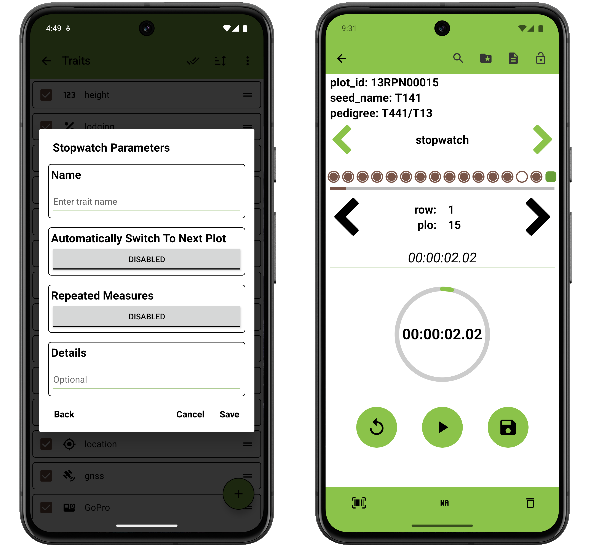

<link rel="stylesheet" type="text/css" href="../_styles/styles.css">

#  Stopwatch Trait

The stopwatch trait format is used to measure elapsed time.

### Parameters
- `Name` assign a value for trait name.
- `Details` text is displayed under the trait name on the Collect screen.
- `Automatically Switch to Next Plot` toggles immediately moving to next entry when the user records an observation for an entry in the Collect screen.
- `Repeated Measures` toggles repeated measure for the trait.
- `Resource File` sets an image for the trait that will be opened by default when accessing resources from Collect.

On the Collect screen, press the  start button to start the timer.
Press the  pause button to pause the timer.
Press the  reset button to reset the timer to zero.
Press the  save button to save the current elapsed time.

The timer displays elapsed time in HH:MM:SS.mmm format (hours:minutes:seconds.milliseconds).
The timer maintains its state when paused or saved, allowing you to resume timing from where you left off.

<figure class="image">
   
  <figcaption class="screenshot-caption"><i>Stopwatch trait creation dialog and collect format</i></figcaption> 
</figure>