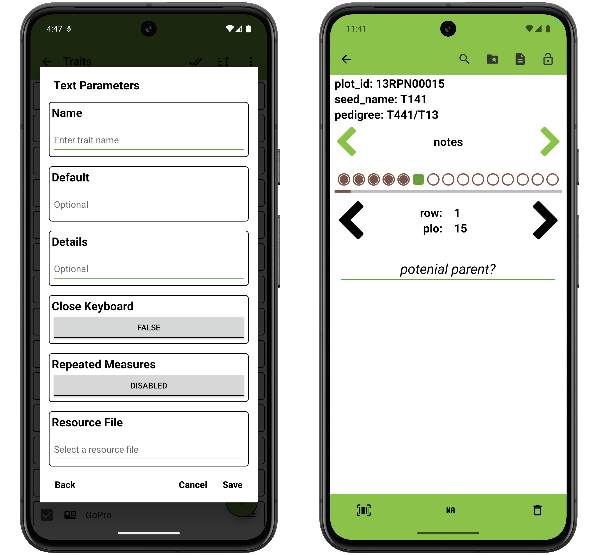

<link rel="stylesheet" type="text/css" href="../_styles/styles.css">

#  Text Trait

The text trait format is used to record open-ended text.

### Parameters
- `Name` assign a value for trait name, alias, and assigns synonyms list to hold the value.
- `Default` automatically assigns a specific value for the observation when visiting an entry having no observation recorded previously.
- `Details` text is displayed under the trait name on the Collect screen.
- `Close Keyboard` opens up the system keyboard for each entry when enabled.
- `Repeated Measures` turns on repeated measure for the trait when enabled.
- `Resource File` opens the resources folder and can be used to set a image for the trait that can be reference later in the Collect screen.

On the Collect screen, text can be typed or dictated using the system keyboard.

<figure class="image">
   
  <figcaption class="screenshot-caption"><i>Text trait creation dialog and collect format</i></figcaption> 
</figure>