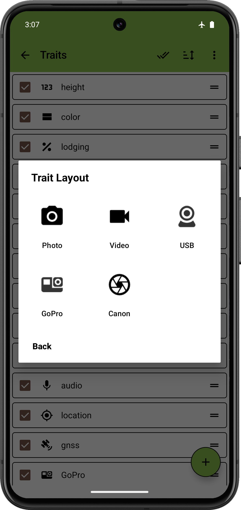
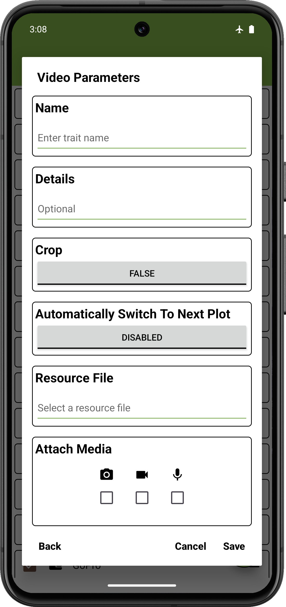
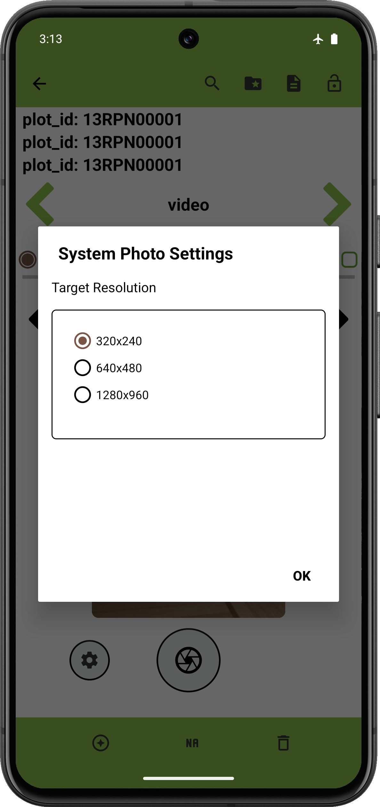
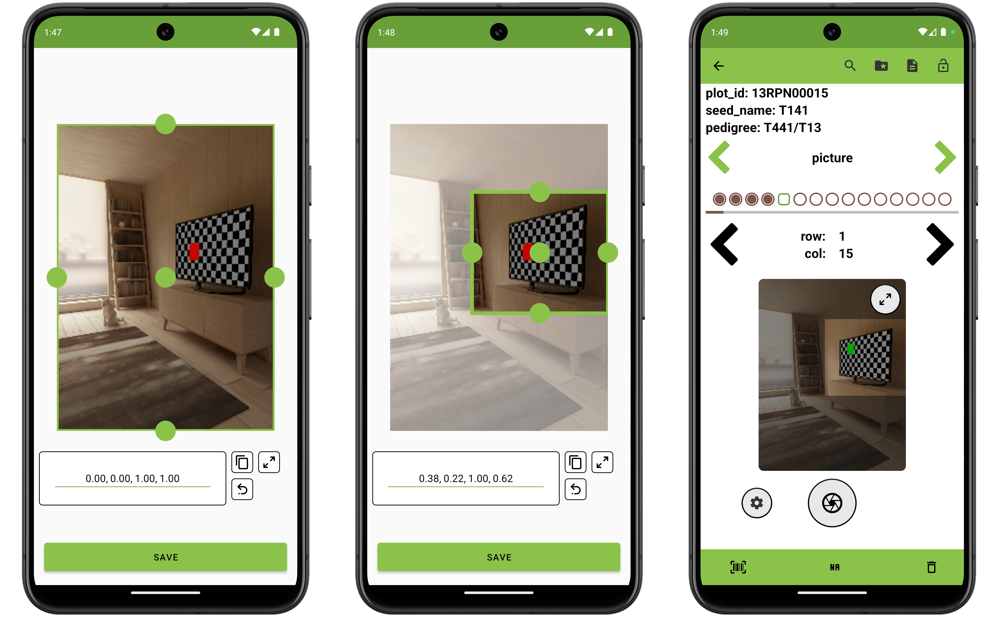

<link rel="stylesheet" type="text/css" href="../_styles/styles.css">

#  Video Trait

## Overview

The video trait format is used to capture video recordings using the device's system camera.

## Creation

#### Parameters
- `Name` — assign a value for the trait name.
- `Details` — text displayed under the trait name on the Collect screen.
- `Crop` — when enabled, define a crop region through the  in Collect to apply to all future captures for the trait.

<figure class="image">
  

    
    
  

  <figcaption class="screenshot-caption"><i>Creating a video trait.</i></figcaption>
</figure>

## Collect layout

Video capture uses the same UI as photo capture.
Video resolution and crop region can be user-adjusted.
Pressing the top right button in the video preview will expand the capture to be full-screen.

<figure class="image">
  
  <figcaption class="screenshot-caption"><i>Video trait settings</i></figcaption>
</figure>

On the Collect screen, pressing the  button starts a video recording using the device camera.
Press the same button will stop the recording and save the video.

The  button opens a dialog where resolution, and other capture options can be adjusted.
If a crop region was defined during trait creation, the "Set Crop Region" option will appear and can be previewed using a captured frame.

<figure class="image">
  
  <figcaption class="screenshot-caption"><i>Setting a video trait's crop region</i></figcaption>
</figure>

Multiple video clips can be captured and attached to a single entry.

### Playback and management

Tapping a video thumbnail in the trait area allows videos to be played in the media viewer with play and pause controls.