<link rel="stylesheet" type="text/css" href="_styles/styles.css">

# Fields

## Overview

Experiments in Field Book are called `Fields`.
Fields can be imported from a file, downloaded from a BrAPI-enabled database, or created from scratch.

<figure class="image">
   
  <figcaption class="screenshot-caption"><i>The Fields screen layout with sample fields loaded</i></figcaption> 
</figure>

Each field is displayed in the list with an icon that matches its import source, its name, and the number of `entries` (experimental units) on which data will be collected (e.g., plots, plants).
Pressing the left icon marks the field as the active field.
Any other part of the field list item can be pressed to open the field details view.

<figure class="image">
   
  <figcaption class="screenshot-caption"><i>A sample field with a name, number of entries, and csv import icon</i></figcaption> 
</figure>

When importing a file, each row of the file reprents an `entry`.

Each entry within a field must have a `unique identifier`.
The `unique identifier` is used to associate data with the specific entry and must be unique across all of your fields.
The sample field import file shown below contains a unique identifier called **plot_id** (highlighted in red).

Additional data columns can be included to provide contextual information on the Collect screen.
Values from two additional columns can be displayed as the primary and secondary ID between the entry navigation arrows, and any number of additional columns can be displayed in the Infobar section.
These choices can be customized or used for for Quick GoTo, as documented in  [Collect](collect.md).

Examples of useful columns for navigation include layout numbers like `plot_number`, `row`, `column`, `rep`, or `block`.
The sample field import file contains columns called `row` and `plot` (highlighted in blue) which are used as the primary and secondary identifiers in this documentation.

Other useful context columns like `variety_name`, `pedigree`, or `treatment` are optional, but can be included and viewed in the InfoBars or in the Summary dialog in Collect.

<figure class="image">
   
  <figcaption class="screenshot-caption"><i>A sample field import file</i></figcaption> 
</figure>

<figure class="image">
   
  <figcaption class="screenshot-caption"><i>The Fields screen layout with sample fields loaded</i></figcaption> 
</figure>

Field Book includes a set of sample field files: `field_sample.csv`, `field_sample2.csv`, and `field_sample3.csv` represent typical wheat breeding fields and `rtk_sample.csv` demonstrates the import format for entry location data (an additional `geo_coordinates` column).
Imported entry coordinates can then be used with the  [Geonav](geonav.md) feature.

## Adding a field

New fields can be added by pressing the  button in the bottom right corner of the Fields screen.
This opens a dialog where you can select whether to import from a local file, from cloud storage (Dropbox, Google Drive, etc.), create a new field from scratch, or import via a  [Brapi](brapi.md) connection (if enabled).
A default import source can be set in  [System Settings](settings-system.md) to skip this dialog, and long-pressing the  button will override the default choice.

<figure class="image">
  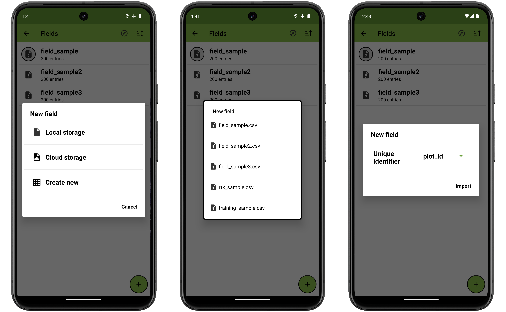 
  <figcaption class="screenshot-caption"><i>The Field import process from local storage</i></figcaption>
</figure>

#### Local storage

Selecting local will display a list of files in the `field_import` folder.
Files can be added to the import folder by downloading or [transferring from a computer](storage.md#file-transfer).
Only `.csv`, `.xls`, or `.xlsx` files will appear in the import dialog.

!> Filenames and column headers must exclude the following special characters: `/ ? < > * | "`

Once a file has been selected, the dropdown menu is used to select which column from the file should be used as the `unique_identifier`.

Pressing **Import** will complete the import process.

#### Cloud storage

If you choose to import from cloud storage, Field Book will open the device file manager.
Using the file manager you can select a file anywhere on the device, including from cloud utilities like Google Drive.
The  menu icon in the upper left of the file manager will display the installed cloud applications that can be used to load files.

<figure class="image">
   
  <figcaption class="screenshot-caption"><i>Cloud import file manager view</i></figcaption> 
</figure>

#### Create New

Creating a new field directly in Field Book requires a field name, dimensions, starting corner for entry ordering, walking direction and pattern.
Universal unique IDs will be generated for all entries.

Press the  left icon or  right icon to move between steps in the creation process.

<figure class="image">
  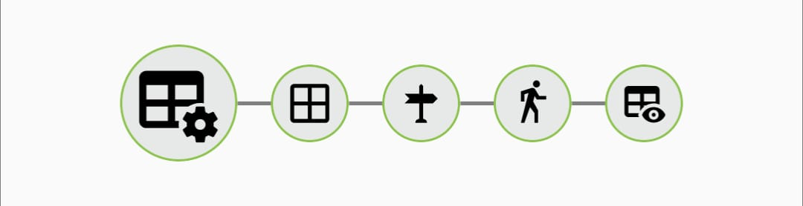 
  <figcaption class="screenshot-caption"><i>Stepper</i></figcaption> 
</figure>

Entry numbers indicate the sequence you'll follow when collecting data in the field.

<figure class="image">
   
  <figcaption class="screenshot-caption"><i>Input field name, dimensions and starting corner</i></figcaption> 
</figure>

Direction determines whether entries progress horizontally or vertically, and pattern determines whether they follow a linear or serpentine path.

<figure class="image">
  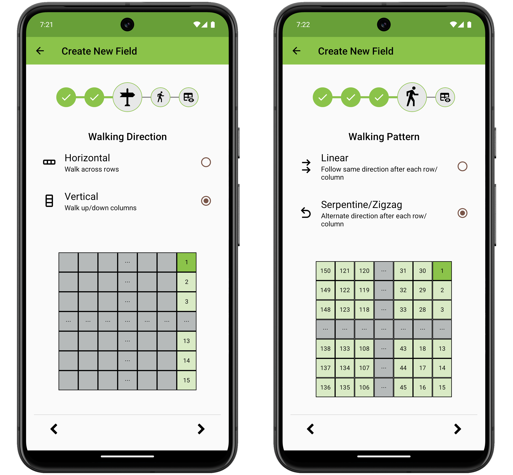 
  <figcaption class="screenshot-caption"><i>Choose direction and pattern</i></figcaption> 
</figure>

Use the  expand icon to see the full preview, and  collapse icon to see collapsed preview of the field when available.
Confirm the planned settings are as expected, then press  to save the field.

<figure class="image">
  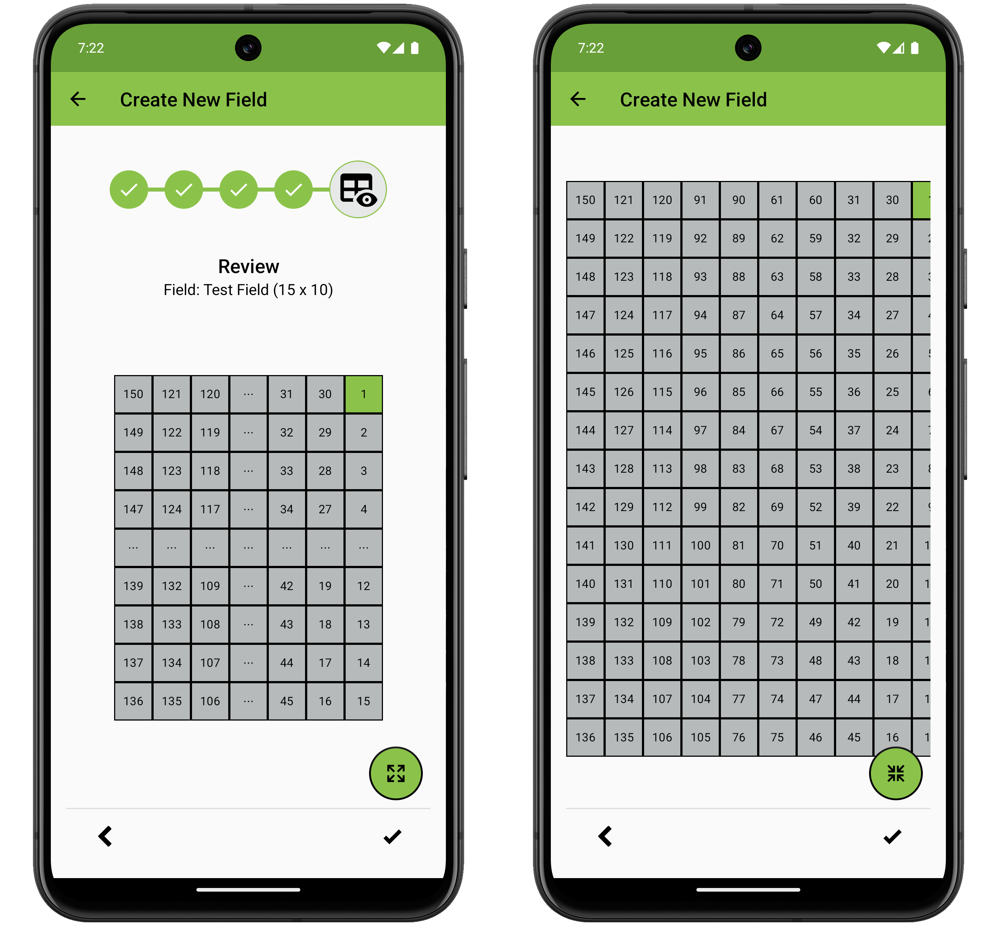 
  <figcaption class="screenshot-caption"><i>Review field</i></figcaption> 
</figure>

<figure class="image">
  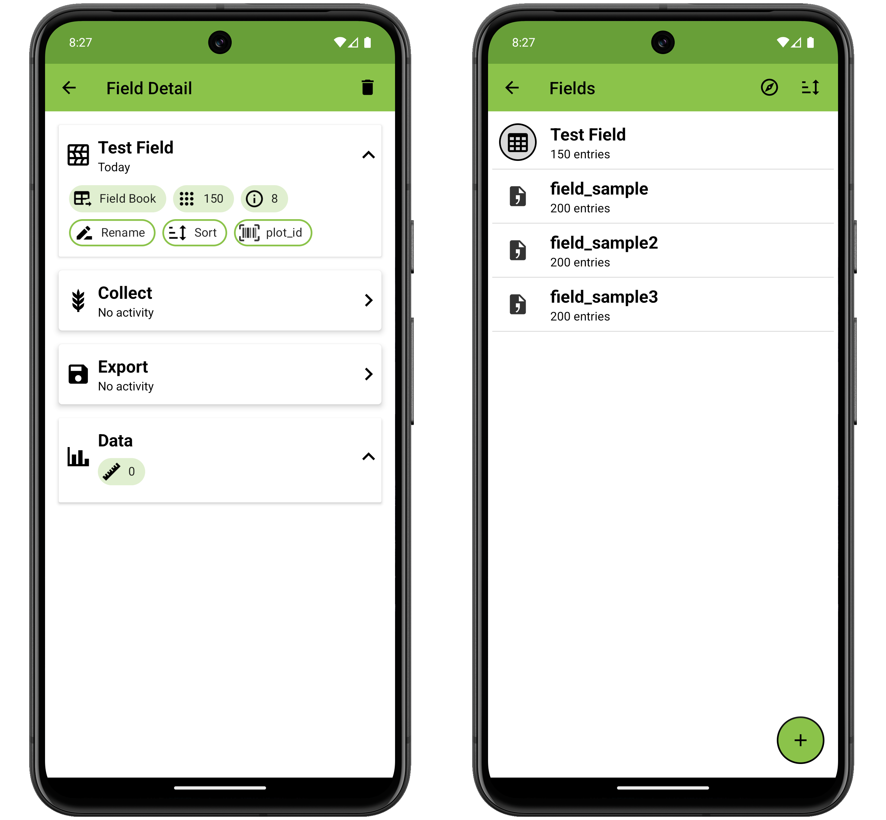 
  <figcaption class="screenshot-caption"><i>Newly created field</i></figcaption> 
</figure>

#### Breeding API (BrAPI)

To import a field using BrAPI, ensure BrAPI is enabled and configured in the  [Brapi settings](settings-brapi.md)

Once your device is authenticated with a compatible database, the BrAPI server will be displayed as an option for field import.
The [BrAPI](brapi.md) section of the documentation has more details about the import, sync, and export process.

!> Any field can be exported locally, but only fields and traits that have been imported via BrAPI are able to export data via BrAPI.

## Managing fields

To set or switch your active field, press the import source icon on the left side of the field item.

If your fields have location data, pressing the  icon in the top toolbar will set the nearest active field.

Pressing the  icon in the top toolbar will display a dialog with different attributes that can be selected to sort the list of fields. If grouping is enabled, sorting by name will sort both the group headers and the fields within each group.

<figure class="image">
   
  <figcaption class="screenshot-caption"><i>Field list sort options</i></figcaption> 
</figure>

For batch operations, long pressing a field opens an action menu on the top toolbar.
Use the action menu icons to  select all,  export all,  delete all,  create a group, or  archive all selected fields.
A confirmation dialog message will be displayed prior to field deletion.
Deleted fields cannot be recovered.

<figure class="image">
   
  <figcaption class="screenshot-caption"><i>Delete fields confirmation</i></figcaption> 
</figure>

### Grouping

Fields can be grouped for better organization.
When grouping is enabled, fields are displayed under expandable group headers in the fields list.
The number of fields in each group is displayed in parentheses in the group header.

Once a group exists, the  or  toolbar options will toggle groups visibility.
Use the expand all or collapse all options from the toolbar to manage the field visibility across groups.
Individual groups can be expanded or collapsed by tapping the group header.
Long pressing the group header will expand the group and select all fields within the group.

#### Assigning and managing groups:

- Select one or more fields with a long press, then tap the  grouping options icon.
- Choose to assign fields to an existing group or create a new group.

<figure class="image">
  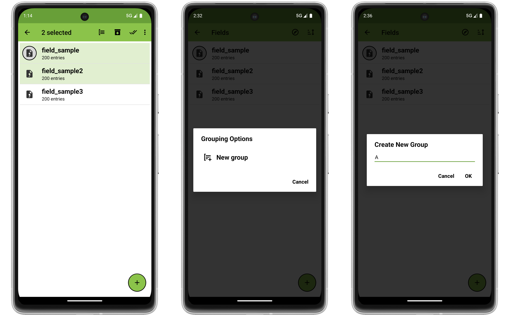 
  <figcaption class="screenshot-caption"><i>Assign a new group</i></figcaption> 
</figure>

<figure class="image">
  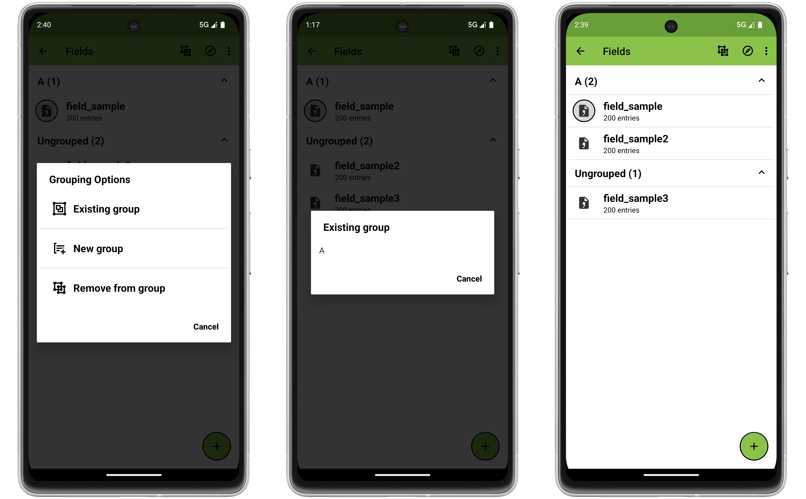 
  <figcaption class="screenshot-caption"><i>Assign an existing group</i></figcaption> 
</figure>

- Fields imported via BrAPI are automatically assigned to a group with their trial name.
- Fields can be removed from groups by selecting them and choosing the "Remove from group" option.
- Groups that do not have any fields assigned to them are automatically deleted.
- Fields without an assigned group appear under an "Ungrouped" header when grouping is enabled.

### Archiving

Fields that are no longer active can be archived to reduce clutter in the main fields list while preserving all data.
Archived fields cannot be set as the active field and their location data be not searched when the  icon is pressed to find the nearest field.

#### Archiving and accessing archived fields:

- Select one or more fields and tap the  archive icon. If the currently active field is selected for archiving, a prompt will be displayed to confirm or select which fields to archive.

<figure class="image">
  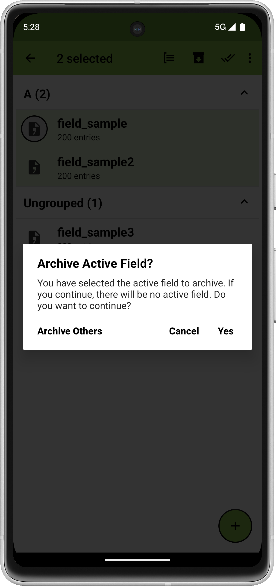 
  <figcaption class="screenshot-caption"><i>Archive active field warning</i></figcaption> 
</figure>

- Archived fields are moved to an archived header at the bottom of the fields list which shows the number of archived studies in parentheses.

<figure class="image">
  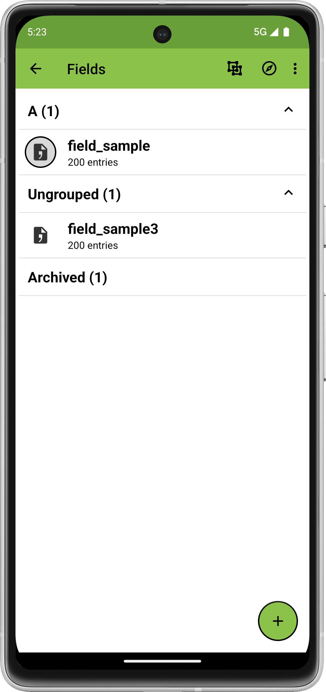 
  <figcaption class="screenshot-caption"><i>Archived header</i></figcaption> 
</figure>

- Tap the archived fields item to view and manage archived studies.

<figure class="image">
  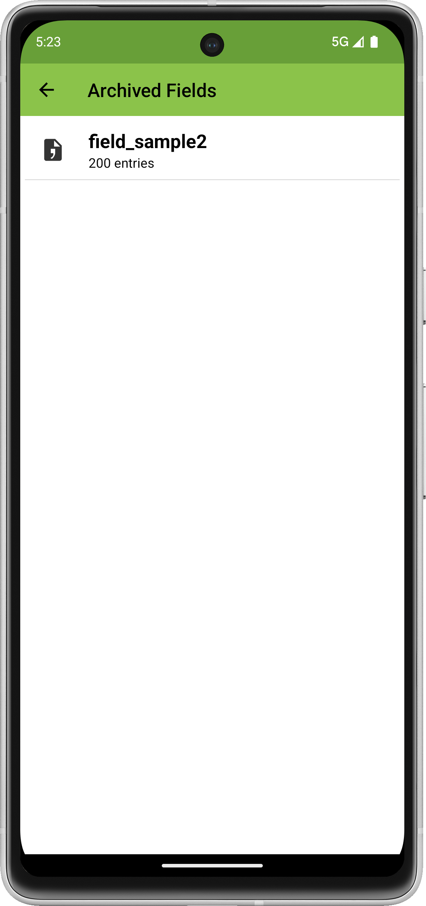 
  <figcaption class="screenshot-caption"><i>Archived fields screen</i></figcaption> 
</figure>

- From the archived screen, fields can be unarchived, exported, or permanently deleted. Unarchived fields return to their original group if they were previously assigned a group.

<figure class="image">
  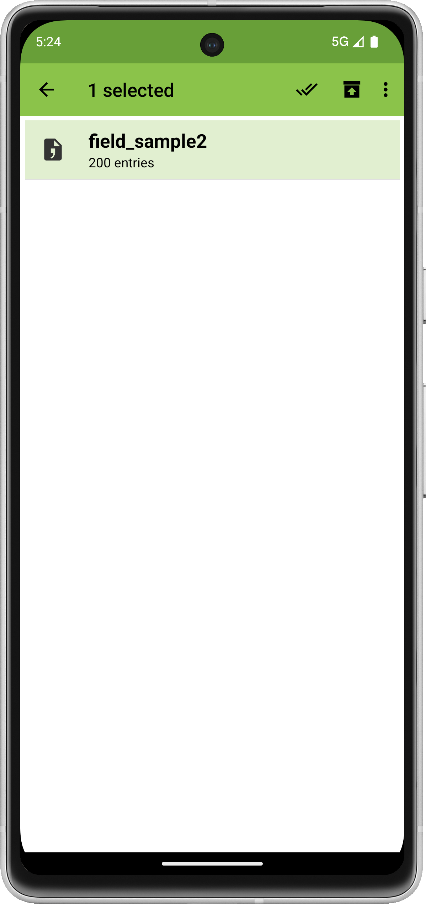 
  <figcaption class="screenshot-caption"><i>Archived fields screen batch options</i></figcaption> 
</figure>

- Since archived fields cannot be set as active, you will be prompted to unarchive the field when trying to collect data or set it as active.

<figure class="image">
  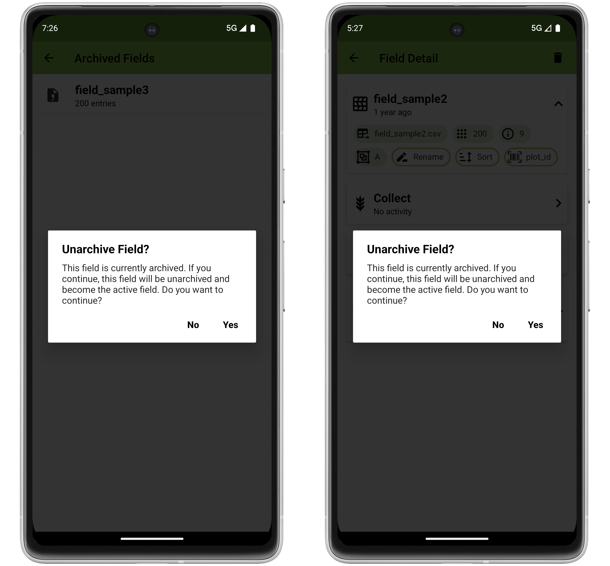 
  <figcaption class="screenshot-caption"><i>Setting an archived field as active</i></figcaption> 
</figure>

## Field details

Pressing a field item in the fields list opens a Field Detail screen.
The **** in the toolbar can be used to delete the field.
A confirmation dialog message will be displayed prior to field deletion.

<figure class="image">
   
  <figcaption class="screenshot-caption"><i>Field detail view</i></figcaption> 
</figure>

The top card includes metadata about the field (import source, entry count, attribute count).
**Renaming** fields will change the name displayed for the field throughout the app.
**Sorting** displays a dialog to modify the entry order.
 **Search ID** displays a dialog to choose which unique attribute a barcode search will check against (default is the unique identifer selected on import).

The sort dialog is populated by pressing the  icon, and selecting from the list of available columns.
Column priority for sorting can be modified by using using the  icon to drag and reorder them.
The  icon will toggle the sort between ascending and descending.
The  icon will remove columns that have been added.

<figure class="image">
  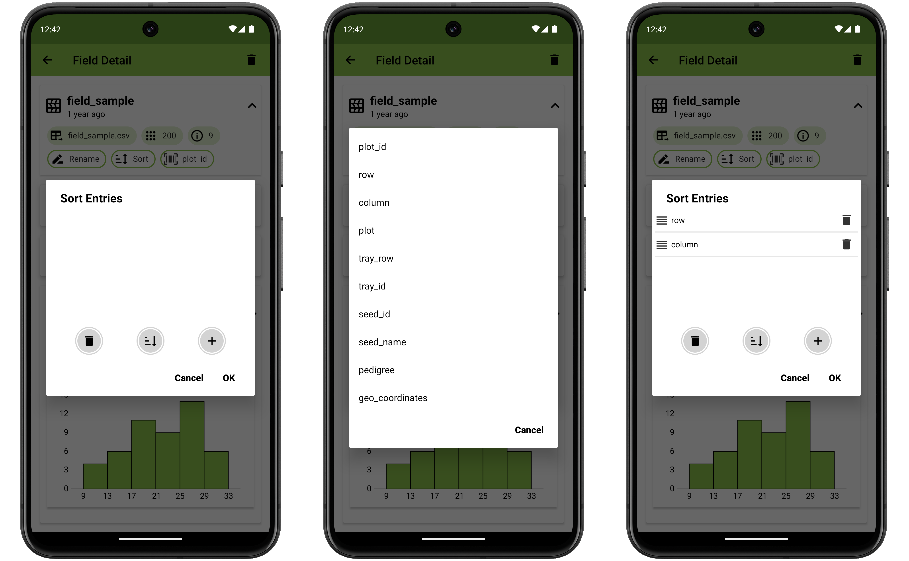 
  <figcaption class="screenshot-caption"><i>Sorting entries by ascending row, then column</i></figcaption> 
</figure>

The Search ID dialog displays a list of attributes that are unique within the field.
By default barcode searches check against the unique identifer that was selected on import.
Selecting a different attribute will modify the behavior to check against the selected Search ID first, then fall back to checking against the unique identifier if no match is found.
This choice can be applied to all fields that have the same attribute by selecting the checkbox.

<figure class="image">
  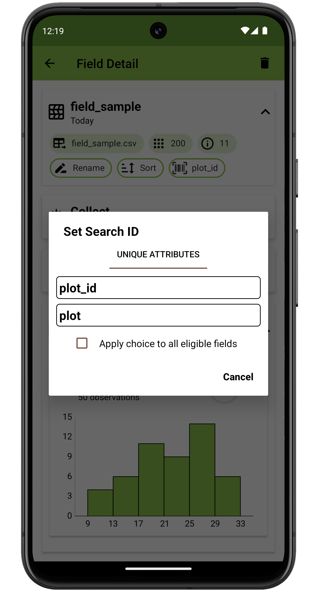 
  <figcaption class="screenshot-caption"><i>The Search ID dialog</i></figcaption> 
</figure>

The  [Collect](collect.md) card will navigate to the Collect screen where data can be collected.

The  [Export](export.md) card will export data that has been collected.

The Data card summarizes data that has been collected for the field.
For each trait with data, the number of observations and percent of entries with phenotypes is displayed in sub-cards.
Expanding each sub-card will show a chart with a distribution of the phenotypes.