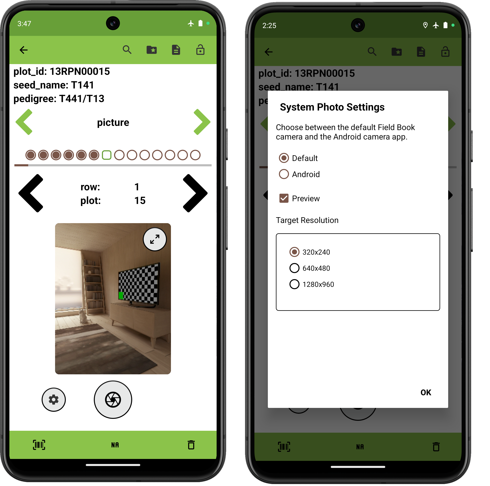
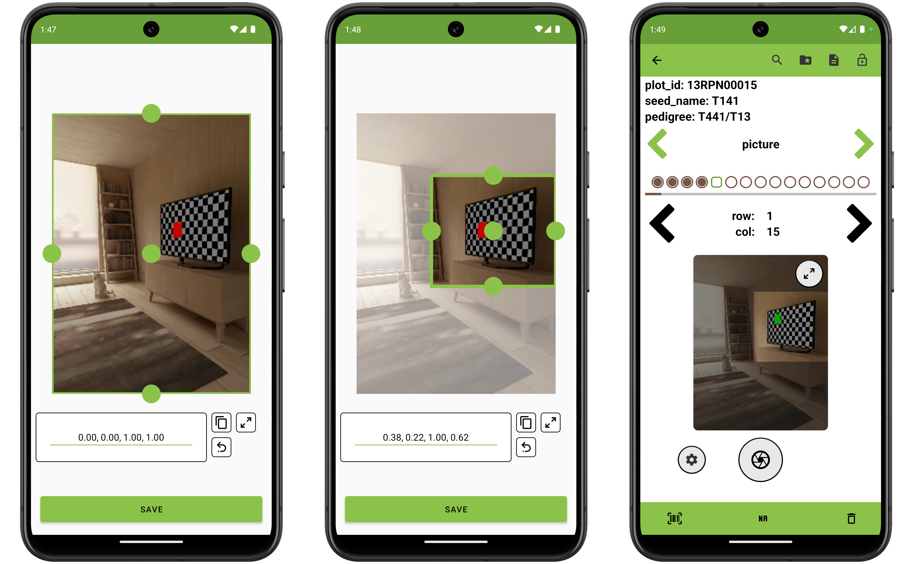
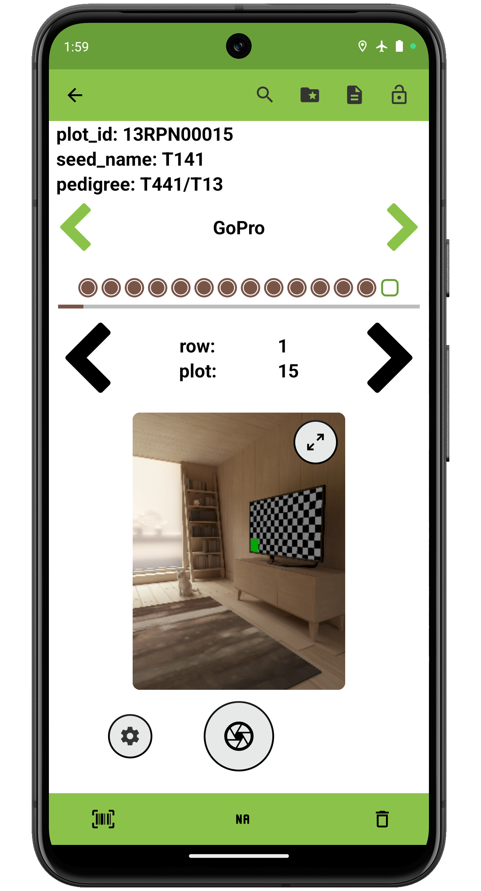

<link rel="stylesheet" type="text/css" href="../_styles/styles.css">

#  Photo Trait

## Overview

The photo trait formats are used to capture images.
Field Book allows photos to be captured from different camera sources including the device camera,  USB cameras,  GoPro cameras, and  [compatible](https://developercommunity.usa.canon.com/s/article/CCAPI-Supported-Cameras) Canon cameras.

## Creation

#### Parameters
- `Name` assign a value for trait name.
- `Details` text is displayed under the trait name on the Collect screen.
- `Crop` when enabled, define a crop region through the  in Collect to apply to all future pictures for the trait.
- `Automatically Switch to Next Plot` toggles immediately moving to next entry when the user records an observation for an entry in the Collect screen.
- `Resource File` sets an image for the trait that will be opened by default when accessing resources from Collect.

<figure class="image">
   
  <figcaption class="screenshot-caption"><i>Photo trait creation (system camera)</i></figcaption> 
</figure>

## Collect layout

<figure class="image">
   
  <figcaption class="screenshot-caption"><i>Photo trait collection interface and settings (system camera)</i></figcaption> 
</figure>

On the Collect Screen, pressing the  icon captures an image from the camera.
Pressing the  icon opens a settings dialog, where the resolution, preview, and other options can be adjusted.

If crop region was enabled when creating the trait, the "Set Crop Region" option will be displayed in the settings and can be pressed to capture a photo and adjust cropping dimensions to be applied to all captured photos. 

<figure class="image">
   
  <figcaption class="screenshot-caption"><i>Setting a photo trait's crop region</i></figcaption> 
</figure>

Multiple photos can be captured for each entry.

Captured photos are stored in `.jpg` format, and named by using underscores to join the entry's `unique id`, the trait name, the photo number, and a timestamp.
The resulting files are stored in a picture folder within a field-specific subfolder of `plot_data`.
An example photo filepath would be `plot_data/FIELD_NAME/picture/PHOTO_FILE_NAME.jpg`.

## External devices

Capturing photos using external cameras requires initial connection setup using the  icon.
The layout and process of capturing images from external cameras is the same as with the the system camera.

<figure class="image">
   
  <figcaption class="screenshot-caption"><i>Photo trait collection interface (GoPro)</i></figcaption> 
</figure>

### GoPro Cameras

GoPros can be used to capture images via Bluetooth.
Field Book can either copy the full image to the Android device or save the name of the image stored in the GoPro memory.
If photos are copied to the Android device, they are stored in `.jpg` format, and named with entry's unique_id, the trait name, the photo number, and a timestamp.
The resulting files are stored in a gopro folder within a field-specific subfolder of `plot_data`.
An example photo filepath would be `plot_data/FIELD_NAME/gopro/PHOTO_FILE_NAME.jpg`.