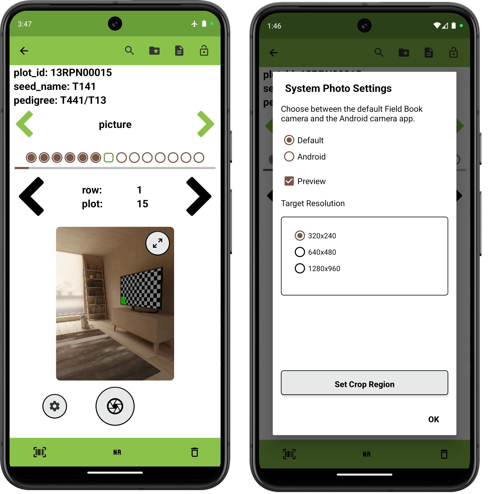

<link rel="stylesheet" type="text/css" href="../_styles/styles.css">

#  Photo Trait

## Overview

The photo trait formats are used to capture images.
Field Book allows photos to be captured from different camera sources including the device camera,  USB cameras,  GoPro cameras, and  [compatible](https://developercommunity.usa.canon.com/s/article/CCAPI-Supported-Cameras) Canon cameras.

## Creation

#### Parameters
- `Name` assign a value for trait name.
- `Details` text is displayed under the trait name on the Collect screen.
- `Crop` when enabled, define a crop region through the  in Collect to apply to all future pictures for the trait.
- `Automatically Switch to Next Plot` toggles immediately moving to next entry when the user records an observation for an entry in the Collect screen.
- `Resource File` sets an image for the trait that will be opened by default when accessing resources from Collect.

<figure class="image">
  
  <figcaption class="screenshot-caption"><i>Photo trait creation (system camera)</i></figcaption> 
</figure>

## Collect layout

<figure class="image">
  
  <figcaption class="screenshot-caption"><i>Photo trait collection interface and settings (system camera)</i></figcaption> 
</figure>

On the Collect Screen, pressing the  icon captures an image from the camera.
Pressing the  icon opens a settings dialog, where the resolution, preview, and other options can be adjusted.

If crop region was enabled when creating the trait, the "Set Crop Region" option will be displayed in the settings and can be pressed to capture a photo and adjust cropping dimensions to be applied to all captured photos. 

<figure class="image">
  
  <figcaption class="screenshot-caption"><i>Setting a photo trait's crop region</i></figcaption> 
</figure>

Multiple photos can be captured for each entry.

Captured photos are stored in `.jpg` format, and named by using underscores to join the entry's `unique id`, the trait name, the photo number, and a timestamp.
The resulting files are stored in a picture folder within a field-specific subfolder of `plot_data`.
An example photo filepath would be `plot_data/FIELD_NAME/picture/PHOTO_FILE_NAME.jpg`.

## External devices

Capturing photos using external cameras requires initial connection setup using the  button.
The process of capturing images from external cameras is the same as with the the system camera.

<figure class="image">
  
  <figcaption class="screenshot-caption"><i>Photo trait collection interface (GoPro)</i></figcaption> 
</figure>

### Canon Cameras

Field Book can only communicate with Canon cameras over WiFi.

To connect to a compatible camera, open the `Wi-Fi/Bluetooth connection` menu and choose `Connect to smartphone`.
Some cameras will have "Advanced connection" which may work as well.

<figure class="image">
  
  <figcaption class="screenshot-caption"><i>Put the camera into smartphone connect / camera connect mode</i></figcaption>
</figure>

Choose the `Camera access point mode` for the network, this creates a WiFi access point on the camera.

<figure class="image">
  
</figure>

When using a new camera for the first time with Field Book, choose the `Add a device to connect to` option.
Once a connection has been established, Field Book will be listed as an option on this screen.

<figure class="image">
  
</figure>

In the `Camera access point mode` select `Manual connection`.

<figure class="image">
  
</figure>

Rename the camera's SSID to `Canon`.

<figure class="image">
  
</figure>

Set the encryption to None.

<figure class="image">
  
</figure>

Choose `Auto setting` for the channel and IP options.

<figure class="image">
  
</figure>

<figure class="image">
  
</figure>

The camera display should be similar to the screenshot below, indicating that it is waiting for Field Book to connect to its network.

<figure class="image">
  
  <figcaption class="screenshot-caption"><i>Device may show a "waiting for network" or similar while the app binds the network</i></figcaption>
</figure>

Press the connect button () on the Canon trait.

<figure class="image">
  
  <figcaption class="screenshot-caption"><i>Tap Connect to begin the connection flow</i></figcaption>
</figure>

If the network isn't found immediately, close the dialog and repress the connect button.
Once the network is detected, Field Book will display a dialog with the name of the camera SSID (`Canon`).
Press the `Canon` network option on the Field Book screen to finish pairing the devices.

<figure class="image">
  
  <figcaption class="screenshot-caption"><i>Field Book lists the camera SSID</i></figcaption>
</figure>

The camera will display an IP address and the Field Book screen will display a live preview streamed from the camera.

<figure class="image">
  
  <figcaption class="screenshot-caption"><i>Camera shows it is connected to Field Book</i></figcaption>
</figure>

If this is the first time connecting the camera to Field Book, an additional prompt on the camera will need to be accepted.

<figure class="image">
  
  <figcaption class="screenshot-caption"><i>On the camera, accept the connection from Field Book</i></figcaption>
</figure>

### GoPro Cameras

Field Book can capture images from GoPro cameras via Bluetooth.
Field Book can either copy the full image to the Android device or save the name of the image stored in the GoPro memory.
If photos are copied to the Android device, they are stored in `.jpg` format, and named with entry's unique_id, the trait name, the photo number, and a timestamp.
The resulting files are stored in a gopro folder within a field-specific subfolder of `plot_data`.
An example photo filepath would be `plot_data/FIELD_NAME/gopro/PHOTO_FILE_NAME.jpg`.